# Summary

_Casino_ is a medium rated machine from _HackSmarter_ in which the target host is a Linux machine hosting a _Werkzeug Python_ webserver. Its compromise was achieved mainly due to the following causes:

- Source map file world-readable and accessible API endpoint -  led to disclosure of an API endpoint containing data that enables bypass access control. This can be mitigated by restricting source map access according to actual needs and sanitizing API endpoints if exposed.
- Broken access control - currently based on values that could be guessed or bruteforced, no-session based authorization. Applying basic access control based on passwords should resolve the issue.
- Server-Side Template Injection (SSTI) - the sole user input field is vulnerable to SSTI, allowing command execution and arbitrary file read on the target host.
- Insecure credential management - cleartext credentials were stored within shell history, enabling lateral movement, and within a log file, enabling privilege escalation.

---
# Introduction

## Objective

Las Vegas is gearing up for a massive cybersecurity conference, and you've been hired to conduct a penetration test against one of the casinos. The client - Hack Smarter World - is a luxury resort where many of the attendees will be staying. Your objective is to identify all vulnerabilities and elevate your privileges to root (if possible).

## Initial Access

You have been provided the IP of the Wifi Captive Portal... but no other information.

---
# Full TCP Range Scan

Scanning the target host with the following command:

```bash
sudo nmap -A -T4 -v -oN Scans/Casino_TCP.nmap 10.1.249.84 -Pn -p-
Nmap scan report for 10.1.249.84
Host is up (0.100s latency).
Not shown: 65532 closed tcp ports (reset)
PORT     STATE SERVICE VERSION
22/tcp   open  ssh     OpenSSH 9.6p1 Ubuntu 3ubuntu13.18 (Ubuntu Linux; protocol 2.0)
| ssh-hostkey: 
|   256 ea:aa:53:ab:d1:8e:7b:67:a8:2e:f0:f5:8c:a0:ff:cc (ECDSA)
|_  256 b2:a7:c5:62:42:d2:12:6d:51:12:fb:0a:b4:46:23:07 (ED25519)
80/tcp   open  http    Werkzeug httpd 3.1.8 (Python 3.10.18)
|_http-server-header: Werkzeug/3.1.8 Python/3.10.18
| http-methods: 
|_  Supported Methods: OPTIONS GET HEAD
| http-title: Hack Smarter World - Guest WiFi & Portal
|_Requested resource was /login
2222/tcp open  ssh     OpenSSH 8.4p1 Debian 5+deb11u7 (protocol 2.0)
| ssh-hostkey: 
|   3072 7d:c5:f5:ba:03:3e:f0:76:5c:9d:47:b6:39:b5:c7:a4 (RSA)
|   256 ed:5d:fa:ea:74:a0:56:b1:39:59:fc:c5:22:1e:5e:bd (ECDSA)
|_  256 50:31:d9:54:80:42:b8:44:cb:40:66:ea:cf:8f:cf:37 (ED25519)
No exact OS matches for host (If you know what OS is running on it, see https://nmap.org/submit/ ).

```

## Notes on Scan Results

- _OpenSSH 9.6p1_ accessible over default port 22.
- _Werkzeug/3.1.8 Python/3.10.18_ web server accessible over default port 80 - 
- _OpenSSH 8.4p1_ accessible over default port 2222. Note - it is a rather old version of _OpenSSH_; released in September 2020.

---
# _Werkzeug/3.1.8 Python/3.10.18_ HTTP Web Application (80/TCP)

### _whatweb_

_whatweb_ is a tool used for fingerprinting web applications, detecting technologies, frameworks, and server details.
The following command was used to identify web technologies running on the target:

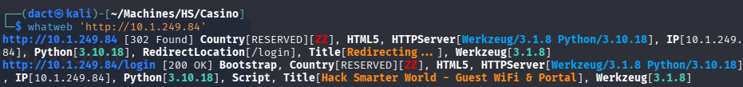

As seen above, there is a redirect to the _/login_ endpoint. It was already known that it is a _Python_-based webserver which might be _Flask_ - with these servers, my instinct is to look for API endpoints.

## Website Browsing

Browsing to `http://10.1.249.84/login` leads to the following web page:

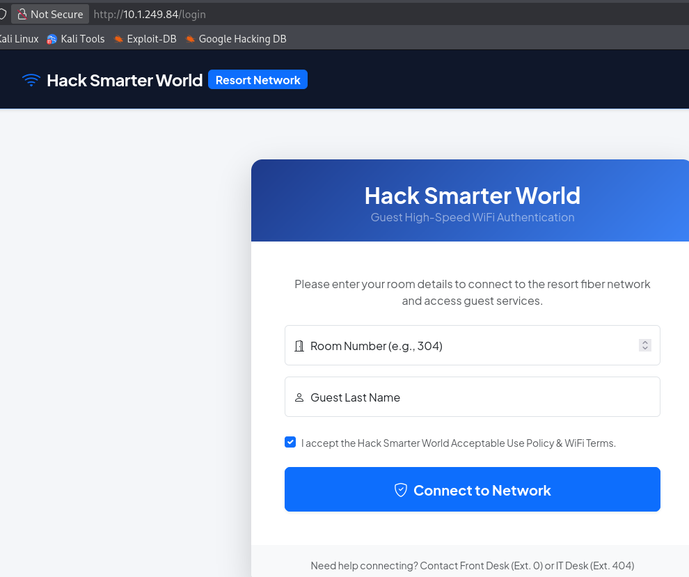

A simple interface requiring room number (above 99) and the last name of the guest. An intercepted request does not shed light on the alleged API endpoint involved:

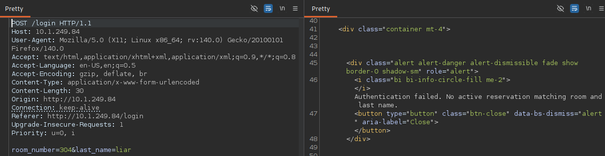

- Using _feroxbuster_ and _ffuf_ - I did not manage to find any interesting endpoints, or any API endpoints at all.
## Source Code Review

Reviewing the source code, I see this non-default _JS_ file:

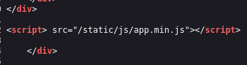

Browsing to `http://10.1.249.84//static/js/app.min.js`, it contains the source map `.map` file:

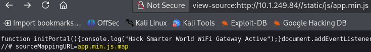

Browsing to `http://10.1.249.84/static/js/app.min.js.map` to read the source map, highlighted below is what seems like an API endpoint:

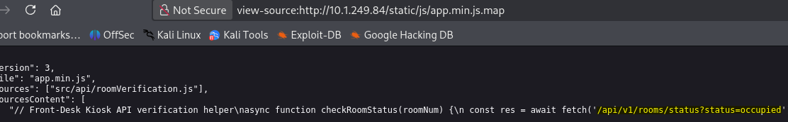

Browsing to `http://10.1.249.84//api/v1/rooms/status?status=occupied`, it is a list featuring 100 entries of guests and their room numbers:

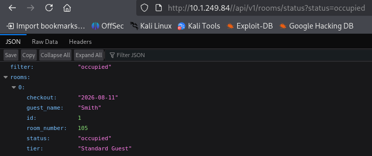

Both these parameters - `guest_name` and `room_number` can be bruteforced using two wordlists in conjunction - however since I have access to the data, I won't need to test that method.

Using one of the recovered names in conjunction with a room number, I can access a user's dashboard.


- Though it presents a plethora of options, only _Profile & WiFi Settings_ leads to a functioning endpoint
# Foothold

## SSTI

Browsing to _Profile & WiFi Settings_, I see an field that accepts input. The tech stack being _Flask_, the template engine is usually _Jinja_ - which might be vulnerable to Server-Side Template Injection (SSTI), a simple test payload is `{{7*7}}` - as per this [resource](https://github.com/swisskyrepo/PayloadsAllTheThings/tree/master/Server%20Side%20Template%20Injection#inject-template-syntax). Inserting it and changing the name of the user:

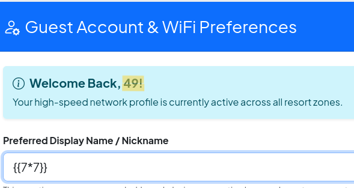

As highlighted above, the name is changed to `49` rather than `{{7*7}}` - this confirms that the input is evaluated as a server-side template; confirming SSTI.

With the help of another [resource](https://onsecurity.io/article/server-side-template-injection-with-jinja2/), I manage to read the target host's _/etc/passwd_ file:

```python
{{ self.__init__.__globals__.__builtins__.open("/etc/passwd").read() }}
```

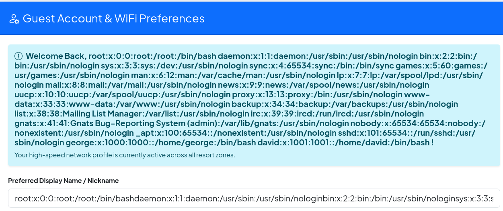

After copying the list to my local host, I check which of the users has bash console:

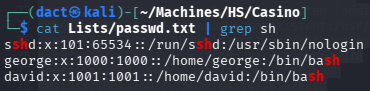

`david` and `george` are valid users. Trying to read the latter's private SSH keys:

```python
{{ self.__init__.__globals__.__builtins__.open("/home/george/.ssh/id_rsa").read() }}
```

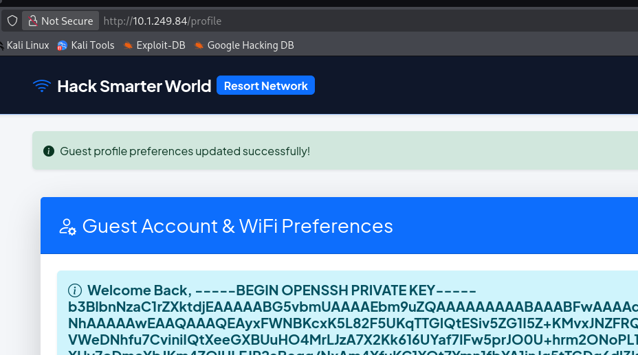

As seen above, I have managed to read `george`'s private SSH key, after copying its contents to my local host and changing its permission set to complement the file's functionality (`chmod 600 id_rsa`), I tried establishing a connection over SSH:

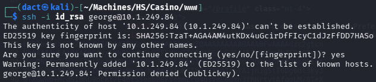

While I failed to establish a session over port 22, there is also an SSH accessible over port 2222 - as previously discovered. Trying to establish a remote session over the latter is successful and I can now execute commands on the target host as `george`:

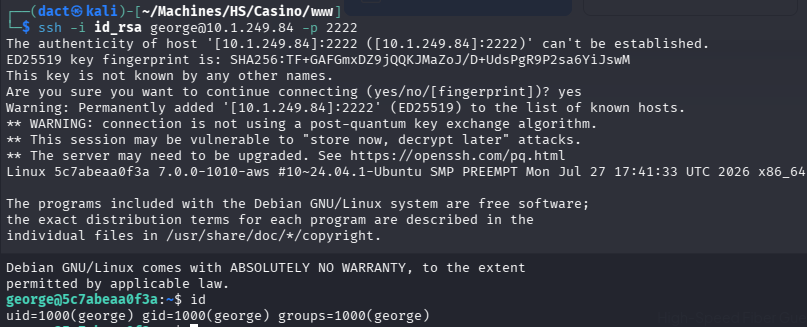

# Privilege Escalation

Reviewing the `george`'s _..bash_history_ file, highlighted below - cleartext credentials for `david`, also in the context of _mysql_, and a log file:

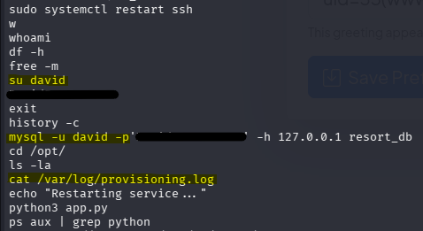

Attempting to switch user to `david`, using the recovered password, is successful. The user is a member of the _adm_ group:

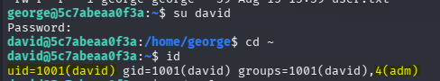

As _provisioning.log_ appeared earlier and `david` being a member of the _adm_ group (usually the group permitted to read log files), I target said file. Within the file, again, cleartext credentials - this time for `root`:

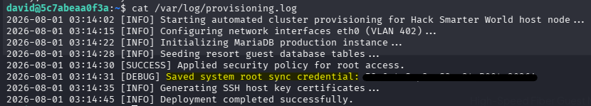

Using the harvested credentials, I switch user to `root` and confirm command execution, achieving full compromise of the target host,  as seen below:

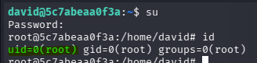

