# Summary

_Haystack_ is a medium rated Linux host from _HackSmarter_. Its compromise is mainly due to the factors below:

- **Anonymous FTP access** - anonymous access to the FTP server allowed me to exfiltrate and review its contents. To remediate, block anonymous access to FTP, rely on authentication based access.
- **Archive protected by a weak password** - one of the exfiltrated archived files was protected by a weak password which allowed me to crack its hash and access a _.git_ directory containing cleartext credentials. To remediate, protect files with strong, complex passwords.
- **Cleartext passwords** within a git commit and a log file within _/var/log_. The recovered passwords were instrumental to the compromise of the target host. To remediate, purge commits that contained cleartext passwords in a manner these could not be recovered and ensure that passwords are not stored within logs. Passwords that were exposed through these vectors should be rotated.
- **Vulnerable installed version of _RoundCube_** - version 1.6.10 of _RoundCube_ is vulnerable to an RCE vulnerability which granted me a remote session on the target host, updating to the latest version of _RoundCube_ would remediate the issue. 
- **adm Group membership** - _adm_ group membership allowed me to view log files and retrieve a cleartext password. Review privileged group membership periodically in accordance with the principle of least privilege. 
- **sudo git with wildcard and pager** - the `sudo git diff *` execution can be used to read arbitrary files on the filesystem and uses `less`, which enables shell escape. To remediate, add  `--no-pager` to the elevated command and restrict filesystem access with a narrowly defined command, ideally two specific files. 

---
# Full TCP Range Scan

Scanning the target host with the following command:

```bash
sudo nmap -v -p- --min-rate 3000 -T4 -sS -n -Pn -oN Scans/Haystack_TCP_discovery 10.0.21.50
ports=$(grep open Scans/Haystack_TCP_discovery | cut -d'/' -f1 | paste -sd,) 
sudo nmap -p$ports -v -sC -sV -sT -T4 -oN Scans/Haystack_TCP_service 10.0.21.50

Nmap scan report for 10.0.21.50
Host is up (0.10s latency).

PORT    STATE SERVICE  VERSION
21/tcp  open  ftp      vsftpd 3.0.5
| ftp-syst: 
|   STAT: 
| FTP server status:
|      Connected to ::ffff:10.0.0.247
|      Logged in as ftp
|      TYPE: ASCII
[...]
| ftp-anon: Anonymous FTP login allowed (FTP code 230)
| -rw-rw-r--    1 1000     1000        73761 May 24 04:40 app.zip
| -rw-r--r--    1 0        0           15562 May 24 05:19 backup.sh
| -rwxrw-r--    1 1000     1000       489837 May 24 05:09 blog.zip
| -rw-r--r--    1 1000     1000        99219 May 24 05:10 joomla.sql
|_-rwxrw-r--    1 1000     1000        12444 May 24 05:09 terraform.zip
22/tcp  open  ssh      OpenSSH 10.2p1 Ubuntu 2ubuntu3.2 (Ubuntu Linux; protocol 2.0)
80/tcp  open  http     Apache httpd 2.4.66 ((Ubuntu))
|_http-server-header: Apache/2.4.66 (Ubuntu)
|_http-title: In The Haystack 
| http-methods: 
|_  Supported Methods: HEAD GET POST OPTIONS
110/tcp open  pop3     Dovecot pop3d
|_pop3-capabilities: STLS SASL TOP RESP-CODES AUTH-RESP-CODE UIDL CAPA PIPELINING
| ssl-cert: Subject: commonName=lk-linux2
[...]
|_ssl-date: TLS randomness does not represent time
143/tcp open  imap     Dovecot imapd
| ssl-cert: Subject: commonName=lk-linux2
[...]
|_imap-capabilities: more LOGIN-REFERRALS have SASL-IR post-login LOGINDISABLEDA0001 ENABLE ID STARTTLS capabilities listed LITERAL+ OK IMAP4rev1 Pre-login IDLE
993/tcp open  ssl/imap Dovecot imapd
|_ssl-date: TLS randomness does not represent time
| ssl-cert: Subject: commonName=lk-linux2
[...]
|_imap-capabilities: LOGIN-REFERRALS more SASL-IR have post-login ENABLE ID AUTH=PLAINA0001 capabilities listed LITERAL+ OK IMAP4rev1 Pre-login IDLE
995/tcp open  ssl/pop3 Dovecot pop3d
|_ssl-date: TLS randomness does not represent time
| ssl-cert: Subject: commonName=lk-linux2
[...]
|_pop3-capabilities: SASL(PLAIN) USER TOP RESP-CODES AUTH-RESP-CODE UIDL CAPA PIPELINING
Service Info: OSs: Unix, Linux; CPE: cpe:/o:linux:linux_kernel
```

## Notes on Scan Results

- FTP accessible over default port 21, anonymous access is allowed according to script results.
- _OpenSSH 10.2p1_ accessible over default port 22.
- _Apache/2.4.66_ accessible over default port 80.
- POP3, IMAP and their SSL variants accessible over default ports 110, 143, 993 and 995.

---
# FTP (21/TCP)

## Anonymous Access

Knowing that anonymous access is allowed from the nmap scan results, I log into the server as `ftp` with a blank password, then download all its contents to my local host:

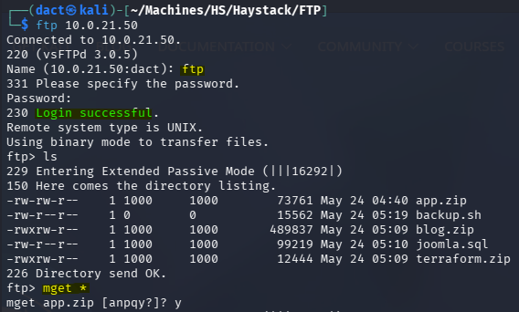

Each of the archive files was deflated into its own directory:

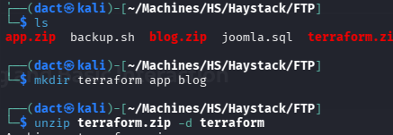

Deflating _app.zip_ resulted in directory names without any files. When reviewing the file types, _app.zip_ was the only one encrypted: 

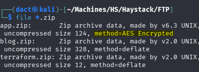

# Foothold
## Hash Cracking and _.git_ Enumeration

While I was not prompted for a password when deflating _app.zip_, it seems to be password protected. Using _zip2john_, I manage to extract a hash from the encrypted value of the file:

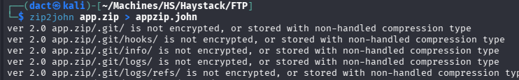

Cracking the (identical) hashes that were extracted for each of the files using _john_:

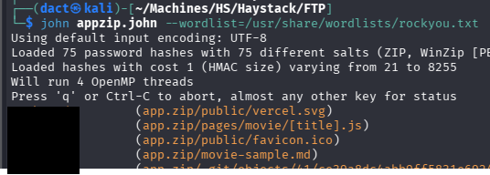

Now, I browse to the archive file through the GUI and extract it:

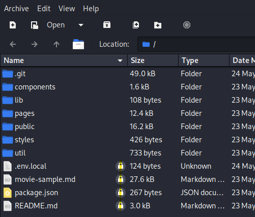

When prompted, I supply the password, and the file deflates successfully:

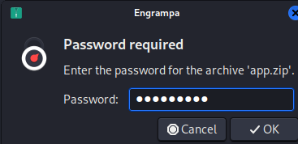

Within _app_, there's a _.git_ directory, when performing basic enumeration using `git log` and showing the initial commit, I manage to recover a cleartext password and two possible usernames (`justin` and `ellen.freeman`):

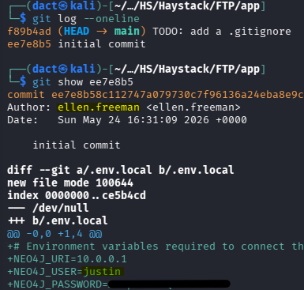

Applying the freshly harvested credential set, I manage to authenticate as `justin` over FTP but not over SSH:

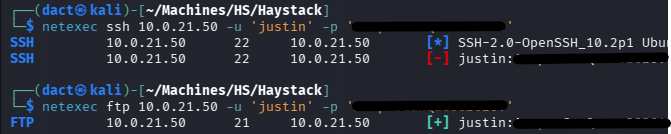

Interacting once more with the FTP server, this time as `justin`, I locate an _.ssh_ directory:

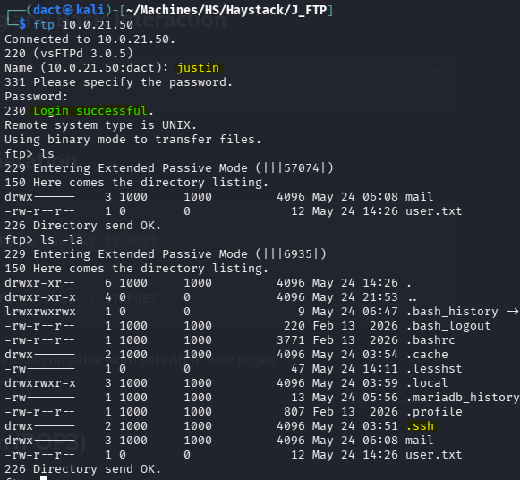

On my local host, I create the necessary files in order to plant SSH keys within `justin`'s _.ssh_ directory:

```bash
ssh-keygen -t rsa -b 4096 -f id_rsa

cat id_rsa.pub > authorized_keys
```

However, placing the generated files within the target _.ssh_ directory does not succeed, as it errors with _550 Permission denied._:

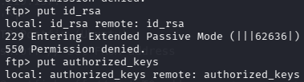

---
# _Apache/2.4.66_ HTTP Web Application (80/TCP)

## Tech Stack

### _cURL_ & _whatweb_

The following commands were used to retrieve HTTP headers from the target web server and fingerprint technologies, frameworks and server details:

```bash
curl -I 'http://10.0.21.50'

whatweb 'http://10.0.21.50'
```

No actionable data was discovered by running the above.

## Website Browsing

Browsing to `http://10.0.21.50` leads to the following web page:


The website does not contain anything of interest at first glance.

## Content Discovery

The following command was used to enumerate hidden directories and files on the target web server:

```bash
feroxbuster -u 'http://10.0.21.50' -w /usr/share/wordlists/dirb/common.txt
feroxbuster -u 'http://10.0.21.50' -w /usr/share/wordlists/dirbuster/directory-list-lowercase-2.3-medium.txt
```

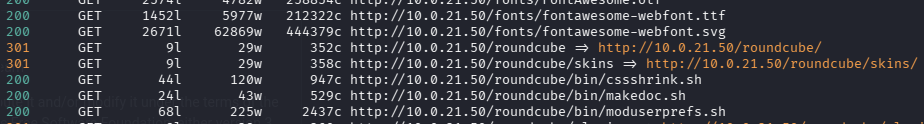

As seen above, _RoundCube_ seems to be the email client on the target host, as it has an endpoint on the web server. 

## _RoundCube_ CVE Exploitation

Browsing to `http://10.0.21.50/roundcube` leads to the below login page:

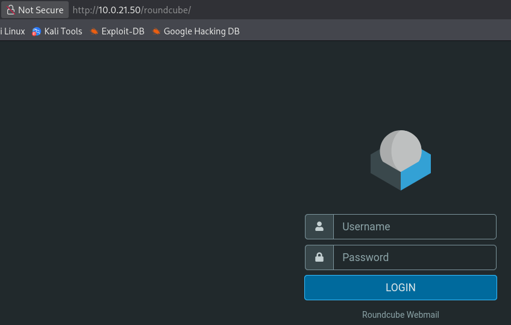

Applying `justin`'s credentials logs me in successfully:

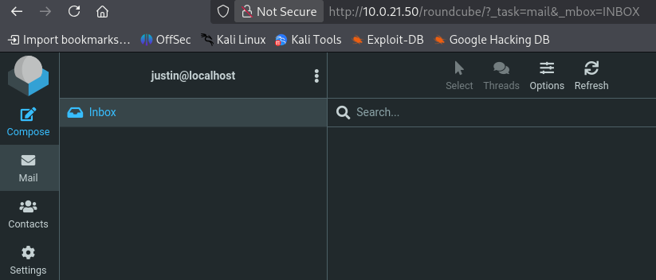

Reviewing the version information, the installed version is 1.6.10.

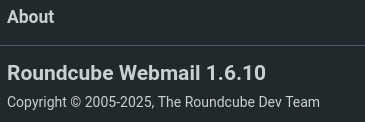

This version of _RoundCube_ is vulnerable to [CVE-2025-49113](https://nvd.nist.gov/vuln/detail/cve-2025-49113), an authenticated RCE vulnerability that's exploited through PHP object deserialization. Using this [exploit script](https://github.com/hakaioffsec/CVE-2025-49113-exploit), I manage to get command execution on the target host as `www-data`:

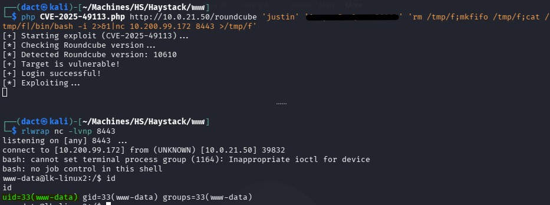

Then, I stabilized the shell with `python3 -c 'import pty; pty.spawn("/bin/bash")'`. 
# Privilege Escalation

## Filesystem Enumeration

Reviewing the users on the target host, `justin` and `gilbert` are the sole non-default users with console:

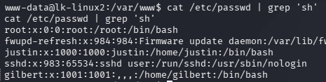

Having `justin`'s credentials, I attempt to switch users by using `su` - which is successful:

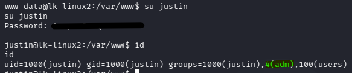

As seen above, `justin` is a member of the _adm_ group - which means that the user will be able to access certain log files. Clearly, I did not have this ability as `www-data`. 

I attempt once more to manipulate the contents of `justin`'s _.ssh_ directory - however, it still blocks my attempts at placing files within it:

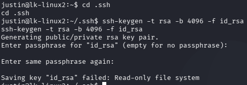

Continuing on the avenue of log file access, I grep for strings within the _/var/log_ directory, which results in the discovery of `gilbert`'s cleartext password:

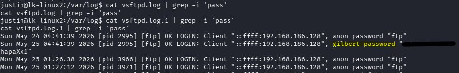

## Exploiting `sudo git`

Applying these credentials while attempting to authenticate as `gilbert` over SSH is successful:

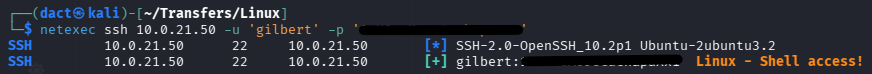

Therefore, I will establish a session over SSH as `gilbert`:

```bash
ssh gilbert@10.0.21.50
```

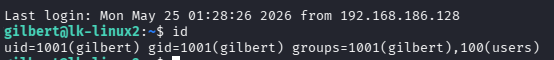

Once confirming command execution, I review whether `gilbert` can execute commands in an elevated manner:

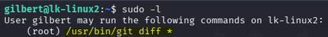

As seen above, `gilbert` can execute `git diff` with a wildcard (`*`). This means that I can compare contents of two different files, any file from the filesystem. Now, I could have used it to read `root`'s private SSH key but it doesn't exist. Also, it can be used to read _/etc/shadow_ but cracking `root`'s hash would have proved difficult for my hardware (stored as yescrypt) . More importantly, in this case, it does that through `less`, which has a shell escape capability. This can be used to escalate privileges in the following manner:

```bash
sudo /usr/bin/git diff /home/gilbert/input /var/log/mail.log
```

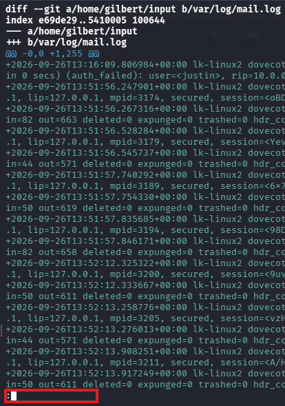

As seen above, highlighted in red - I can input commands into `less`, which will be executed as `root` since that's the context through which I ran `git diff`. I can simply use the shell escape operator (`!`) in the following manner -  `!/bin/bash`, and spawn a `root` shell, as seen below - and confirm command execution as `root` and full host compromise:

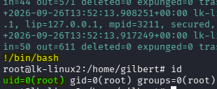

