# Summary

_SysAdmins_ is a medium rated machine from _HackSmarter_ in which the target host is a Linux machine hosting an FTP, Web and SNMP servers. Its compromise is mainly due to the factors below:

- The FTP server can be accessed without actual credentials, `anonymous` session is allowed and does not even prompt for a password. This allowed me to get a hold of a file linking a publicly available list of passwords that were exfiltrated. At a minimum, disabling anonymous FTP access would mitigate this risk
- Staff disclosure allows the collection of potentially valid usernames. Although it is not a classic vulnerability or misconfiguration to be mitigated - it is required to think whether it is necessary and know the risk that accompany it.
- A valid password appears on a published credential list online and was not changed in due time - it is still valid and allowed me to authenticate to the SNMP server. An elementary mitigation to this risk is the immediate changing of passwords of all users after a breach has been detected.
- Cleartext credentials stored in a cronjob were detected while enumerating SNMP, this allowed me to establish a session on the target host. To minimize the risk - storing credentials in a secret management mechanism or another obfuscation mechanism. 
- Unpatched _sudo_ binary - allowed for privilege escalation. Can be patched to the latest stable released _1.9.17p2_.

---
# Introduction

## Objective

You have been hired to perform a penetration test against a sensitive Linux server in the client's internal network. Your task is to thoroughly enumerate the machine, identify all vulnerabilities, and (if possible) elevate your privileges to root to demonstrate impact.

## Initial Access

The client has provided you with VPN access but no other information.

----
# Full TCP Range Scan

Scanning the target host with the following command:

```bash
sudo nmap -A -T4 -v -oN Scans/SysAdmins_TCP 10.1.61.132 -Pn -p-
Host is up (0.098s latency).
Not shown: 65532 closed tcp ports (reset)
PORT   STATE SERVICE VERSION
21/tcp open  ftp     vsftpd 3.0.5
| ftp-anon: Anonymous FTP login allowed (FTP code 230)
|_-rw-r--r--    1 0        0             742 Jul 13 12:39 data_breach_notification.txt
| ftp-syst: 
[...]
22/tcp open  ssh     OpenSSH 9.6p1 Ubuntu 3ubuntu13.16 (Ubuntu Linux; protocol 2.0)
[...]
80/tcp open  http    nginx 1.24.0 (Ubuntu)
|_http-title: Sysadmins - System Administration Services
|_http-server-header: nginx/1.24.0 (Ubuntu)
| http-methods: 
|_  Supported Methods: GET HEAD
No exact OS matches for host (If you know what OS is running on it, see https://nmap.org/submit/ ).

```

## Notes on Scan Results

- FTP server accessible over default port 21. Scan script result detected that anonymous login is allowed.
- _OpenSSH 9.6p1_ accessible over default port 22.
- _nginx 1.24.0_ web application accessible over default port 80.

---
# Top UDP Ports Scan

```bash
sudo nmap -sU --top-ports 20 -T4 -A -oN Scans/SysAdmins_UDP.nmap -v --open 10.1.61.132
Nmap scan report for 10.1.61.132
Host is up (0.099s latency).
Not shown: 13 closed udp ports (port-unreach)
PORT     STATE         SERVICE      VERSION
68/udp   open|filtered dhcpc
69/udp   open|filtered tftp
139/udp  open|filtered netbios-ssn
161/udp  open          snmp         net-snmp; net-snmp SNMPv3 server
| snmp-info: 
|   enterprise: net-snmp
|   engineIDFormat: unknown
|   engineIDData: 13f3f36692d0546a00000000
|   snmpEngineBoots: 10
|_  snmpEngineTime: 15m09s
445/udp  open|filtered microsoft-ds
514/udp  open|filtered syslog
1900/udp open|filtered upnp
Too many fingerprints match this host to give specific OS details
[...]
```

- _SNMPv3_ server accessible over default port 161.

---
# FTP (21/TCP)

Knowing that anonymous access is allowed, I used `anonymous` as username and was not prompted for password. Listing the contents of the server:

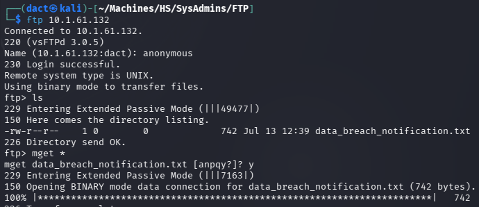

As seen above, a single _txt_ file was downloaded to my local host. Reading the file, it holds information about a breach that occurred _last week_, exfiltration and publishing of credentials online - supplying a link to it.

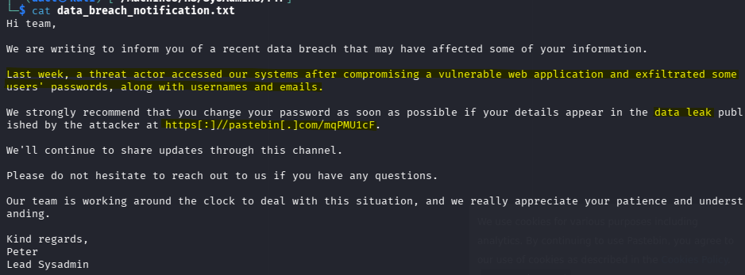

Accessing the resource, it is a list of 100 passwords:

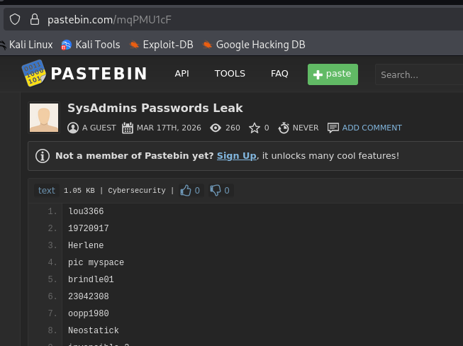


# _nginx 1.24.0_ HTTP Web Application (80/TCP)

- Reviewing the tech stack with _whatweb_ and _curl_ did not divulge any useful or previously unknown information.

## Website Browsing

Browsing to `http://10.1.61.132/` leads to the following web page:


A rather basic website; again - does not disclose any actionable information. 
## Content Discovery

The following command was used to enumerate hidden directories and files on the target web server:

```bash
feroxbuster -u 'http://10.1.61.132/' -w /usr/share/wordlists/dirb/common.txt
```

Within the output, I notice what appears to be staff name disclosure in the _/images/team/_ directory:

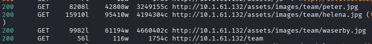

Browsing to `http://10.1.61.132/team` to verify whether there are other members whose URLs were not detected:

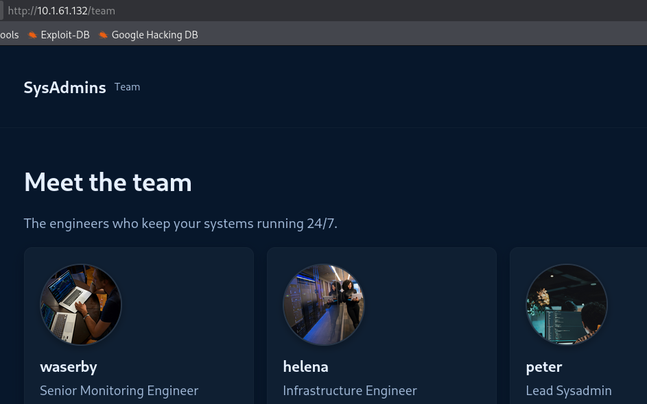

I collected the three potential usernames and placed them in a list.

# Foothold

## SNMP Bruteforce

After trying to bruteforce SSH by combining the above users and the recovered password file - which did not result in any successful authentications, I moved on to try and do the same now targeting SNMP. For that task, I will use _legba_, as _hydra_ proved problematic for the task as it is not optimized to target SNMP v3 servers:

```bash
legba --target 10.1.61.132 --username Lists/users.txt --password Lists/SysAdmins_Passwords_Leak.txt snmp3
```

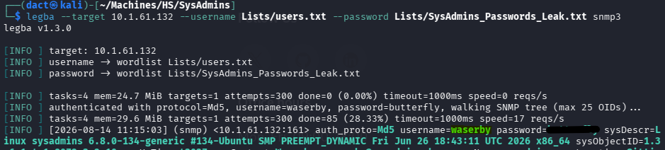

As seen above, I manage to authenticate as `waserby`. 

## SNMP Enumeration

Having valid credentials for the server, I will attempt to enumerate it using _snmpwalk_:


```bash
snmpwalk -v3 -u waserby -l authNoPriv -a MD5 -A 'butterfly' 10.1.61.132
```

The output is quite massive, after reviewing it I notice what seems to be a cleartext password and the context of which it appears ties it to `helena` and running as a cronjob.

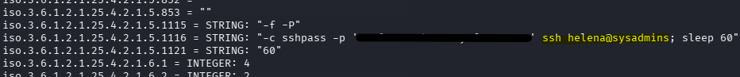

Testing the recovered password - it authenticates `helena` successfully:

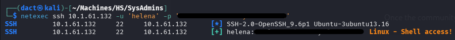

# Privilege Escalation

Having valid SSH credentials, I establish a session on the target host:

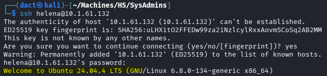

`helena` is the only non-default user with _bash_ console:

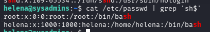

After reviewing the file system shortly, I note that the _sudo_ version falls within the range of a year old _sudo_ vulnerability, [CVE-2025-32463](https://nvd.nist.gov/vuln/detail/cve-2025-32463):

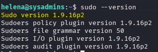

[CVE-2025-32463](https://www.oligo.security/blog/new-sudo-vulnerabilities-cve-2025-32462-and-cve-2025-32463) affects version of _sudo_ prior to 1.9.17p1. The exploit relies on a user controlled directory that contains a fake _/etc/nsswitch.conf_ file and a malicious  `libnss_*.so` file - then invoking the binary. 

To exploit the vulnerability, I have used the script of this [PoC](https://github.com/kh4sh3i/CVE-2025-32463), it was transferred to target host, then executed:

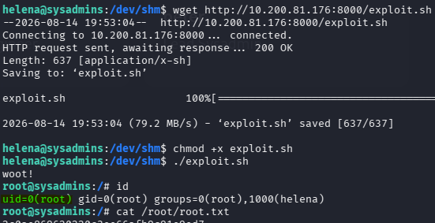

As seen above - the execution is followed by spawning a `root` shell which is then confirmed by running _id_. 