# Summary

_Walnut_ is an easy rated machine from _HackSmarter_, target host is a Linux machine. Its compromise is mainly due to the factors below:

- Cleartext credentials retrievable from _OpenLDAP_ - an administrative note in one of the user's description attribute disclosed an allegedly old password. To remediate, remove password entries, regardless of their alleged status, from accessible locations such as LDAP directories.
- Writable SAMBA share exposing SSH keys - allowed retrieval of private SSH keys and the subsequent foothold on the target host. To remediate, apply least-privilege access control, ensure private SSH keys and other sensitive files are not accessible on shared resources. 
- Insecure credential storage - cleartext passwords were stored within files with minimal obfuscation of the corresponding username, allowing for the compromise of four different users. To remediate, implement a password and secret manager and update existing scripts so they would access credentials from a secure source.
- Users can execute elevated commands without providing a password - allowed execution elevated commands without password authentication. In this case, the password had already been obtained, so this misconfiguration did not materially contribute to the compromise. To remediate, require password authentication when executing elevated commands.
- Excessive permissions to sensitive files - the compromised user was able to write to a sensitive file, _/etc/exports_, granting full access to the filesystem. In conjunction with the elevated program, this enabled access to further sensitive files and alter their contents which eventually led to a full system compromise. To remediate, restrict write access to sensitive files unless they are explicitly required. 

## Graphical Summary

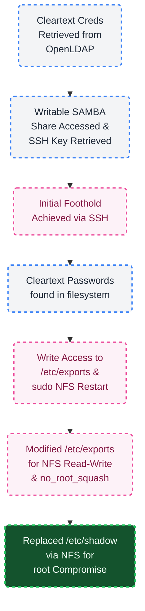

---
# Introduction

## Objective

You have been assigned a penetration test on a critical Linux server in the client's environment. The primary objective is to gain root-level access to this system to demonstrate maximum impact from the engagement.

## Credentials

Assumed breach scenario, therefore credentials are provided (`larryburns`:`ILoveMontgommery!`) and the hostname _walnut.local_.

---
# Full TCP Range Scan

Scanning the target host with the following command:

```bash
sudo nmap -v -p- --min-rate 3000 -T4 -sS -n -Pn -oN Scans/Walnut_TCP_discovery walnut.local
ports=$(grep open Scans/Walnut_TCP_discovery | cut -d'/' -f1 | paste -sd,)
sudo nmap -p$ports -v -sC -sV -sT -T4 -oN Scans/Walnut_TCP_service walnut.local

Nmap scan report for walnut.local (10.1.26.244)
Host is up (0.10s latency).

PORT      STATE SERVICE     VERSION
22/tcp    open  ssh         OpenSSH 9.6p1 Ubuntu 3ubuntu13.18 (Ubuntu Linux; protocol 2.0)
| ssh-hostkey: 
|   256 a1:50:1d:04:de:66:51:74:29:2d:8e:87:af:5d:7d:17 (ECDSA)
|_  256 4a:db:47:8c:fa:61:66:2e:22:e5:df:da:bb:b3:ce:c5 (ED25519)
111/tcp   open  rpcbind     2-4 (RPC #100000)
| rpcinfo: 
|   program version    port/proto  service
|   100003  3,4         2049/tcp   nfs
|_  100003  3,4         2049/tcp6  nfs
139/tcp   open  netbios-ssn Samba smbd 4
389/tcp   open  ldap        OpenLDAP 2.2.X - 2.3.X
445/tcp   open  netbios-ssn Samba smbd 4
2049/tcp  open  nfs         3-4 (RPC #100003)
36677/tcp open  status      1 (RPC #100024)
39329/tcp open  mountd      1-3 (RPC #100005)
40345/tcp open  nlockmgr    1-4 (RPC #100021)
41291/tcp open  mountd      1-3 (RPC #100005)
56251/tcp open  mountd      1-3 (RPC #100005)
Service Info: OS: Linux; CPE: cpe:/o:linux:linux_kernel

Host script results:
| nbstat: NetBIOS name: WALNUT, NetBIOS user: <unknown>, NetBIOS MAC: <unknown> (unknown)
| Names:
|   WALNUT<00>           Flags: <unique><active>
|   WALNUT<03>           Flags: <unique><active>
|   WALNUT<20>           Flags: <unique><active>
|   \x01\x02__MSBROWSE__\x02<01>  Flags: <group><active>
|   WORKGROUP<00>        Flags: <group><active>
|   WORKGROUP<1d>        Flags: <unique><active>
|_  WORKGROUP<1e>        Flags: <group><active>
|_clock-skew: -2s
| smb2-time: 
|   date: 2026-09-01T21:08:44
|_  start_date: N/A
| smb2-security-mode: 
|   3.1.1: 
|_    Message signing enabled but not required
```

## Notes on Scan Results

- _OpenSSH 9.6p1_ accessible over default port 22.
- NFS and RPC related accessible over default ports 111, 2049, ≥ 36677
- SAMBA accessible over default port 445.
- _OpenLDAP_ accessible over default port 389.
---
# Initial Service Enumeration

## SAMBA (445/TCP)

The provided credentials are not an actual edge when it comes to share enumeration, as the access is `Guest`. Apart from listing the shares and noting _automation_ as a non-default share - it does not provide anything of substance. 

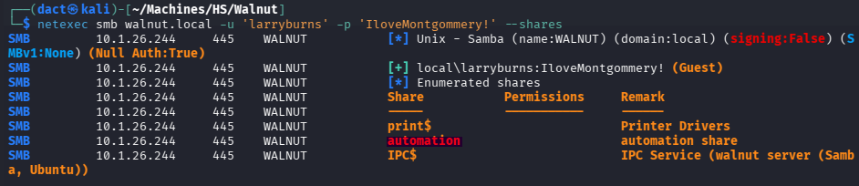

# Foothold
## OpenLDAP (389/TCP)

Having (allegedly) valid credentials, I can attempt to enumerate LDAP. Starting with _netexec_ threw an error, so I continued using _ldapsearch_. The query execution itself took some effort to construct, I referred to [OpenLDAP documentation](https://www.openldap.org/doc/admin24/access-control.html), where I found the below example:

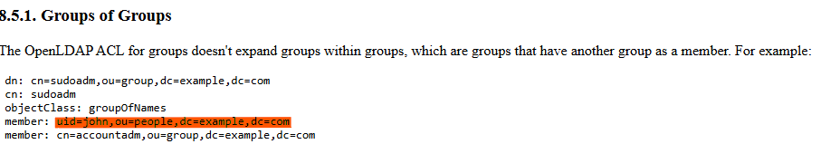

Applying this example, I managed to get through and obtained a valid output:

```bash
ldapsearch -x -H ldap://walnut.local -D 'uid=larryburns,ou=People,dc=walnut,dc=local' -w 'IloveMontgommery!' -b 'dc=walnut,dc=local' > LDAP/ldapsearch.txt
```

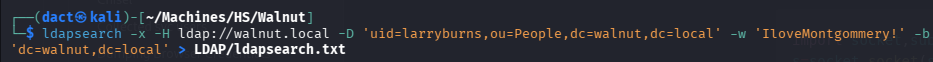

Reviewing the output, grepping for key words, I found an old password belonging to `automation`:

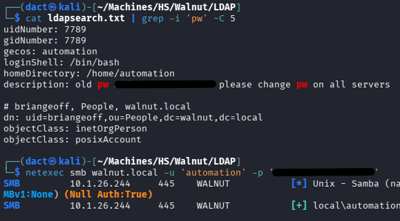

As seen above, I managed to authenticate using this password. However, I could not use it to start a session over SSH. Instead, I returned to SMB - checking my current permissions as `automation`:

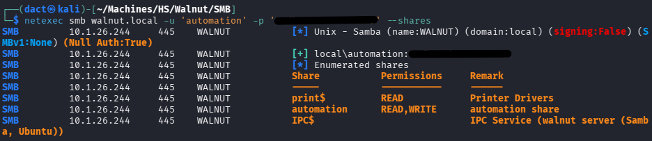

Having full read and write permissions to the _automation_ share, I review its contents:

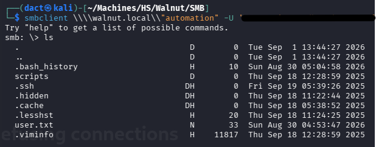

I note the _.ssh_ directory and reach for the private key:

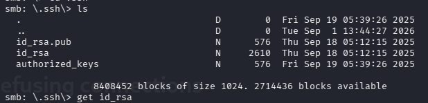

Applying the private key after changing its permissions with `chmod 600`, I manage to authenticate and establish a session on the target host as `automation`:

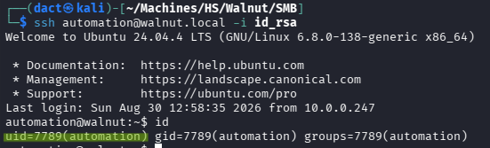

# Privilege Escalation

## File System Enumeration

Glancing over the content on `automation`'s home directory, I note a _.hidden_ directory and a _scripts_ directory:

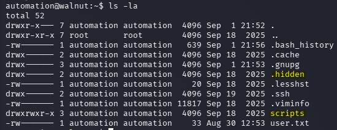

Inspecting their contents, the latter contains a script and the former contains a few unidentified files:

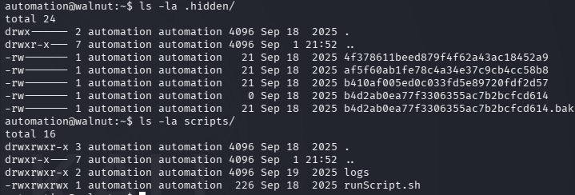

## Compromising Additional Users

_runScript.sh_ uses `su` uses two arguments to run specific commands as a certain user. The first argument is a username, which is converted to its MD5sum, the second one is the command that should be executed. 

```bash
#!/bin/bash

PARM1="$1"
PARM2=`echo -n "$1" | md5sum | cut -d' ' -f 1`
PARM3="$2"
DATE=`date +%d.%m.%Y-%Hh%m.%S`

su - "$PARM1" -c "$PARM3" < /home/automation/.hidden/"$PARM2" > /home/automation/scripts/logs/"$1"-"$DATE".log
```

What indicates the password input is `< /home/automation/.hidden/"$PARM2"`, the password is read from files that are named after each user's MD5 hash. In short, the password is stored within the files on _.hidden_. To get the filenames corresponding cleartext, it's possible to read the entries from _/etc/passwd_, produce an MD5 hash from them and compare the outcome to the values within _.hidden_:

```bash
for u in $(cut -d: -f1 /etc/passwd); do
    h=$(printf '%s' "$u" | md5sum | cut -d' ' -f1)
    for f in .hidden/*; do
        [ "$(basename "$f")" = "$h" ] && echo "$u -> $f"
    done
done
```

Once executed, I can understand which file refers to which of the users:

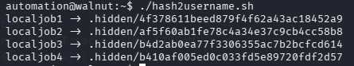

Going one after the other, reading the files and getting all 4 users passwords in the following manner:

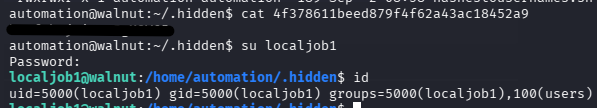

The user worth noting for its ability to execute in an elevated manner is `localjob3`. It can restart a service related to NFS. While executing the below command won't restart NFS - it will enforce changes in its configuration, if these occurred:

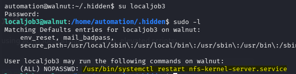

One simple target to abuse the ability to enforce configuration changes is _/etc/exports_:

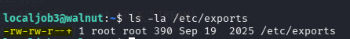

As seen above, in this specific case - the file permissions contain `+`, an ACL indicator better understood if inspected with `getfacl`:

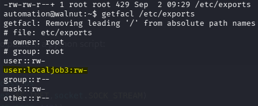

`localjob3` can write to _/etc/exports_ - meaning he can alter its contents and potentially grant access to the entire file system over NFS. Currently, as seen below, there aren't any mounts available when attempting to list shares:

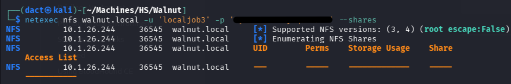

There are at least two ways to abuse the current rights on _/etc/exports_:

- Grant read rights to the entire file system - will allow me to fetch `root`'s private key or _/etc/shadow_'s contents without altering existing files.
- Grant read and write rights to the entire file system - will allow me to change the contents of _/etc/shadow_ and _/etc/passwd_, _/usr/bin/bash_, private SSH keys, etc., potentially replacing them with ones of my own making.

## Read-Only Attempt

Altering _/etc/exports_, granting complete, read-only access to the file system:

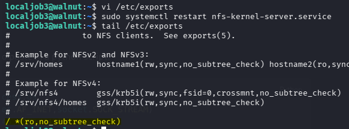

Running `sudo /usr/bin/systemctl restart nfs-kernel-server.service` enforces the change. Checking the mounts now, it includes `*` - all the file system can be access through NFS:

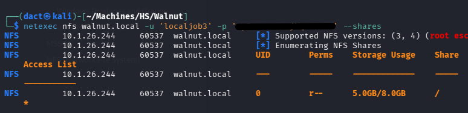

Fetching _/etc/shadow_ successfully:

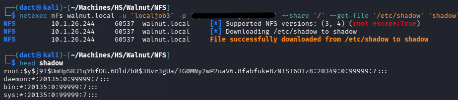

_/etc/shadow_ won't assist me going forward. Also, trying to retrieve `root`'s private SSH key fails since it does not exist.

## Read-Write Rights

Granting read-write and _no_root_squash_, I can now abuse every file on the target host's file system. An easy manipulation will be to insert a `root` password to _/etc/shadow_ and replace the original file.

Granting the relevant rights:

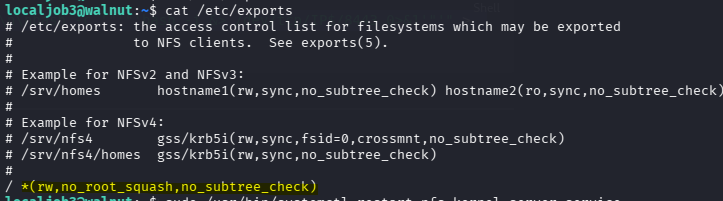

Generating a password entry, inserting it to the previously-downloaded _shadow_ file (the generation below is an example, does not fit the eventual entry I previously inserted to the _shadow_ file):

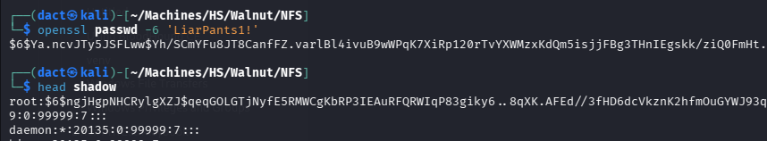

Replacing the file on the target host:

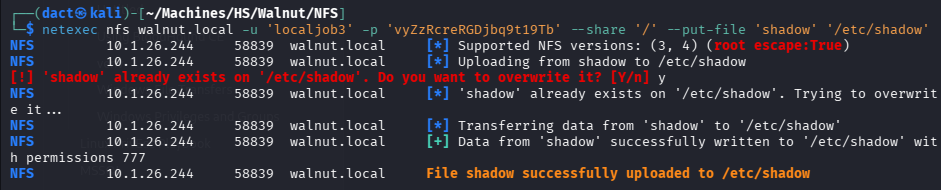

Switching user and applying the password, switching user to `root`, confirming command execution and host being fully compromised:

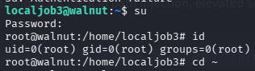

