# Summary

_NorthBridge_ is a hard rated machine on the _HackSmarter_ platform. In order to fully compromise the target hosts, one must exploit/abuse multiple vulnerabilities/misconfigurations:

- Cleartext credentials stored within multiple locations. Although most were not applicable in the context of this engagement, one of them was and led to the compromise of a service user. Remediation is purging cleartext credentials from scripts, their readme files, etc.
- Excessive ACL grant, led to the compromise of one of the hosts via RBCD. ACLs should be periodically audited so grants and privileges are relevant and justified. 
- Incomplete hardening left a gap from which RBCD was possible to perform. While the default Machine Account Quota is 10, it was set to 0 in order to harden the domain. However, _CREATE_CHILD_ rights on an OU allowed that safeguard to be circumvented and create a workstation account. To remedy this gap, remove _CREATE_CHILD_ rights where they are not needed. 
- DPAPI credentials for a domain-privileged account are recoverable by a local administrator on a workstation. This enabled access to sensitive hives which resulted in the compromise of the domain. In this context, using gMSA or a dedicated secrets manager to store passwords would eliminate this risk.
- NTLM authentication allowed me to perform Pass-the-Hash. It played a part when I used the harvested credentials and the eventual compromise. Disable NTLM authentication and enforce Kerberos authentication instead.

# Graphical Summary

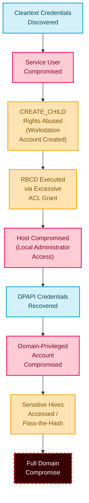

---
# Introduction

## Objective / Scope

NorthBridge Systems is a managed service provider that has engaged the Hack Smarter Red Team to perform a security assessment against a portion of their environment. The assessment is to be conducted from an assumed breach perspective, as you have been provided credentials for a dedicated service account created specifically for this engagement.

Your point of contact at NorthBridge Systems has authorized testing on the following hosts. Any host outside this scope is considered out of scope and should not be accessed.

- NORTHDC01 (Domain controller)
- NORTHJMP01 (Jump box user by the IT team)

The primary objective of the security assessment is to compromise the domain controller (NORTHDC01) in order to demonstrate the effectiveness (or lack thereof) of the recent security hardening activities.

To track your progress in the assessment, there are flags located at C:\Users\Administrator\Desktop on each host.

As you progress through the environment, make sure to document these flags so your point of contact knows you have compromised the environment.

Your success in this assessment will directly inform their future cybersecurity budget! No pressure!

## Starting Credentials

```
_securitytestingsvc:4kCc$A@NZvNAdK@
```

---
# Nmap Scans
## Host Information

As a preliminary step, I authenticate to the target hosts using the disclosed credentials - from the output I can draw the hostnames, domain name and FQDNs:

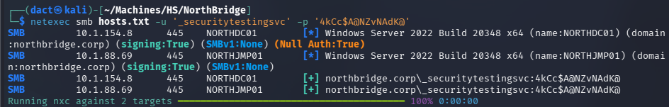

These were added as entries to my local hosts file:

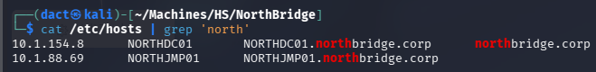

## Full TCP Range Scan

Scanning the target hosts with the following command:

```bash
sudo nmap -T4 -v -oN Scans/NorthBridge_TCP_Service -iL host_names.txt -Pn -A
```

### Notes on Scan Results (_NORTHDC01_)

```bash
Nmap scan report for NORTHDC01 (10.1.154.8)
Host is up (0.099s latency).
Not shown: 988 filtered tcp ports (no-response)
PORT     STATE SERVICE       VERSION
53/tcp   open  domain        Simple DNS Plus
88/tcp   open  kerberos-sec  Microsoft Windows Kerberos (server time: 2026-08-15 19:41:24Z)
135/tcp  open  msrpc         Microsoft Windows RPC
139/tcp  open  netbios-ssn   Microsoft Windows netbios-ssn
389/tcp  open  ldap          Microsoft Windows Active Directory LDAP (Domain: northbridge.corp, Site: Default-First-Site-Name)
[...]
445/tcp  open  microsoft-ds?
464/tcp  open  kpasswd5?
593/tcp  open  ncacn_http    Microsoft Windows RPC over HTTP 1.0
636/tcp  open  ssl/ldap      Microsoft Windows Active Directory LDAP (Domain: northbridge.corp, Site: Default-First-Site-Name)
[...]
3268/tcp open  ldap          Microsoft Windows Active Directory LDAP (Domain: northbridge.corp, Site: Default-First-Site-Name)
[...]
3269/tcp open  ssl/ldap      Microsoft Windows Active Directory LDAP (Domain: northbridge.corp, Site: Default-First-Site-Name)
[...]
3389/tcp open  ms-wbt-server Microsoft Terminal Services
[...]
5985/tcp open  http          Microsoft HTTPAPI httpd 2.0 (SSDP/UPnP)
Service Info: OS: Windows; CPE: cpe:/o:microsoft:windows
```

- Default AD domain controller services (DNS, Kerberos, LDAP, SMB, RDP, WinRM) accessible over default ports.

### Notes on Scan Results (_NORTHJMP01_)

```bash
Nmap scan report for NORTHJMP01 (10.1.88.69)
Host is up (0.099s latency).
Not shown: 997 filtered tcp ports (no-response)
PORT     STATE SERVICE       VERSION
135/tcp  open  msrpc         Microsoft Windows RPC
445/tcp  open  microsoft-ds?
3389/tcp open  ms-wbt-server Microsoft Terminal Services
[...]
5985/tcp open  http          Microsoft HTTPAPI httpd 2.0 (SSDP/UPnP)
[...]
Service Info: OS: Windows; CPE: cpe:/o:microsoft:windows
```

- SMB, RDP and WinRM accessible over default ports.
---
# AD Enumeration

## Password Policy

Using _netexec_'s `--pass-pol` option against the DC to enumerate the domain's password policy:

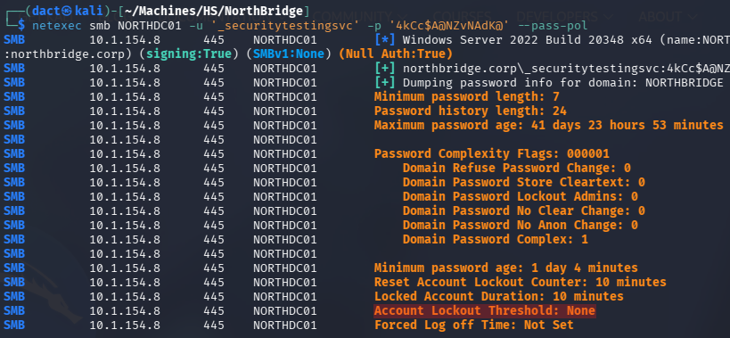

As seen above, there is no account lockout threshold, which will enable me to spray credentials without the restriction of account lockout.

## Domain User Enumeration

Using _impacket-lookupsid_, I can compile a list of valid domain users:

```bash
# Collecting names of domain objects - usernames, groups, etc.
impacket-lookupsid '_securitytestingsvc':'4kCc$A@NZvNAdK@'@NORTHDC01 25000 > Lists/RIDC.txt

# Refining the list to contain valid usernames
grep "(SidTypeUser)" Lists/RIDC.txt | awk -F '\\' '{print $2}' | sed 's/ (SidTypeUser)//' > Lists/users_RIDC.txt
```

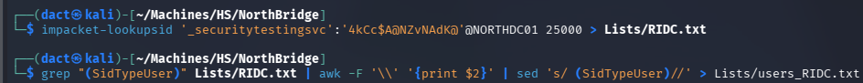

Reviewing the user list, it seems that there are duplicate users for the purpose of tiered accounts, for example `rhall`:

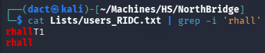

Based on this principal, I can already establish some hierarchy:

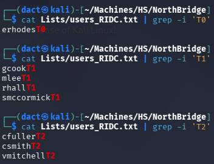

In addition, there are 2 additional service accounts (excluding the one I am using for the test purpose):

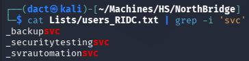

Some users having at least one additional account raises the probability of password re-use - this will be repeatedly checked every time a new set of domain credentials will be harvested.

Initially, I will spray the password supplied for the purpose of this engagement against the domain user list:

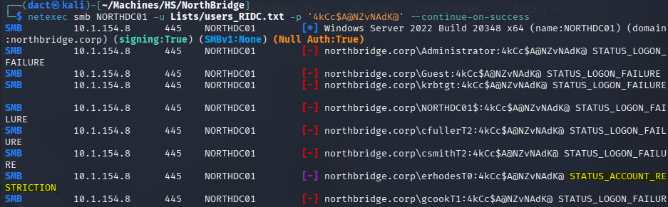

Though it did not authenticate any other user other than the one supplied for the engagement, it does shed light on the fact that the user `erhodsT0` gets _STATUS_ACCOUNT_RESTRICTION_ when trying to authenticate. This status response isn't password-dependent, it can stem from a variety of reasons - usually a safety measure regarding authentication.

## Credentialed LDAP Enumeration

LDAP (Lightweight Directory Access Protocol) is a protocol used to access and manage directory services, such as Active Directory. It operates over **port 389 (unencrypted)** and **port 636 (LDAPS - encrypted with SSL/TLS)** by default.

Having valid domain credentials allows me to enumerate the Active Directory environment using _ldapdomaindump_ and _BloodHound_ ingestor. The output from this tools can help map relationships and identify attack paths visually.

### _ldapdomaindump_

Using `_securitytestingsvc`'s valid credentials to execute _ldapdomaindump_:

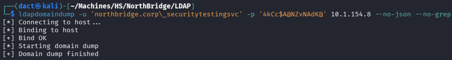

Reviewing the _domain_users_ and _domain_users_by_group_ output files I can gather the following insights:

- `_backupsvc` is a sole member of the _Backup Operators_ group - compromising this user will enable me to compromise the domain completely:

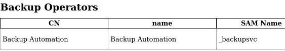

- `erhodsT0` is a member of both _Domain Admins_ and _Protected Users_ group - confirming the tiering naming scheme and explaining _STATUS_ACCOUNT_RESTRICTION_ when attempting to authenticate - as NTLM authentication is probably blocked for it:

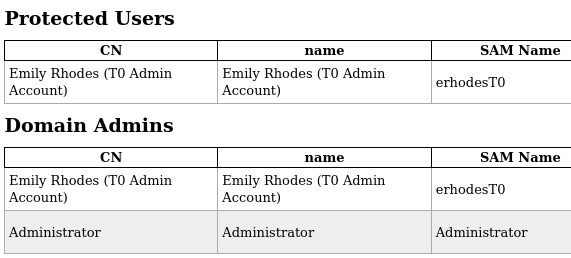

- Membership of _SERVICEDESKPRIV_ and _NORTHJMP01PRIV_ groups also seemed tiered, with the following members in each:

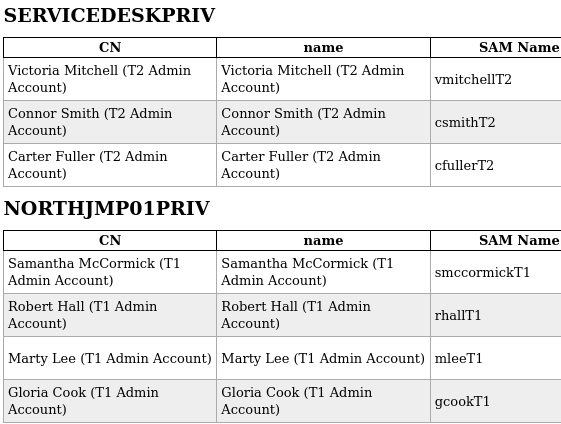

- _IT Leadership_ contains users that are not present in any other group:

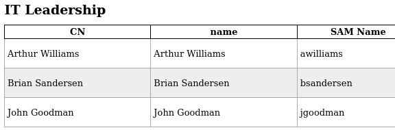

- _Remote Desktop Users_ and _Remote Management Users_ groups have no members.
- My current user `_securitytestingsvc`, has a description indicating it is owned by `Samantha McCormick`, who has two additional accounts - `smccormick` and `smccormickT1`.

### _BloodHound_

Using `_securitytestingsvc`'s valid credentials to execute _bloodhound-python_ collector:

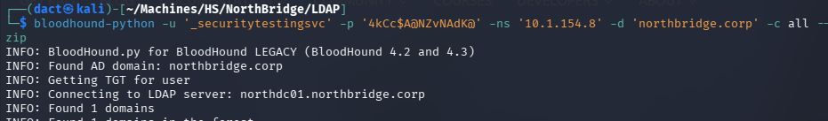

Loading the newly-created _.zip_ file into the _BloodHound_ GUI, I mark `_securitytestingsvc` as owned. Reviewing the different queries, at this point - nothing can be done to advance. 

# _NORTHJMP01_ 

Applying `_securitytestingsvc`'s credentials, I review the SMB share access and check whether the user can establish a session over RDP:

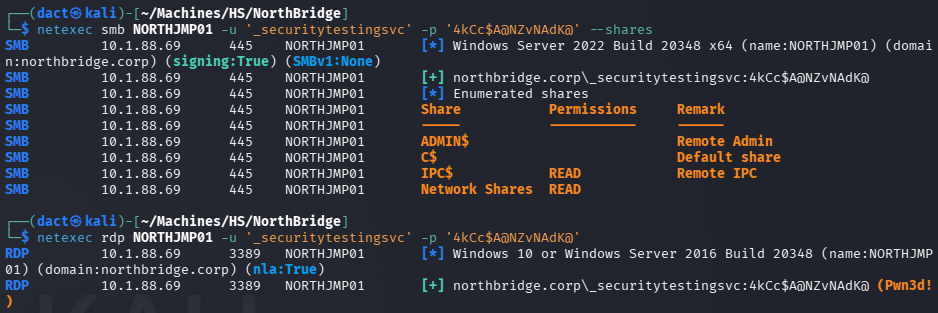

_NORTHJMP01_ hosts the _Network Shares_ directory as an SMB share, `_securitytestingsvc` can use RDP to establish a session on the target host. For ease of navigating, I will start a remote session over RDP:

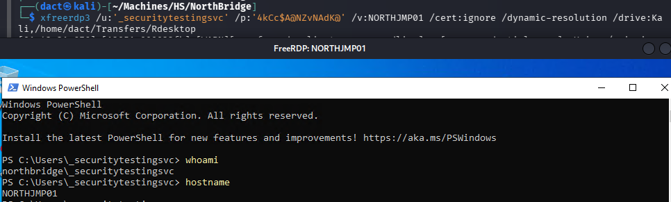
## File System Enumeration

Reviewing _C:\\_, I can note the _Network Shares_ directory and _Scripts_ another, non-default, directory:

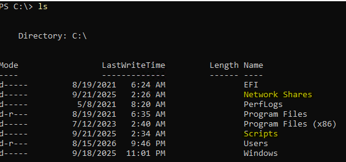

A breakdown of their respective subdirectories:

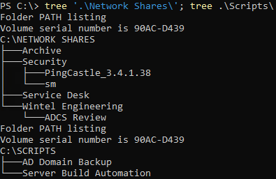

_C:\Network Shares\Archive_ contains a single file, _backup.bat_, in which a _PuTTY_ password is stored:

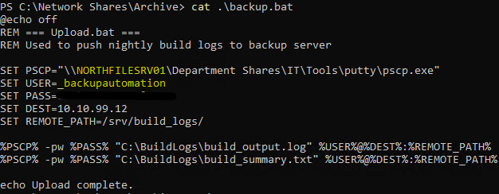

As seen above, the context copying files to a Linux host using _pscp.exe_ (_scp_ for _PuTTY_) hosted on _NorthFILESRV01_. For that, it uses `_backupautomation`. Though I have tried to authenticate, both locally and domain-wise, using these recovered credentials - they do not authenticate the user to any of the two hosts. Also, the Linux and _NORTHFILESRV01_ hosts are not present on the same network. 

In another document, within _C:\Network Shares\Security\sm_, there's a task list aimed to harden the AD environment. I will assume the _sm_ corresponds with `smccormick/T1`, it revolves around DACLs, credentials hardcoded in scripts, MSA migration, ADCS, etc. The current status of these tasks is unknown.

There are a few findings within _C:\Network Shares\Service Desk_ but these are mostly files containing cleartext passwords that aren't authenticating any user, with a domain or local authentication attempts.

_C:\Network Shares\Wintel Engineering_ contains _Privileged accounts notes.txt_, in which a breakdown of password changing schedule and auditing notes about the different accounts:

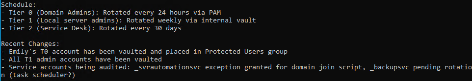

Within _C:\Scripts\AD Domain Backup\Password.txt_, I find a DPAPI blob - I am not able to decrypt it, but I can see its function within _Invoke-NorthADBackup.ps1_, it stores a password for a backup script executed as `_backupsvc`:

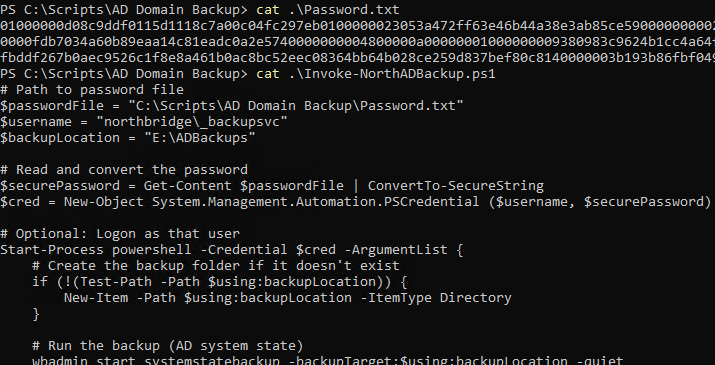

Finally, within _C:\Scripts\Server Build Automation\Readme.txt_, I find another cleartext password:

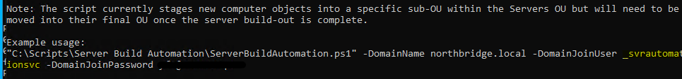

# Lateral Movement

## Attempting to Abuse _WriteAccountRestrictions_

Unlike the previous findings of that sort, this password allows me to authenticate successfully as `_svrautomationsvc`:

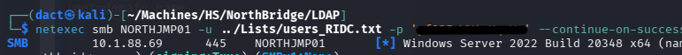

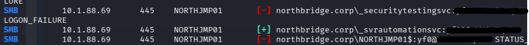

Reviewing `_svrautomationsvc` on the _BloodHound_ UI, the user has the _WriteAccountRestrictions_ ACL over the host _NORTHJMP01_:

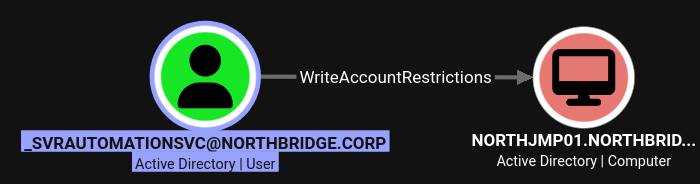

The _WriteAccountRestrictions_ ACL on a host should enable me to perform RBCD - as long as the machine account quota (MAQ) allows me to create new workstation accounts. However, as mentioned earlier in the _C:\Network Shares\Security\sm\sm scratchpad.txt_ file, the MAQ was lowered to 0. I can confirm that with _netexec_:

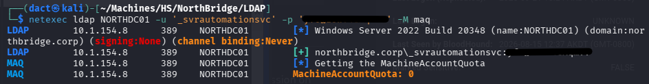

Another option is to perform shadow credentials, which also fails due to insufficient access rights:

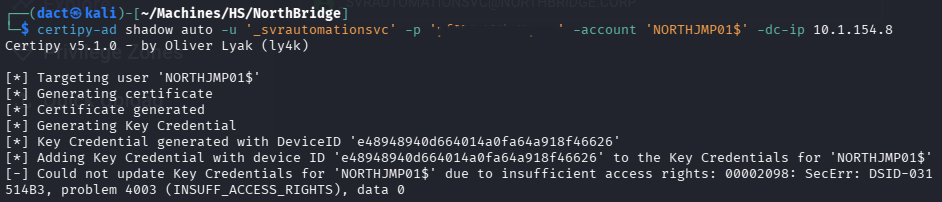

## Working Around MAQ to Perform RBCD

To better understand the scope of my current privilege over _NORTHJMP01_, I will review `_svrautomationsvc`'s writable objects:

```bash
bloodyad  --host NORTHDC01 -d northbridge.corp -u '_svrautomationsvc' -p 'REDACTED' get writable
```

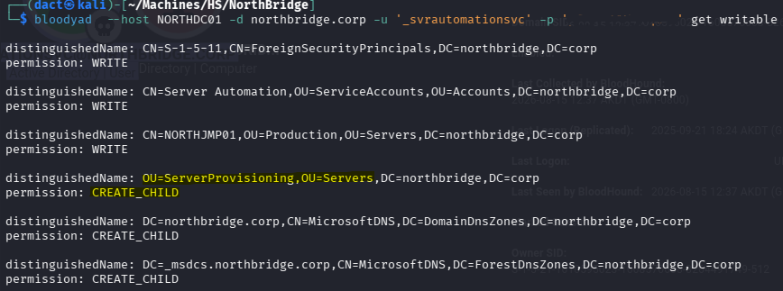

The output brings RBCD back to the table. Although I am not able to add a computer to MAQ, I might use _CREATE_CHILD_ on the _ServerProvisioning_ OU to create an object that would serve for the purpose of RBCD. Currently, there are no computers within _ServerProvisioning_, as seen below:

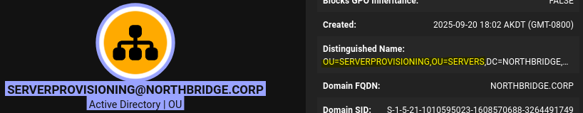

Following [bloodyAD](https://github.com/CravateRouge/bloodyAD/wiki/User-Guide#add-computer) documentation, I will try and add a computer:

```bash
bloodyad  --host NORTHDC01 -d northbridge.corp -u '_svrautomationsvc' -p 'yf0@EoWY4cXqmVv' add computer --ou 'OU=ServerProvisioning,OU=Servers,DC=northbridge,DC=corp' 'LyingServer' 'LiarPants1!'
```

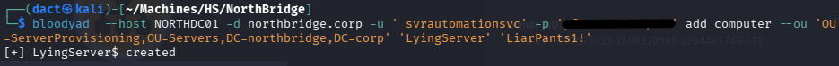

Then, I will get to performing RBCD, delegating from the newly-created workstation account to _NORTHJMP01_:

```bash
impacket-rbcd -delegate-from 'LyingServer$' -delegate-to 'NORTHJMP01$' -dc-ip 10.1.154.8 -action write 'northbridge.corp/_svrautomationsvc:REDACTED'
```

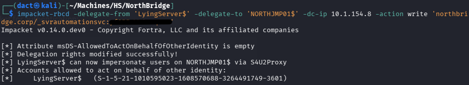

As seen above, I have now populated _msDS-AllowedToActOnBehalfOfOtherIdentity_ on _NORTHJMP01_. It will allow me to impersonate and I will choose a tiered account as my target, specifically `smccormickT1`. The `-hashes` value is `LyingServer$`'s password NT hash:

```bash
impacket-getST -spn 'cifs/NORTHJMP01.northbridge.corp' -impersonate 'smccormickT1' -dc-ip 10.1.154.8 -hashes ':a76cee349724a3d28e6cd74986a62923' 'northbridge.corp/LyingServer$'
```

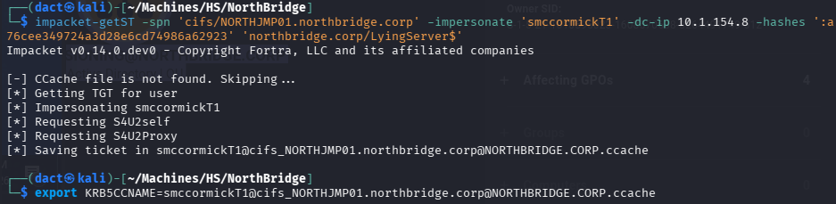

As seen above, it resulted in a Kerberos ticket for `smccormickT1`, which I point to in the context of Kerberos authentication. Next, I will confirm that I can actually authenticate using the ticket:

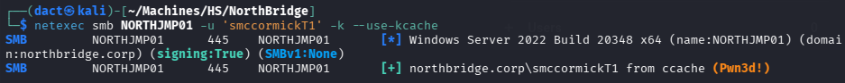

As it is a tiered account, it seemed to be privileged to the level of local admin, hence the _Pwn3d!_ in the output above. Below, I dump _NORTHJMP01_'s _SAM_ hive to harvest the actual local administrator NT hash:

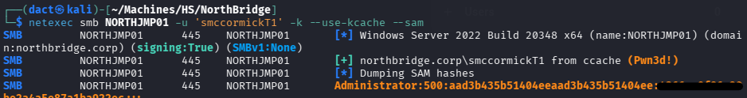

Using Pass-the-Hash to start a session on _NORTHJMP01_ as its local administrator and confirming command execution:

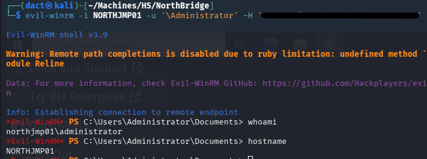

# Privilege Escalation

## Compromising `_backupsvc`

Remembering there are stored credentials mentioned in _C:\Scripts\AD Domain Backup_ directory and the file containing a DPAPI blob I attempt to dump the DPAPI, which results in recovering `_backupsvc`'s cleartext password:

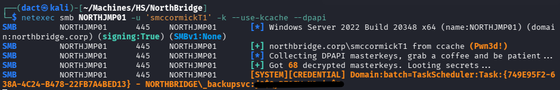

Authenticating successfully as `_backupsvc`:

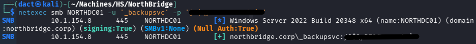

## Abusing _Backup Operators_ Membership

Exploiting its _Backup Operators_ membership to dump _SAM_, _SYSTEM_ and _SECURITY_ hives:

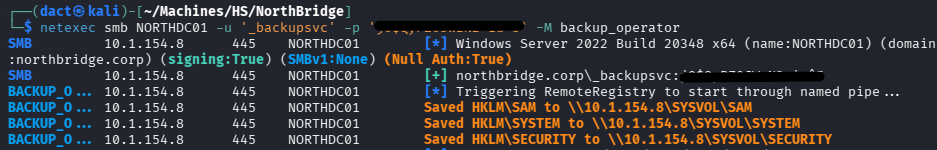

Within the output, the NT hash of `NORTHDC01$` machine account:


Having this hash will allow me to perform DCSync, or just dump NTDS to harvest `Administrator`'s hash - at this point I can confirm I fully compromised the domain:

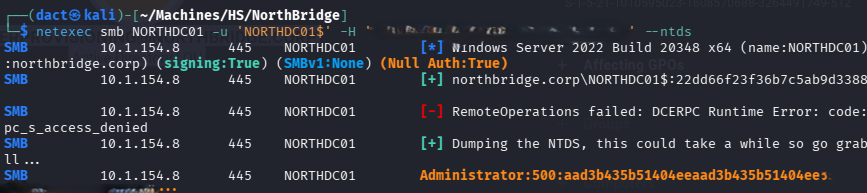

Using the recovered hash, performing Pass-the-Hash to start a remote session over WinRM - confirming command execution as the domain administrator:

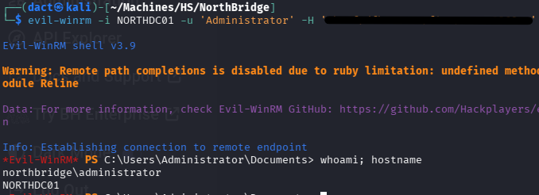

