# Summary

_Orion_ is an easy rated Linux machine hosted on HTB.  Its compromise was achieved mainly due to the following causes:

- CMS version disclosure - The CMS version could be obtained without authentication, which allowed me to conduct version-specific vulnerability search. Restrict version information disclosure with non-authorized users unless it is required.
- Vulnerable CMS version - the installed version of _Craft CMS_ is vulnerable to a pre-authentication RCE vulnerability, which allowed me to gain an initial foothold on the target host. Patching to the latest version (or at least 5.6.17) should remediate the vulnerability. 
- Credential Management - database credentials were stored within the environment variable in cleartext, enabling me to access password hashes stored in the database. 
- Weak password - the previously mentioned hashed password was alphabetic characters only, lacking numbers and special characters, 9 characters long only - which makes it susceptible to cracking, despite a relatively strong hashing algorithm.  Passwords should be set with appropriate complexity and length.
- Vulnerable _telnet_ version - _telnet_'s version is vulnerable to an authentication bypass vulnerability which enabled me to obtain a session as `root`. Patch the version of GNU _inetutils_ to its latest release (2.8). 

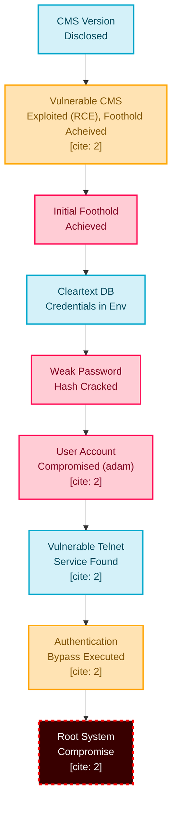

---
# Full TCP Range Scan

Scanning the target host with the following command:

```bash
sudo nmap -A -T4 -v -oN Scans/Orion_TCP orion.htb -Pn -p-
Nmap scan report for orion.htb (10.129.74.190)
Host is up (0.021s latency).
Not shown: 65533 closed tcp ports (reset)
PORT   STATE SERVICE VERSION
22/tcp open  ssh     OpenSSH 8.9p1 Ubuntu 3ubuntu0.15 (Ubuntu Linux; protocol 2.0)
| ssh-hostkey: 
|   256 3e:ea:45:4b:c5:d1:6d:6f:e2:d4:d1:3b:0a:3d:a9:4f (ECDSA)
|_  256 64:cc:75:de:4a:e6:a5:b4:73:eb:3f:1b:cf:b4:e3:94 (ED25519)
80/tcp open  http    nginx 1.18.0 (Ubuntu)
|_http-server-header: nginx/1.18.0 (Ubuntu)
|_http-title: Orion Telecom
| http-methods: 
|_  Supported Methods: GET HEAD POST
Device type: general purpose|router
Running: Linux 5.X, MikroTik RouterOS 7.X
OS CPE: cpe:/o:linux:linux_kernel:5 cpe:/o:mikrotik:routeros:7 cpe:/o:linux:linux_kernel:5.6.3
OS details: Linux 5.0 - 5.14, MikroTik RouterOS 7.2 - 7.5 (Linux 5.6.3)
```

## Notes on Scan Results

- _OpenSSH 8.9p1_ accessible over default port 22
- _nginx 1.18.0_ HTTP server accessible over default port 80.
---
# _nginx/1.18.0_ Web Application (80/TCP)

## Tech Stack

### _cURL_

The following command was used to retrieve HTTP headers from the target web server:

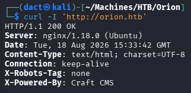

As seen above, it seems that _Craft CMS_ is installed on the target web application. 

### _whatweb_

_whatweb_ is a tool used for fingerprinting web applications, detecting technologies, frameworks, and server details.
The following command was used to identify web technologies running on the target:

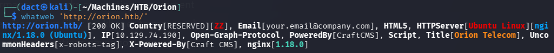

Does not disclose new information but reaffirms _Craft CMS_.

## Website Browsing

Browsing to `http://orion.htb/` leads to the following web page:

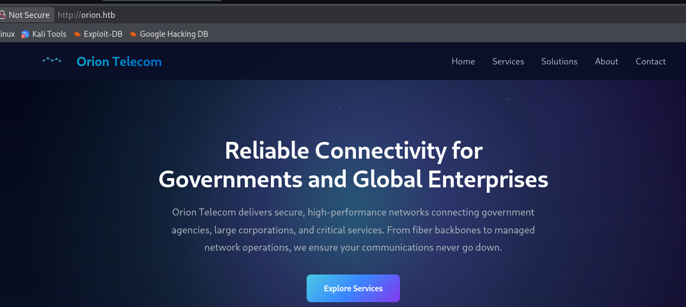

It does not contain much content. 

## Content Discovery

The following command was used to enumerate hidden directories and files on the target web server:

```bash
feroxbuster -u 'http://orion.htb/' -w /usr/share/wordlists/dirb/common.txt
```


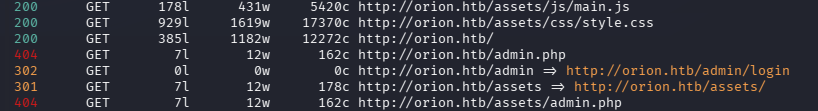

As seen above, within the output - _/admin/login_ page is detected. Browsing to the page leads to the below login form, at the bottom of the page - _Craft CMS_ version disclosure. 

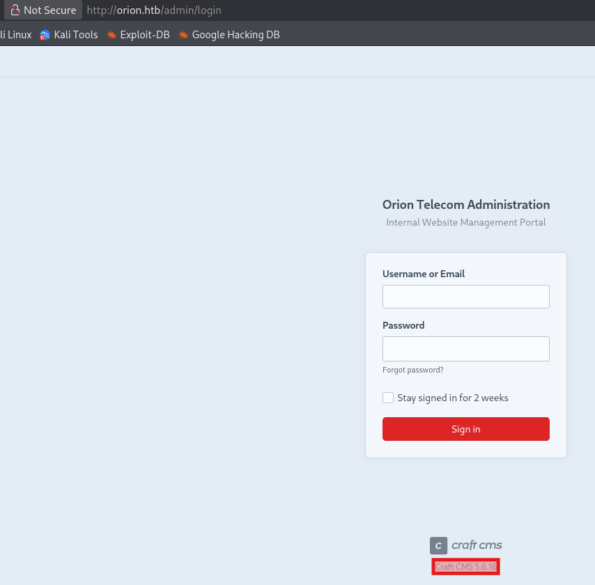

_Craft CMS_ [version 5.6.16 ](https://github.com/craftcms/cms/releases/tag/5.6.16) was released on Apr 8, 2025. Googling the version information, I find that it is vulnerable to [CVE-2025-32432](https://nvd.nist.gov/vuln/detail/CVE-2025-32432), _Craft is vulnerable to remote code execution. This is a high-impact, low-complexity attack vector_, according to the advisory. _Craft_ passes a user-supplied POST data into an image-transform end point (`generate-transform`) without restricting which data passes through. In short, it is an RCE vulnerability that bypasses authentication. 

# Foothold

## Exploiting CVE-2025-32432

To exploit this vulnerability, I first used a script to test it on the instance in question, then attempted to read the _/etc/passwd_ file contents. 

- Used the [first script](https://github.com/Sachinart/CVE-2025-32432) to confirm vulnerability:

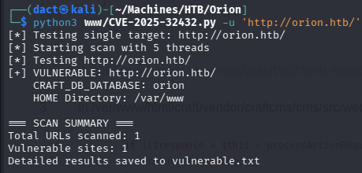

- Used the [second script](https://github.com/c0gnit00/CVE-2025-32432) to execute commands, starting with username enumeration:

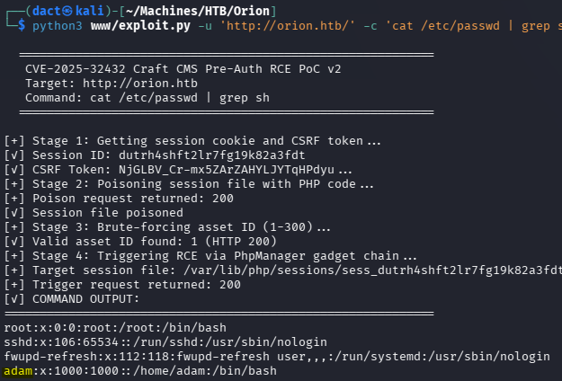

Knowing that I can execute commands, I tried various reverse shell payloads:

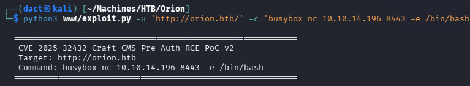

As seen below, _busybox_ payload triggered a connection to my _netcat_ listener, then I was able to execute commands as `www-data`:

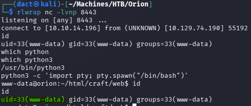

# Lateral Movement

## File System Enumeration - Compromising `adam`

Reading _env_, I find it contains cleartext passwords for a stored database:

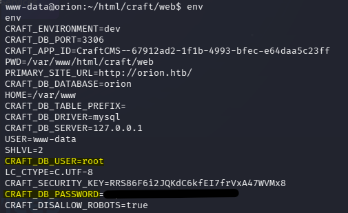

I apply the harvested credentials to interact with the database through _mysql_:

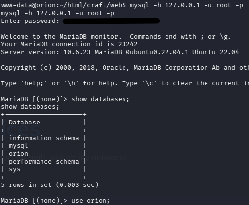

After choosing the _orion_ database, I present the contents of the _users_ table and recover a hash password:

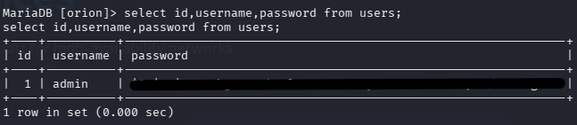

The recovered hashed password matches _bcrypt_, so I attempt to crack it with _hashcat_ on my bare metal host:

```
.\hashcat.exe -m 3200 -a 0 .\ToCrack\orionadmin.txt .\rockyou.txt
```

As seen below, the hash is cracked and I recovered a password:

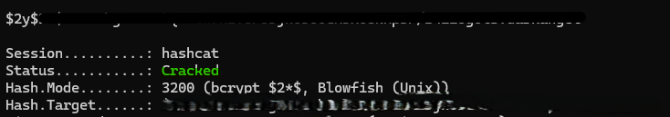

As a first step, I attempt to use `su` to change user to `adam` in conjunction with the recovered password - which succeeded:

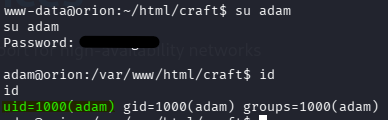

Then, I attempt to authenticate over SSH - which succeeded as well:

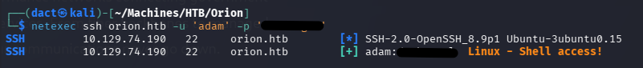

I establish a remove session over SSH:

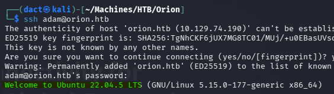

# Privilege Escalation

After reviewing the file system for a while, I inspect the connections on the target host and find that it is listening on port 23 (telnet), a non-standard port which was not detected when scanned the host was previously scanned with _nmap_, it is bound to the local host on loopback only:

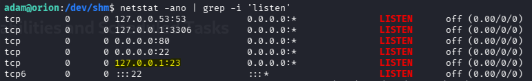

Interacting with the service using _telnet_ prompts me for credentials:

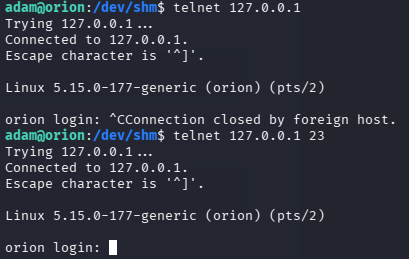

After trying to reuse the harvested credentials in a few combinations, I checked the version of the service:

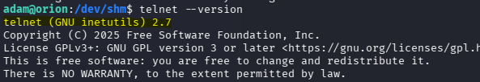

The installed _telnet_ is a part of _inetutils 2.7_, a collection of network clients and server developed by the GNU projects, it includes basic tools like _ping_, _ftp_, _telnet_, etc. 

Searching for related vulnerabilities I find [CVE-2026-24061](https://nvd.nist.gov/vuln/detail/cve-2026-24061), an authentication bypass vulnerability in _telnet_ released in GNU _inetutils_ in versions ranging from 1.9.3 to 2.7. It exploits invoking of _/usr/bin/login_ that runs as `root`, passes the value of _USER_ environment variable from the client - if the _USER_ value supplied is `-f root`, the client will automatically log in as `root` without any authentication. 

To exploit this vulnerability I will use [this designated](https://www.exploit-db.com/exploits/52524) exploit script, copying it to the target host and executing it:

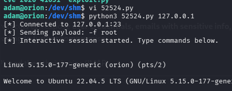

I can then perform command execution as `root`, confirming the compromise of the target host:

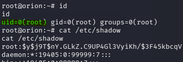

