# Machine Summary

_ShadowGate 2_ is a medium rated machine from _HackSmarter_ in which the target host is an Active Directory domain controller. Its compromise is mainly due to the factors below:

- Exposed login form, vulnerable to SQL injection that bypasses authentication. It can be remediated with user-supplied input validation.
- Unrestricted file upload through web application in conjunction with NTLM authentication allows for NTLM theft. Upload restriction based on file type, magic bytes should resolve the upload vector, while disabling NTLM authentication will mitigate the risk from NTLM theft.
- Weak credentials led to the compromise of multiple accounts (used non-complex, shorter than ideal passwords). This risk can be mitigated by implementing password policy with complexity and length values while preventing use of common compromised passwords.
- The `administrator` account has an SPN set, though its password did not crack during the engagement. SPN(s) need to be reviewed periodically and removed from privileged accounts, to minimize the risk of Kerberoasting.
- Excessive ACLs such as _ForceChangePassword_, _GenericAll_, _WriteOwner_ allowed multiple lateral movements. ACLs need to be audited periodically - granted when justified, revoked when they are not.
- Recoverable privileged user in AD's _Deleted Objects_ allowed for privilege escalation in conjunction with ADCS misconfigurations. Remove or permanently decommission accounts, especially privileged, as soon as possible. Similarly to ACLs, ADCS has to be audited periodically to mitigate the risk of misconfiguration and vulnerabilities.

---
# Introduction

_ShadowGate_ 2 is a Medium ranked machine on _HackSmarter_, from the platform:

```
## Objective

ShadowGate provides cybersecurity solutions for global enterprises. They are in the process of getting SOC 2 certified, and have hired Hack Smarter to perform an internal network penetration test. Find all vulnerabilities and, if possible, elevate your privileges to Domain Admin.

## Initial Access

You have been provided with VPN access to their network, but no other information.
```

---
# Full TCP Range Scan

Scanning the target host with the following command:

```bash
sudo nmap -A -T4 -v -oN Scans/SG2_TCP 10.0.24.209 -Pn
map scan report for 10.0.24.209
Host is up (0.10s latency).
Not shown: 987 filtered tcp ports (no-response)
PORT     STATE SERVICE       VERSION
53/tcp   open  domain        Simple DNS Plus
80/tcp   open  http          Microsoft IIS httpd 10.0
| http-methods: 
|   Supported Methods: OPTIONS TRACE GET HEAD POST
|_  Potentially risky methods: TRACE
|_http-title: ShadowGate | Advanced Cyber Security Solutions
|_http-server-header: Microsoft-IIS/10.0
88/tcp   open  kerberos-sec  Microsoft Windows Kerberos (server time: 2026-08-03 18:09:44Z)
135/tcp  open  msrpc         Microsoft Windows RPC
139/tcp  open  netbios-ssn   Microsoft Windows netbios-ssn
389/tcp  open  ldap          Microsoft Windows Active Directory LDAP (Domain: shadowgate.local, Site: Default-First-Site-Name)
|_ssl-date: 2026-08-03T18:11:14+00:00; -1s from scanner time.
[...]
445/tcp  open  microsoft-ds?
464/tcp  open  kpasswd5?
593/tcp  open  ncacn_http    Microsoft Windows RPC over HTTP 1.0
1433/tcp open  ms-sql-s Microsoft SQL Server 2019 15.00.2000.00; RTM
| ms-sql-ntlm-info: 
|   10.0.24.209:1433: 
|     Target_Name: SHADOWGATE
[...]
3268/tcp open  ldap          Microsoft Windows Active Directory LDAP (Domain: shadowgate.local, Site: Default-First-Site-Name)
[...]
3269/tcp open  ssl/ldap      Microsoft Windows Active Directory LDAP (Domain: shadowgate.local, Site: Default-First-Site-Name)
[...]
|_ssl-date: 2026-08-03T18:11:14+00:00; -1s from scanner time.
3389/tcp open  ms-wbt-server Microsoft Terminal Services
[...]
5985/tcp open  http          Microsoft HTTPAPI httpd 2.0 (SSDP/UPnP)
[...]
Warning: OSScan results may be unreliable because we could not find at least 1 open and 1 closed port
Device type: general purpose
Running (JUST GUESSING): Microsoft Windows 2019|10 (92%)
OS CPE: cpe:/o:microsoft:windows_server_2019 cpe:/o:microsoft:windows_10
Aggressive OS guesses: Microsoft Windows Server 2019 (92%), Microsoft Windows 10 1903 - 22H2 (85%), Microsoft Windows 10 1607 (85%)
No exact OS matches for host (test conditions non-ideal).
Network Distance: 3 hops
TCP Sequence Prediction: Difficulty=263 (Good luck!)
IP ID Sequence Generation: Incremental
Service Info: Host: SG-DC01; OS: Windows; CPE: cpe:/o:microsoft:windows
```

## Notes on Scan Results

- _Simple DNS Plus_ server accessible over default port 53.
- _Microsoft IIS 10_ HTTP server accessible over default port 80; uncommon on a DC.
- Kerberos, LDAP, SMB, RPC, accessible over their default ports - the target is an Active Directory domain controller.
- _Microsoft SQL Server 2019_ server accessible over default port 1433; uncommon on a DC.
- WinRM, RDP accessible over default ports 3389 and 5985.

## Host and Domain Information

While the scan was underway, I attempt null authentication against the host to get the host, domain and fully qualified domain names (FQDN):

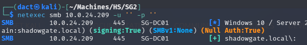

Added corresponding entries to my local hosts file:

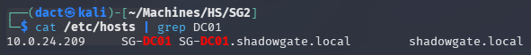

---
# _Microsoft IIS 10.0_ HTTP Web Application (80/TCP)

## Tech Stack

### _cURL_

The following command was used to retrieve HTTP headers from the target web server:

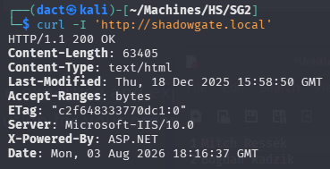

### _whatweb_

_whatweb_ is a tool used for fingerprinting web applications, detecting technologies, frameworks, and server details.
The following command was used to identify web technologies running on the target:

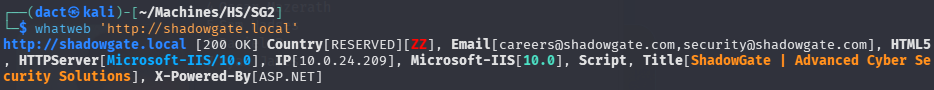

`shadowgate.com`

## Website Browsing

Browsing to `http://shadowgate.local` leads to the following web page:

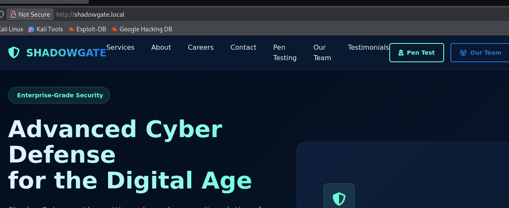

Browsing to the _Our Team_ page, there is an accounting of some of the potential staff members:

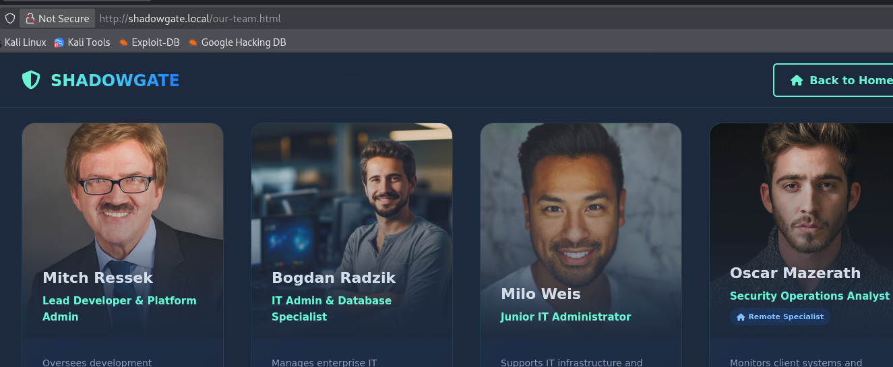

I have collected the full names presented within that page and compiled a list

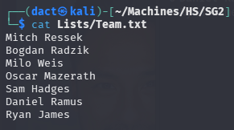

Using my script, [usernamed.py](https://github.com/dact91/usernamed), that's derived from the _username-anarchy_ function - to create a list with variating entries based on common username structures:

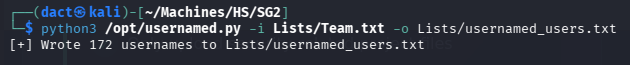

Testing the validity of the generated entries using _Kerbrute_, the format used is `firstname.l`:

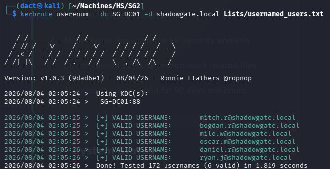

I then tested whether any of the users had _NO_PREAUTH_:

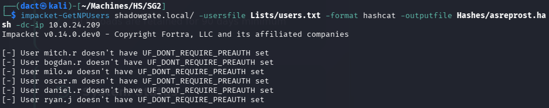

At this point the avenue related to the usernames has shrunk to limited, noisy options like password spraying. I will attempt to view whether there's an additional VHOST using _ffuf_:

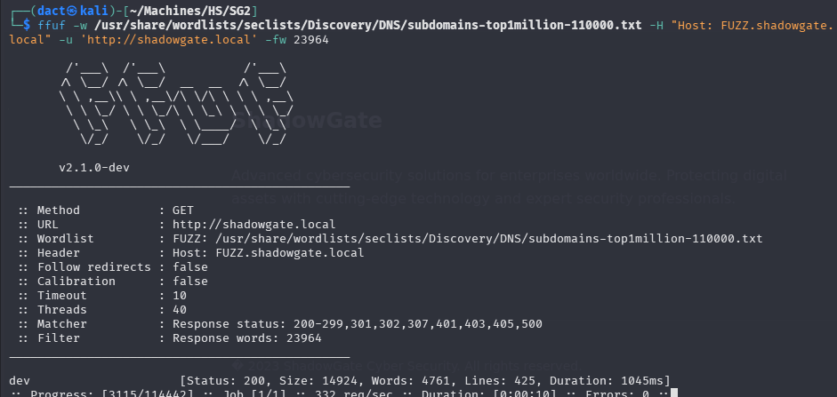

Added it as an entry to my hosts file. Browsing to it leads to the page below:

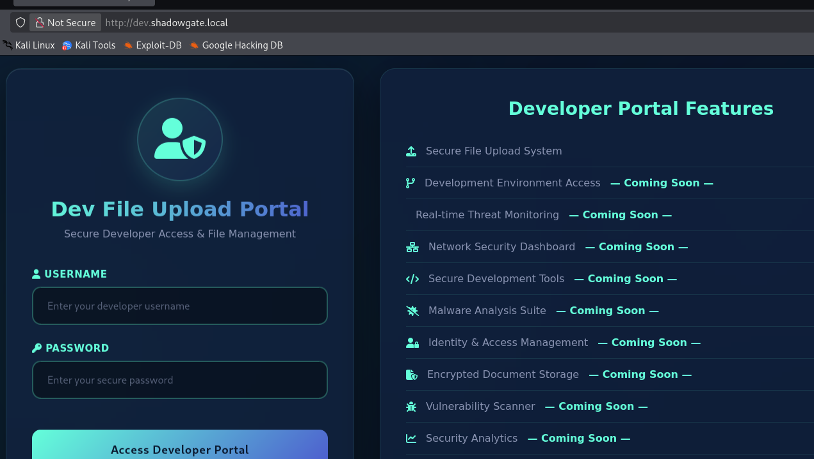

The page contains a login form and a _Secure File Upload System_, as seen above. Scrolling downwards, there is a mention of `mitch.r` as the reviewer of the uploads:

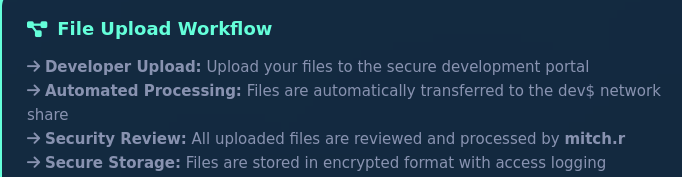

Using `feroxbuster -u 'http://dev.shadowgate.local' -w /usr/share/wordlists/dirb/common.txt` I locate what seem to be the upload function endpoint - which appears to be blocked:

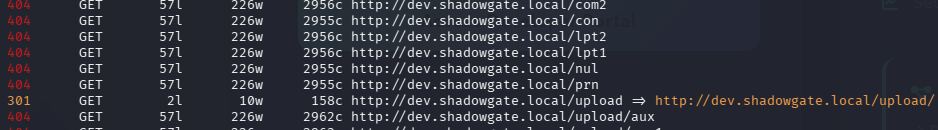

File upload doesn't seem possible at this time, which leaves the login form as the main target for now. After trying a [few basic SQLi payloads](https://github.com/swisskyrepo/PayloadsAllTheThings)  - I gain access using `admin' AND 1=1 -- -`:

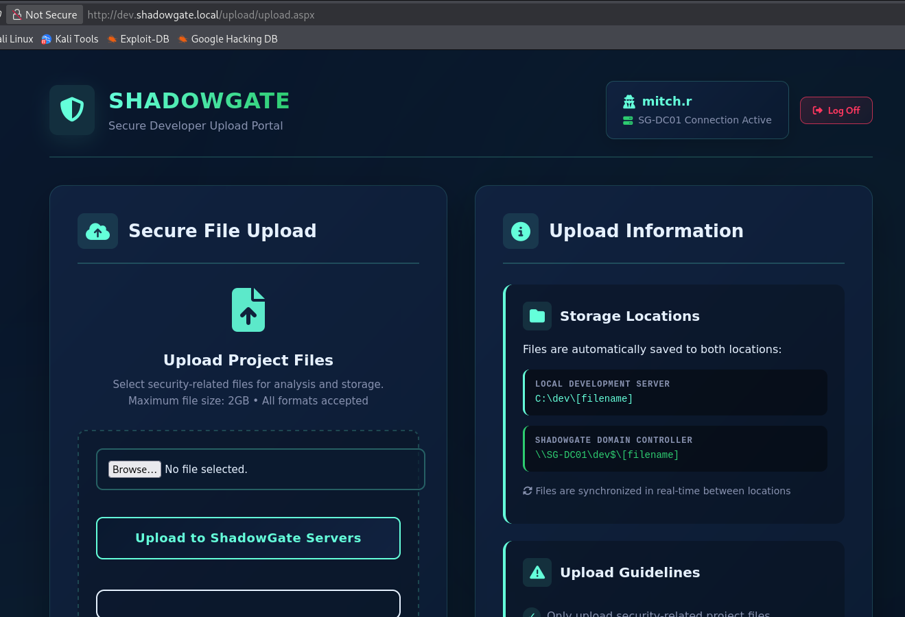

The upload interface does not seem to blacklist any file, as it allowed me to upload files with a few test extensions. I decided to forge files pointing to my local host with _NTLM_theft.py_:

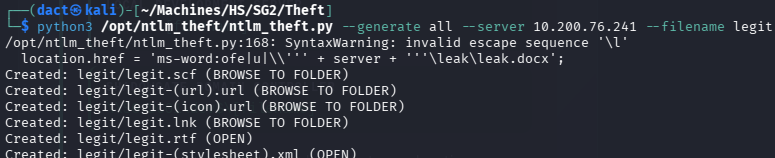

Initiating _Responder_, `sudo responder -I tun0` and uploading the files. After a few uploads that did not trigger authentication traffic, I uploaded the shortcut (`.lnk`) which triggered the below traffic:


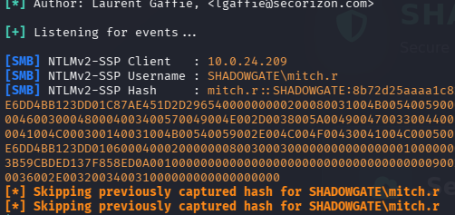

On my bare metal host `.\hashcat.exe -m 5600 -a 0 .\ToCrack\mitcr.txt .\rockyou.txt`:

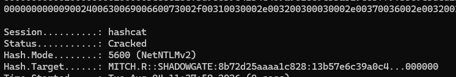

Password isn't very complex (common word, birth year, no special characters).

# AD Enumeration
## Domain User Enumeration

Using _impacket-lookupsid_, I can compile a list of valid domain users

```bash
# Collecting names of domain objects - usernames, groups, etc.
impacket-lookupsid 'mitch.r':'REDACTED'@SG-DC01 -no-pass 25000 > Lists/RIDC.txt

# Refining the list to contain valid usernames only
grep "(SidTypeUser)" Lists/RIDC.txt | awk -F '\\' '{print $2}' | sed 's/ (SidTypeUser)//' > Lists/users_RIDC.txt
```

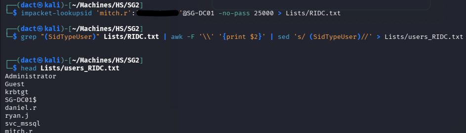

Although I previously acquired a partial user list - this one has the addition of the `svc_mssql` - a service user. 

- Checked password re-use.
- Checked the use of username as corresponding password.
- Performed blind Kerberoast - surprisingly, `administrator` has two SPNs:

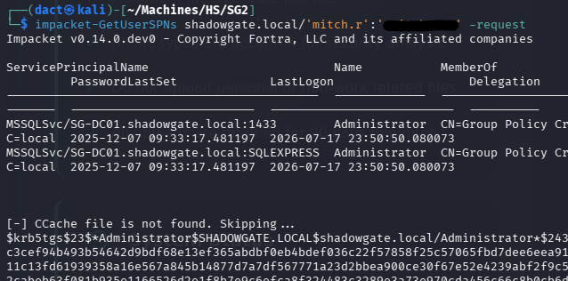

However, this hash won't crack in conjunction with _rockyou.txt_. 

## Credentialed LDAP Enumeration

LDAP (Lightweight Directory Access Protocol) is a protocol used to access and manage directory services, such as Active Directory. It operates over **port 389 (unencrypted)** and **port 636 (LDAPS - encrypted with SSL/TLS)** by default.

Having valid domain credentials allows me to enumerate the Active Directory environment using _ldapdomaindump_ and _BloodHound_ ingestor. The output from this tools can help map relationships and identify attack paths visually.

### _ldapdomaindump_

Using `mitch.r`'s valid credentials to execute _ldapdomaindump_:

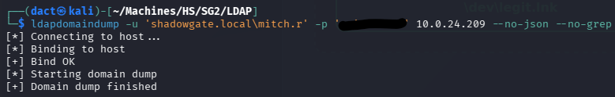

Reviewing the output files, specifically _domain_users.html_, I can gather the following:

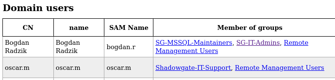

- `bogdan.r` is the sole member of _SG-MSSQL-Maintainers_, a non-default, probably _MSSQL_ related group - which might also point to the identity of the person using `svc_mssql`. `bogdan.r` is also the sole member of the _SG-IT-Admins_ group and it is also a member of _Remote Management Users_.
- `oscar.m` is the sole member of the _Shadowgate-IT-Support_ group and it is also a member of _Remote Management Users_.

The two above-mentioned users can be considered at this point to high value target as both can establish remote session on the target host, at the very least. Furthermore, both are also members of non-default groups that might differentiate their privilege level from other users. 

### _BloodHound_

Using `mitch.r`'s valid credentials to execute _bloodhound-python_ collector:

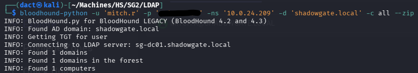

Loading the newly-created _.zip_ file into the _BloodHound_ GUI, I mark `mitch.r` as owned. 

Viewing the user's _Outbound Object Control_, it has the _ForceChangePassword_ ACE over two other users, `milo.w` and `ryan.j`:

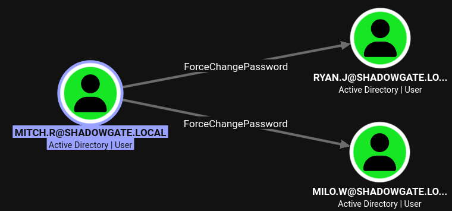

When reviewing these users' _Outbound Object Control_, `milo.w` has the _WriteOwner_ ACE over `svc_mssql`, whereas `ryan.j` does not have any control over another user:

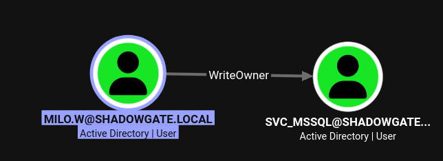

# Lateral Movement

## Compromising `milo.w` and `svc_mssql`

I will target `milo.w`, as it has at least one further step in its path, altering its password using the dedicated _netexec_ module:

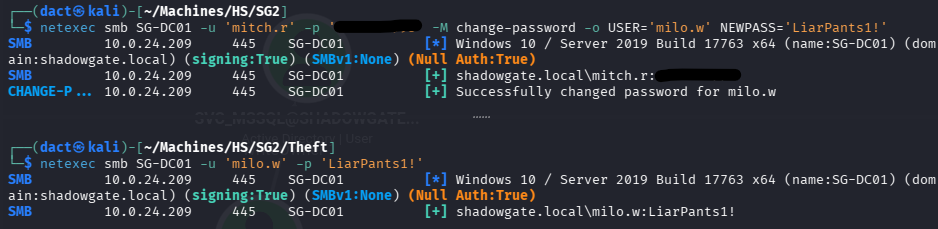

Now that `milo.w` is compromised, I move to take control over `svc_mssql`:

```bash
# Taking ownership of svc_mssql
impacket-owneredit -action 'write' -new-owner 'milo.w' -target 'svc_mssql' 'shadowgate.local'/'milo.w':'LiarPants1!'

# Granting GenericAll
impacket-dacledit  -action 'write' -rights 'FullControl' -principal 'milo.w' -target 'svc_mssql' 'shadowgate.local'/'milo.w':'LiarPants1!'
```

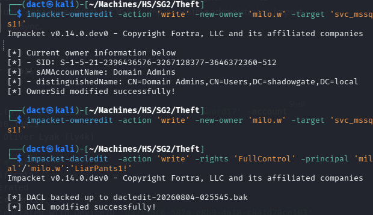

Having performed the above, I now have _GenericAll_ ACE over `svc_mssql`. 

After attempting to perform Shadow Credentials - unsuccessfully, I moved on to try and perform targeted Kerberoast against `svc_mssql`:

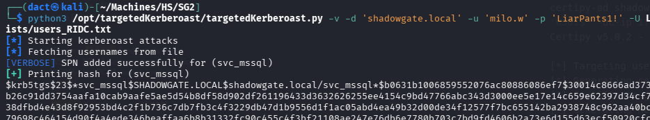

Cracking the hash on my bare metal host `.\hashcat.exe -m 13100 -a 0 .\ToCrack\shadow_svcmssql.txt .\rockyou.txt`:

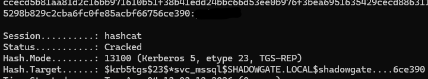

After spraying the password against the user list, I can confirm there is no password re-use and this password authenticates only `svc_mssql`. 

# Foothold 

## Compromising `bogdan.r`

The account's name is self-explanatory, so I attempted using it with the _mssql_priv_ module on _netexec_. 

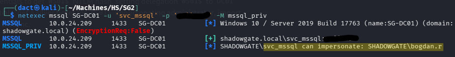

This module tests whether an impersonation is possible. Usually, it means that a low level MSSQL user (in this case - `svc_mssql`) can impersonate a more privileged user in the context of MSSQL (commonly - `sysadmin`, in this case it is `bogdan.r`). As seen above, `bogdan.r` can be impersonated and as previously discussed - this user is a member of privileged and/or non-default groups.

However, in this case, attempting to impersonate with `netexec mssql SG-DC01 -u 'svc_mssql' -p 'REDACTED' -M mssql_priv -o ACTION=privesc` isn't successful. 

Establishing a session using _impacket-mssqlclient_:

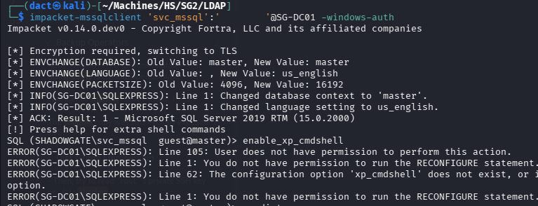

As seen above, I cannot use `xp_cmdshell`. After reviewing the contents with `xp_dirtree` I try to relay, similarly to what I have done before, I initiate _Responder_ and direct traffic to a fictional resource hosted on my attacking machine:

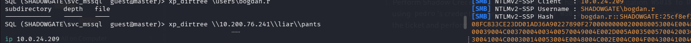

As seen above on both displayed terminals, reaching (using `xp_dirtree` on the left) to my local host creates traffic (intercepted by _Responder_, on the right) - as a result I can harvest an NTLMv2 hash. Attempting to crack the hash using _hashcat_, again, on my bare metal host `.\hashcat.exe -m 5600 -a 0 .\ToCrack\bogdan_r.txt .\rockyou.txt`:

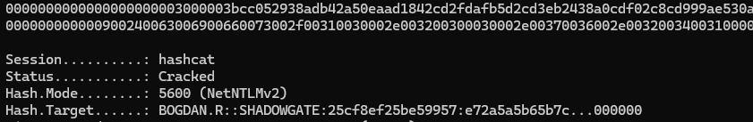

The hash cracked successfully - and once more it is a very weak password - name, 4 date characters, no special characters. 

Having compromise `bogdan.r` successfully, I manage to establish a remote session over WinRM:

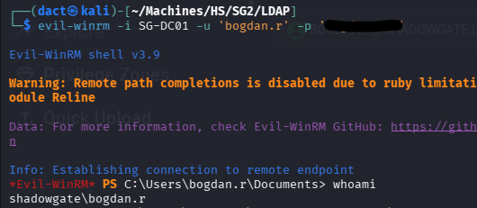

# Privilege Escalation

## Compromising `oscar.m`

After reviewing the file system without finding any vector or information disclosure, I turned back to the _BloodHound_ UI and viewed `bogdan.r`'s _Outbound Object Control_ - the user has _GenericAll_ ACE over `oscar.m` and `daniel.r`:

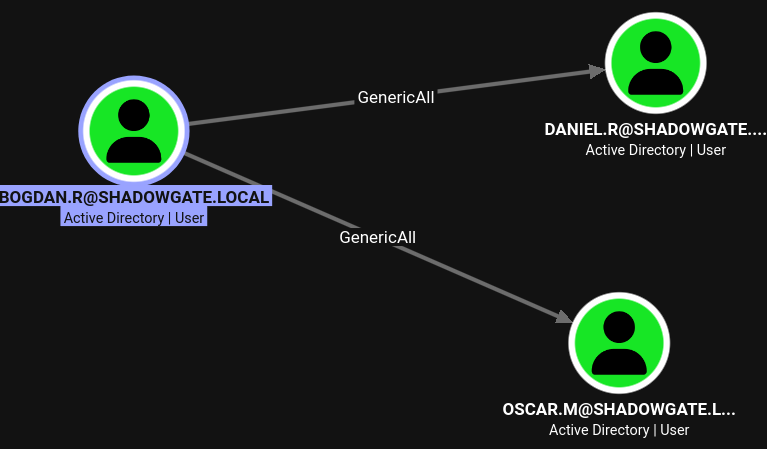

Unfortunately, targeted Kerberoast and Shadow Credentials did not assist in compromising any of the two users. I had to turn to altering passwords, in which I chose to target `oscar.m` first - as it seemed the more privileged user:

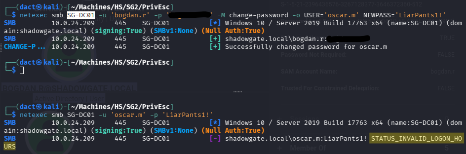

As seen above, compromising the user proved not to be as straight forward as the logon fails due to _STATUS_INVALID_LOGON_HOURS_ error which is triggered by time of date restriction. 

I will try removing _logonHours_ from `oscar.m`'s user object, for that - I will create _hours.ldif_, that will delete the attribute content:

```
# Contents of hours.ldif
dn: CN=oscar.m,CN=Users,DC=shadowgate,DC=local
changetype: modify
delete: logonHours
-
```

Applying the change by using _ldapmodify_:

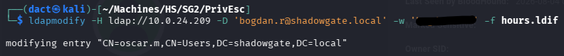

Attempting to authenticate once more - it succeeded:

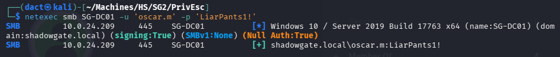

Now I can establish a session on the target host as `oscar.m`:

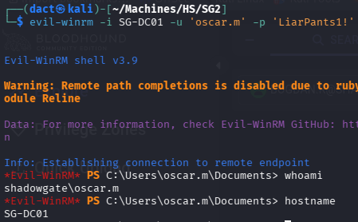

Reviewing the file system, I find the following note:

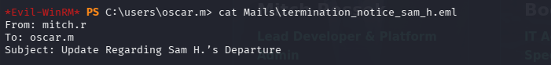

```
From: mitch.r
To: oscar.m
Subject: Update Regarding Sam H.’s Departure

Hi Oscar,

I wanted to inform you that Sam H. has officially resigned from his position. His user account is no longer needed and should be removed from the system.

Additionally, since Sam was responsible for certificate issuance management (Manage-CA), please identify a suitable replacement to ensure that our certificate services continue operating without interruption.

During a recent internal review, we also identified a potential ESC-related misconfiguration within our Active Directory Certificate Services environment. While no abuse has been confirmed, the configuration could allow unintended certificate enrollment or privilege escalation if left unmanaged. This finding further emphasizes the need for proper ownership and oversight of the CA role.

As a temporary security measure, the LDAP/RPC enrollment ports on the CA server have been blocked at the firewall, since there is currently no designated staff member to oversee certificate operations.

Please note:
If no suitable successor for Sam’s role is appointed in a timely manner, we may be required to shut down the certificate service entirely. Without proper oversight, there is a heightened risk that someone could attempt to bypass or tunnel around the firewall restrictions, especially in light of the identified ESC weakness, leading to potential misuse of our enrollment endpoints. This measure would be taken to ensure the security and integrity of our environment.

Once a new responsible person is appointed, the blocked ports can be re-enabled to restore full certificate enrollment capabilities.

Let me know once the account has been removed and when you have identified a candidate for the role.

Regards,
Mitch R.
```

## Compromising `sam.h`

To get started, I will try to verify whether `sam.h` is deleted beyond reach:

```bash
ldapsearch -H ldap://10.0.24.209 -D 'oscar.m@shadowgate.local' -w 'LiarPants1!' -b 'CN=Deleted Objects,DC=shadowgate,DC=local' -E '1.2.840.113556.1.4.417' '(objectClass=*)' msDS-LastKnownRDN whenChanged objectClass > PrivEsc/deleted_LDAP.txt
```

I can find it within the _Deleted Objects_:

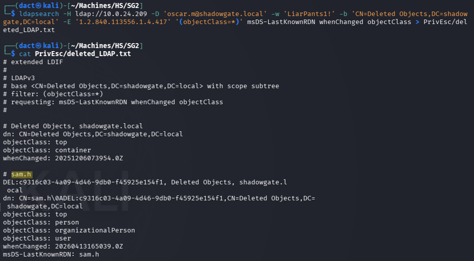

An alternative manner is the review all writable with `get writable` when using _BloodyAD_ - `bloodyad --host SG-DC01 -d shadowgate.local -u 'oscar.m' -p 'LiarPants1!' get writable`:

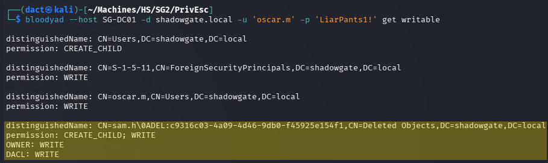

It picks up `sam.h`, on which I have full control over.

Restoring it with `bloodyad --host SG-DC01 -d shadowgate.local -u 'oscar.m' -p 'LiarPants1!' set restore 'sam.h'`:

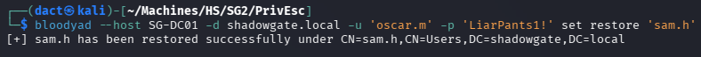

Since I have full control over `sam.h`, I can attempt Shadow Credentials, targeted Kerberoast or _ForceChangePassword_, in this case I succeeded in compromising the user with targeted Kerberoast:

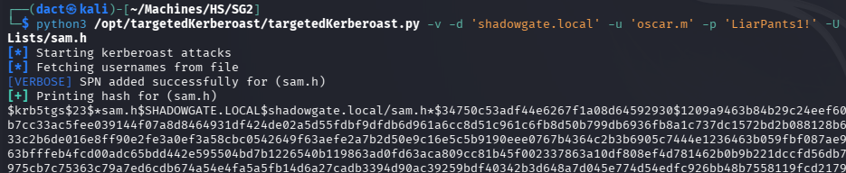

Cracking the hash - on my bare metal host `.\hashcat.exe -m 13100 -a 0 .\ToCrack\samh.txt .\rockyou.txt`:

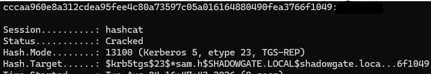

Authenticating as `sam.h` is successful:

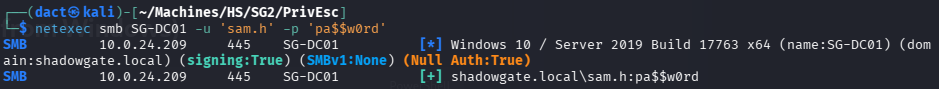

The original context of the discovery of `sam.h` was the note left to `oscar.m`, within that note it was also mentioned that `sam.h` was was responsible for certificate issuance management, and that the LDAP/RPC ports were blocked - which is the reason to my failures of conducting Shadow Credentials attack - as _certipy-ad_ uses port 636 for LDAPS, per its [documentation](https://github.com/ly4k/Certipy/wiki/08-%E2%80%90-Command-Reference). This port is closed, which blocked my previous attempt to conduct the attack. 

## Abusing ADCS

Having that in mind, an additional LDAPS port is open (3289), I will use _certipy-ad_ to enumerate ADCS over that port - `certipy-ad find -u 'sam.h@shadowgate.local' -p 'REDACTED' -dc-ip '10.0.24.209' -ldap-port 3269 -stdout -vulnerable`:

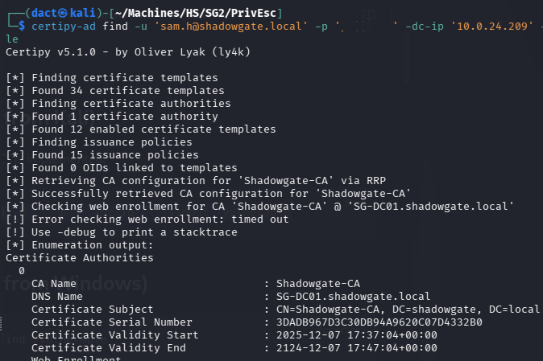

The script output points to ESC7 vulnerabilities:

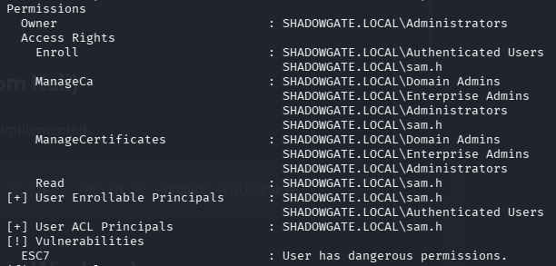

Scrolling further down, the script output notes that ADCS is vulnerable to ESC3. 

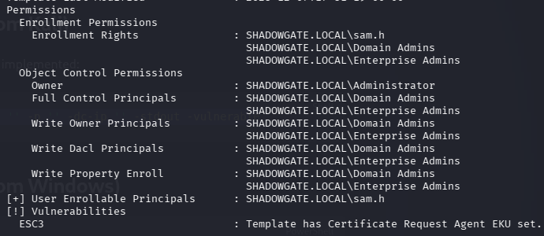

According to _certipy-ad_'s [documentation](https://github.com/ly4k/Certipy/wiki/06-%E2%80%90-Privilege-Escalation#esc3-enrollment-agent-certificate-template), ESC3 "_... exploit weaknesses related to Certificate Request Agents, also known as Enrollment Agents. An Enrollment Agent is an account authorized to request certificates on behalf of other users..._".   

ESC3 and ESC7 don't need to be chained together, exploiting either will result in compromising the domain. For learning purposes, I will opt for ESC3:

- Obtaining an enrollment agent certificate, resulting in a certificate file (_.pfx_):

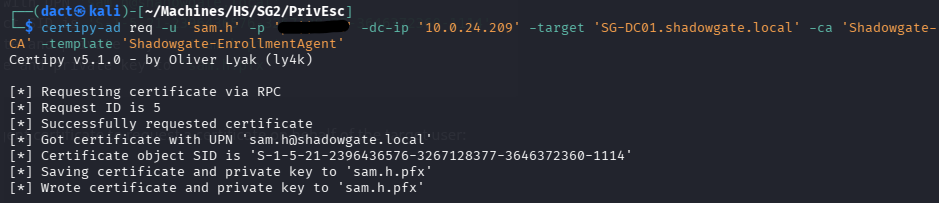

- Using the forged certificate on behalf of `administrator`, using the _User_ template. Again `-ldap-port 3269`, since it originally failed. This results in an administrator certificate:


- Authenticating using the `administrator`'s certificate, outputting the full NTLM hash. Again `-ldap-port 3269`, since it originally failed:


Confirming successful authentication as `administrator`:


Establishing a session on the target host as `administrator`:


Performing DCSync to fully compromise the target domain:


