# Summary

_Forensics_ is a medium rated machine range on the _HackSmarter_ platform. It includes 3 hosts, all within the context of an AD environment. In order to fully compromise the target hosts, one must exploit/abuse multiple vulnerabilities and misconfigurations. The full breakdown can be found in the remediation section at the end of the writeup.

## Attack Path Summary

### Compromising _WS01_

```
Abusing GenericWrite to compromise an additional user → Filesystem enumeration to obtain Access DB file → Cracking its password and harvesting an additional credential set → Service configuration abuse → Dumping LSA post-exploitation
```

### Compromising _FORENSICS01_

```
Harvest user credentials from previous LSA dump → Abuse SeDebugPrivilege → Dump LSASS → Local Administrator
```

### Compromising _DC01_

```
Local Administrator access on FORENSICS01 allows filesystem enumeration → Obtaining domain admin's Kirbi ticket → Converting the ticket and dumping secrets from the domain controller
```

## Attack Path Graphical Summary

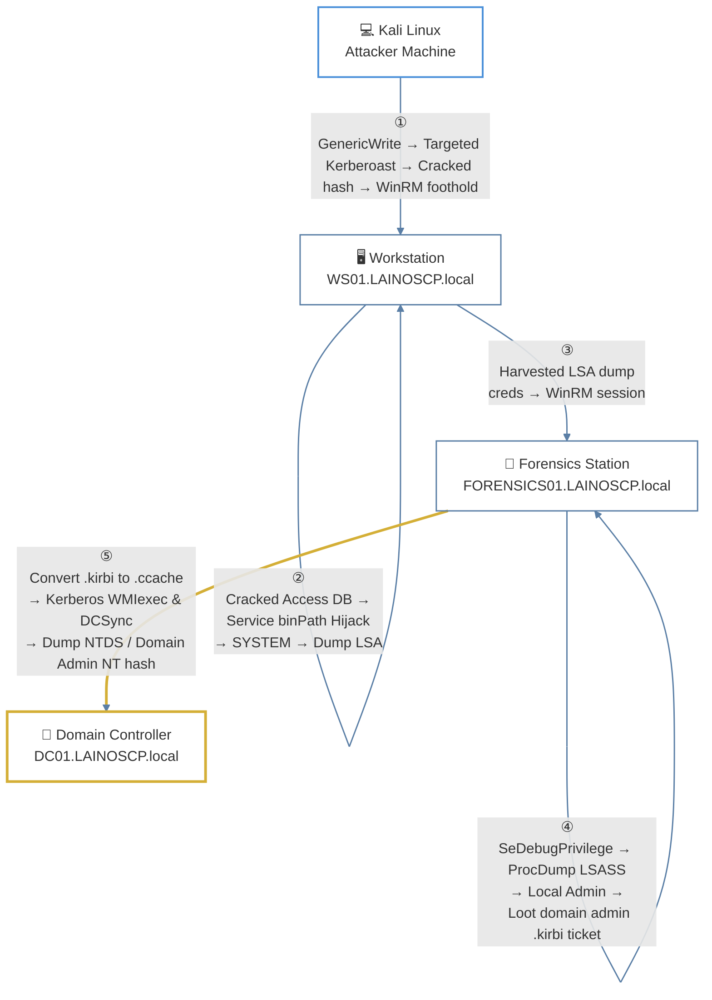

---
# Introduction

> [!info]
> This lab is a hosted version of the OSCP-LK set. The machines were designed to be truly "OSCP like" even more than some machines in OSCP like lists.

## Credentials

```
User: shannon
Password: GoldSeagull123
```

## Authentication

Attempting to authenticate to all three hosts using the provided credentials - all hosts are accessible and belong to the _LAINOSCP.local_:

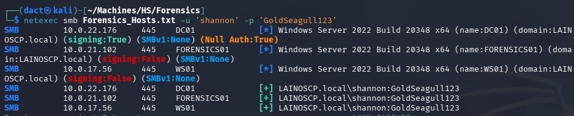

Added IP addresses and their corresponding host names to my local hosts file:

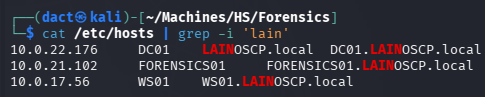

---
# Full TCP Range Scan

Scanning the target host with the following command:

```bash
sudo nmap -v -p- --min-rate 3000 -T4 -sS -n -Pn -oN Scans/Forensics_TCP_discovery -iL Forensics_Hosts.txt
```

## Notes on Scan Results

- _DC01_ is the domain controller, as such the accessible services on it are default for a DC.
- _FORENSICS01_ and _WS01_ are both domain-joined hosts. For both, SMB, RPC, WinRM and RDP are accessible.

---
# AD Enumeration

## Password Policy

Using _netexec_'s `--pass-pol` option to enumerate the domain's password policy:

```bash
netexec smb DC01 -u 'shannon' -p 'GoldSeagull123' --pass-pol
```

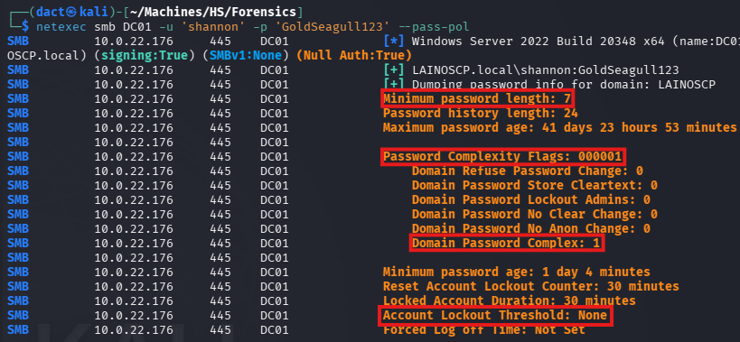

As seen above, password complexity is configured, minimum length of passwords is 7 characters. However, there isn't an account lockout threshold, which will allow me to spray credentials without triggering account lockouts.
## Domain User Enumeration

Using _netexec_'s `--users-export` option to enumerate domain users and export them to a file:

```bash
netexec smb DC01 -u 'shannon' -p 'GoldSeagull123' --users-export Lists/domain_users.txt
```

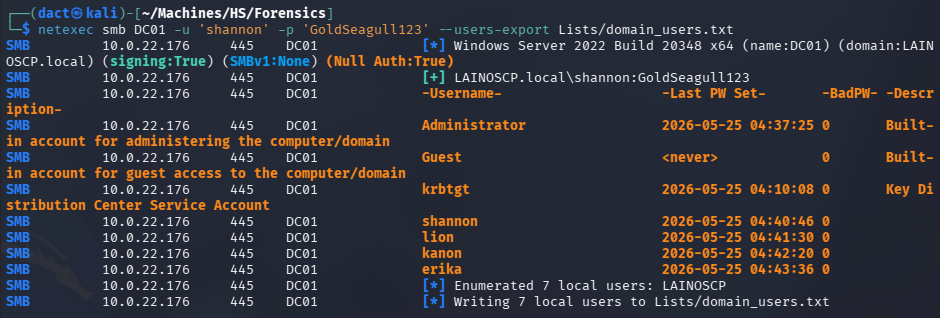

## Credentialed LDAP Enumeration

Having valid domain credentials allows me to enumerate the AD environment using _bloodyAD_. The output from it can help map relationships and identify attack paths visually.

### _BloodHound_

Using `shannon`'s valid credentials to execute _bloodhound-python_ collector:

```bash
bloodyad --host DC01 -d 'LAINOSCP.local' -u 'shannon' -p 'GoldSeagull123' get bloodhound
```

Loading the newly-created _.zip_ file into the _BloodHound_ GUI, I mark `shannon` as owned. 
# Compromising _WS01_

## Foothold on _WS01_ - Abusing _GenericWrite_

Viewing its Outbound Object Control, `shannon` has a _GenericWrite_ ACL over `lion`:


Having this ACL, I will be able to perform a targeted Kerberoast on `lion`, as I would rather not change the latter's password. It will add an SPN to the user, then request a Kerberos ticket. The received ticket will be encrypted with `lion`'s password hash:

```bash
python3 /opt/targetedKerberoast/targetedKerberoast.py -v -d 'LAINOSCP.local' -u 'shannon' -p 'GoldSeagull123' --request-user 'lion' -o TK.txt
```

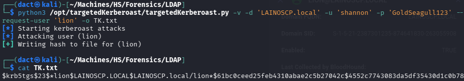

Copying the hash, I can attempt to crack it on my bare-metal host using _hashcat_:

```powershell
.\hashcat.exe -m 13100 -a 0 .\Crack2026\lion_FORENSICS.txt .\rockyou.txt
```

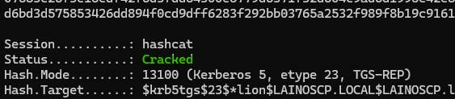

The hash is cracked successfully and I am able to authenticate as `lion` to the domain hosts:

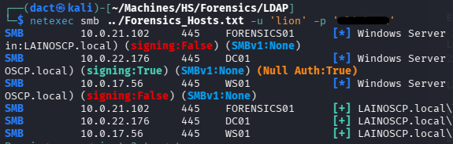

`lion` can authenticate over WinRM to _WS01_, which allows me to establish a remote session on the host:

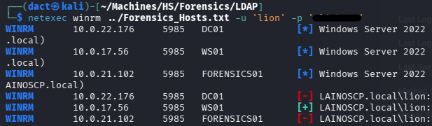

Establish a remote session on _WS01_ host and confirming command execution:

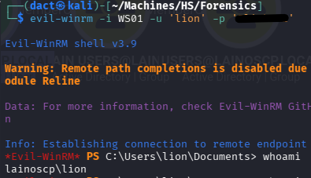

## _WS01_ Privilege Escalation

### Access Database File

Performing basic file system enumeration, I managed to find _Database1.accdb_ - a Microsoft Access database file. It is a non-default file and therefore I will download it to my local host:

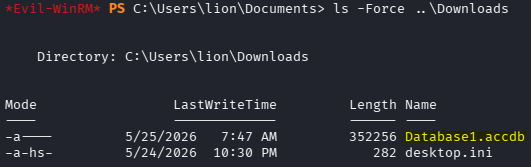

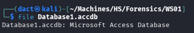

The file is native to Windows, to view its contents on Kali, I will attempt using _[mdbtools](https://github.com/mdbtools/mdbtools)_. Installing it:

```bash
sudo apt install mdbtools
```

Attempting to inspect the tables on the file fails:

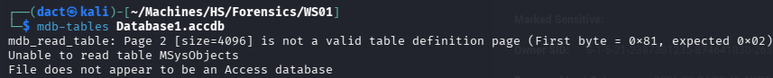

Further inspection of the file itself using `strings`, it seems to be password protected. _office2john_ will extract the encrypted data from the file in a manner that will allow me to attempt to crack it:

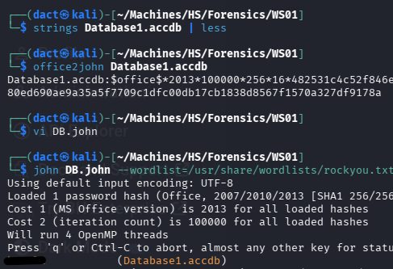

As seen above, I have successfully cracked the file's password. However, _mdbtools_ does not support password input and therefore can't be used to review the file's contents. 

Alternatively, I move the file to a Windows machine and use the native _Access_ to open it, it prompts for password:

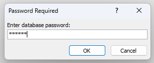

After password insertion, I can view the file's contents - it contained a cleartext password for the domain user `kanon` and an additional entry that proved of non-significance:

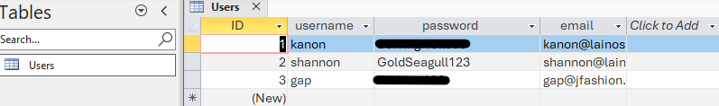

Spraying the password against the entire user list together with the host list:

```bash
netexec smb ../Forensics_Hosts.txt -u ../Lists/domain_users.txt -p '[...]'
```

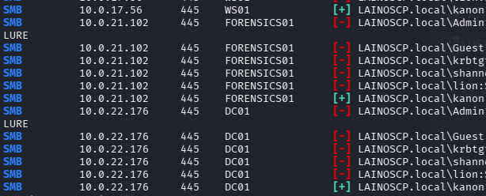

As seen above, the password authenticates `kanon` to all domain hosts.

`kanon`, like `lion`, can start a remote session on _WS01_ over WinRM:

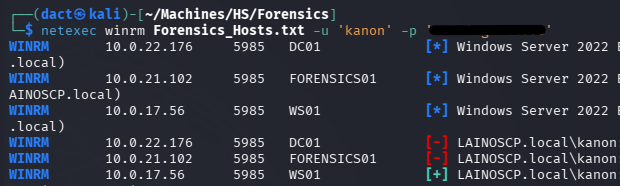

### Service Binary Path Hijacking

 Filesystem enumeration does not bear fruit, I will use _[PrivescCheck](https://github.com/itm4n/PrivescCheck)_ to automate the enumeration:

```powershell
powershell -ep bypass -c ". .\PrivescCheck.ps1; Invoke-PrivescCheck -Report TXT,HTML"
```

Within the output, _wuauserv_ seems like an exploitable service, as `kanon` can start, stop and change its configuration:

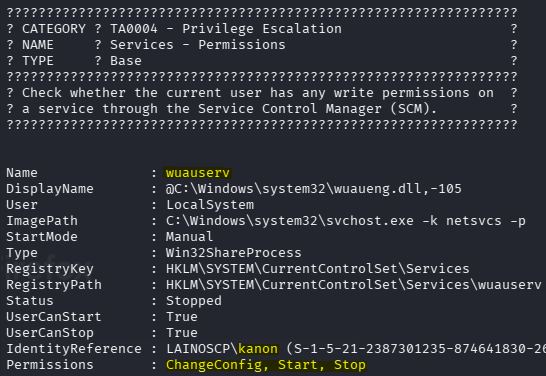

Generating a malicious binary with _msfvenom_, then transferring it to _WS01_:

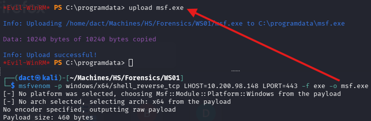

Since I can change the service's configuration, I will be able to point to the malicious binary with `binPath`, then start the service:

```powershell
sc.exe config wuauserv binPath= "C:\programdata\msf.exe"

Get-Service -Name "wuauserv"

C:\programdata> Start-Service -Name "wuauserv"
```

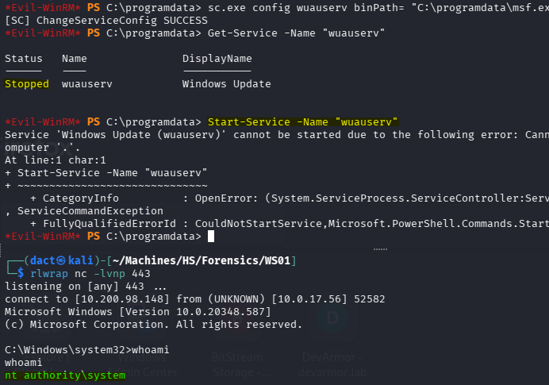

As seen above, using `binPath` to trigger the malicious binary then starting the service results in a connection to the _netcat_ listener and command execution as `NT AUTHORITY\SYSTEM` - confirming compromise of _WS01_.

## _WS01_ Post Exploitation

### Credential Harvesting

Using _mimikatz_, I can now dump password-related data:

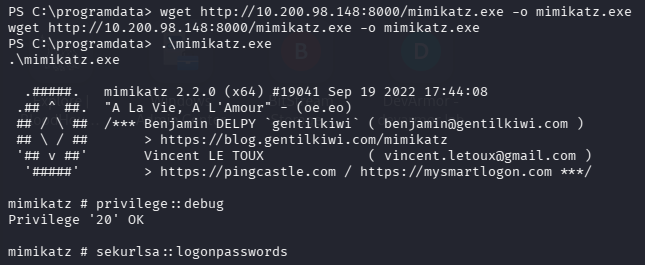

Then, I manage to dump the SAM and harvest the local `administrator`'s NT hash:

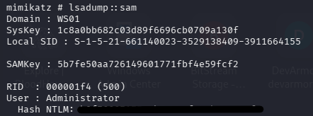

# Compromising _FORENSICS01_

## Foothold on _FORENSICS01_

Dumping LSA as local `administrator` once more with _netexec_, for a more readable output, I harvest `erika`'s cleartext password:

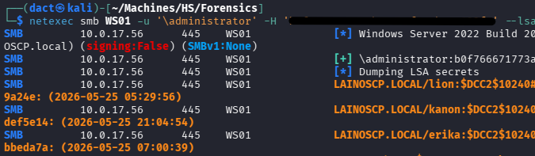

Authenticating as `erika` to the domain hosts:

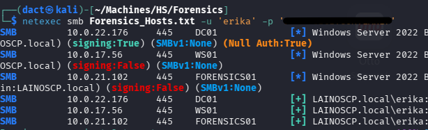

`erika` can establish a remote session on _FORENSICS01_:

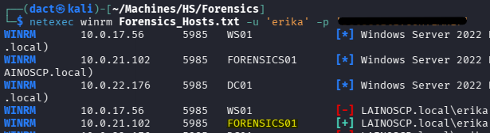

Confirming command execution as `erika` after establishing a remote session on _FORENSICS01_:

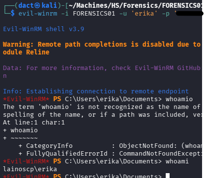

## _FORENSICS01_ Privilege Escalation

Reviewing its privileges, `erika` has the _SeDebugPrivilege_ privilege:

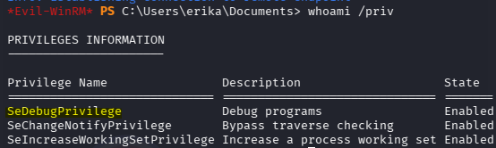

The _SeDebugPrivilege_ privilege grants the ability to debug and interact with any process, including SYSTEM-owned ones, like _lsass_, a vital core process in Windows that enforces security policies, manages user logins, handles password changes, and creates access tokens.

To abuse _SeDebugPrivilege_, I will use a SysInternals binary, _[procdump.exe](https://learn.microsoft.com/en-us/sysinternals/downloads/procdump)_, once transferred to the host, it will dump the process into a minidump file:

```powershell
.\procdump.exe -accepteula -ma lsass.exe lsass.dmp
```

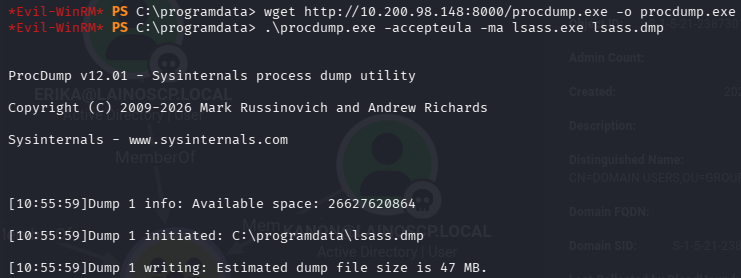

Having downloaded the file to my local host, I can now use [pypykatz](https://github.com/skelsec/pypykatz) and parse the dump file:

```bash
pypykatz lsa minidump lsass.dmp -o lsass_creds
```

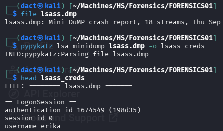

Harvesting the local `administrator`'s password:

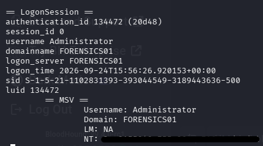

Authenticating as the local `administrator`:

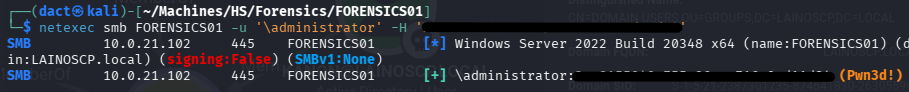

## _FORENSICS01_ Post Exploitation

### Filesystem Enumeration

Leveraging the harvested NT hash, I start a remote session on _FORENSICS01_ as its local `administrator`:

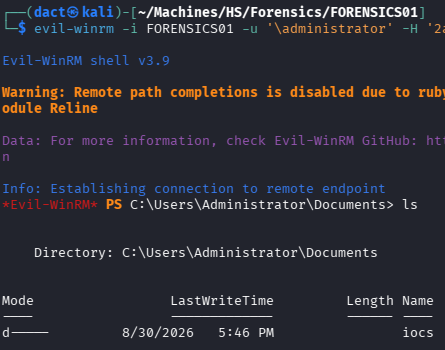

As seen above, there is an _iocs_ directory within the _Documents_ directory. Below, its contents include a _.kirbi_ file. _.kirbi_ is a file format that stores Kerberos tickets extracted from the operating system's memory. In this case, the name points to it being the domain administrator's ticket. Contents of _notes.txt_ confirm that it is indeed the nature of the ticket file:

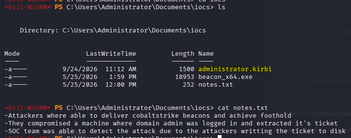

# Compromising  _DC01_

Kirbi tickets can be converted to _.ccache_ files using _impacket-ticketConverter_, as demonstrated below. Once the _.ccache_ ticket is created, I can point to it for Kerberos authentication and list the ticket:

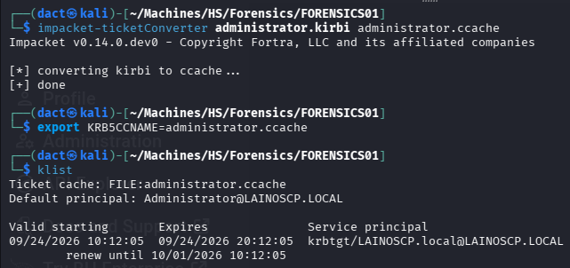

Listing the ticket is important in order to understand the exact naming convention used within the context of Kerberos authentication, to test whether it authenticates properly - I used the below _impacket-wmiexec_ command:

```bash
impacket-wmiexec -k -no-pass -dc-ip DC01.LAINOSCP.local LAINOSCP.LOCAL/Administrator@DC01.LAINOSCP.local
```

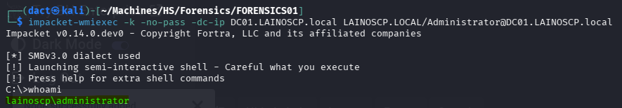

As seen above, I managed to authenticate successfully and execute commands on the DC as the domain `administrator`. I can now leverage the ticket to perform DCSync:

```bash
impacket-secretsdump -k -no-pass -dc-ip DC01.LAINOSCP.local LAINOSCP.LOCAL/Administrator@DC01.LAINOSCP.local > FORENSICS_Secrets.txt
```

I can fetch domain admin's NT hash from the output file:

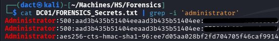

Authenticating as domain `administrator` using the harvested hash, then establishing a session over WinRM, confirming command execution and full domain compromise:

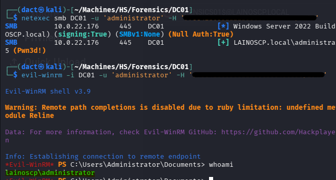

---
# Vulnerabilities, Misconfigurations and Recommended Remediations

The below items are in no manner an exhaustive list, but rather main points that are relatively easy to address. The referral is corresponding to the attack path rather to the location of the actual finding (process, rather than host):

## _WS01_

- **Potentially excessive ACLs** - _GenericWrite_ ACL allowed me to perform targeted Kerberoast against `lion`. To remediate, ACLs need to be audited periodically and removed if deemed not required. 
- **Weak, crackable passwords** - `lion`'s password was weak (8 characters, a band's name) and therefore the hash that resulted from the targeted Kerberoast was easily cracked. To remediate, enforce longer and more complex passwords.
- **Insecure storage of credentials** - Microsoft _Access_ database was used to store passwords and was protected by a weak password, which allowed me to crack it, access the database and retrieve a cleartext password for `kanon`. Microsoft _Access_ database files should not hold passwords. Unlike _KeePass_ database files, the encryption on _Access_ database files is minimal and optional and lacks brute-force protection. To remediate, purge passwords from _Access_ database file and use an alternative such as _KeePass_ with a strong master password.
- **Service configuration** - permissions to alter a service configuration as well as starting and stopping it allowed me to escalate privileges on _WS01_. Audit permissions on services and remove any unnecessary permissions held by users, potentially restricting these to local administrative accounts.

## _FORENSICS01_

- **Cleartext domain credentials recoverable from LSA secrets** - allowed me to compromise `erika` after escalating privileges on the host. To remediate, consider including relevant or all domain users within the _Protected Users_ group, use _Credential Guard_ where applicable.
- **SeDebugPrivilege** - `erika`'s _SeDebugPrivilege_ allowed me to create a dump file from the LSASS process, exfiltrate and parse it and obtain credentials from the file - resulting in local `administrator` access and host compromise. Privileges need to be audited periodically and removed if not required. Furthermore, _Credential Guard_ would provide defense-in-depth in that context.

## _DC01_

- **Domain admin Kirbi ticket accessible on a domain-joined host** - allowed me to compromise the domain. To remediate, purge all artifacts recovered from security assessments, penetration tests or red teaming engagements from the filesystem. 

## Domain-Wide

- **No account lockout threshold** - allowed me to spray credentials whenever harvested. To remediate, enforce an account lockout threshold.